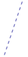

# Line

[ Browse the sample](/samples/dotnet/maui-samples/userinterface-shapes)

The .NET Multi-platform App UI (.NET MAUI) [[Line|Line]] class derives from the [[Shape|Shape]] class, and can be used to draw lines. For information on the properties that the [[Line|Line]] class inherits from the [[Shape|Shape]] class, see [[shapes|Shapes]].

[[Line|Line]] defines the following properties:

- [[Line.X1|X1]], of type double, indicates the x-coordinate of the start point of the line. The default value of this property is 0.0.
- [[Line.Y1|Y1]], of type double, indicates the y-coordinate of the start point of the line. The default value of this property is 0.0.
- [[Line.X2|X2]], of type double, indicates the x-coordinate of the end point of the line. The default value of this property is 0.0.
- [[Line.Y2|Y2]], of type double, indicates the y-coordinate of the end point of the line. The default value of this property is 0.0.

These properties are backed by [[BindableProperty|BindableProperty]] objects, which means that they can be targets of data bindings, and styled.

For information about controlling how line ends are drawn, see [[index#control-line-ends|Control line ends]].

## Create a Line

To draw a line, create a [[Line|Line]] object and set its `X1` and `Y1` properties to its start point, and its `X2` and `Y2` properties to its end point. In addition, set its [[Shape.Stroke|Stroke]] property to a [[Brush|Brush]]-derived object because a line without a stroke is invisible. For more information about [[Brush|Brush]] objects, see [[brushes|Brushes]].

> [!NOTE]
> Setting the [[Shape.Fill|Fill]] property of a [[Line|Line]] has no effect, because a line has no interior.

The following XAML example shows how to draw a line:

```xaml
<Line X1="40"
      Y1="0"
      X2="0"
      Y2="120"
      Stroke="Red" />
```

In this example, a red diagonal line is drawn from (40,0) to (0,120):


Because the [[Line.X1|X1]], [[Line.Y1|Y1]], [[Line.X2|X2]], and [[Line.Y2|Y2]] properties have default values of 0, it's possible to draw some lines with minimal syntax:

```xaml
<Line Stroke="Red"
      X2="200" />
```

In this example, a horizontal line that's 200 device-independent units long is defined. Because the other properties are 0 by default, a line is drawn from (0,0) to (200,0).

The following XAML example shows how to draw a dashed line:

```xaml
<Line X1="40"
      Y1="0"
      X2="0"
      Y2="120"
      Stroke="DarkBlue"
      StrokeDashArray="1,1"
      StrokeDashOffset="6" />
```

In this example, a dark blue dashed diagonal line is drawn from (40,0) to (0,120):



For more information about drawing a dashed line, see [[index#draw-dashed-shapes|Draw dashed shapes]].
