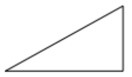

# Path

[ Browse the sample](/samples/dotnet/maui-samples/userinterface-shapes)

The .NET Multi-platform App UI (.NET MAUI) [[Path|Path]] class derives from the [[Shape|Shape]] class, and can be used to draw curves and complex shapes. These curves and shapes are often described using [[Geometry|Geometry]] objects. For information on the properties that the [[Path|Path]] class inherits from the [[Shape|Shape]] class, see [[shapes|Shapes]].

[[Path|Path]] defines the following properties:

- [[Path.Data|Data]], of type [[Geometry|Geometry]], which specifies the shape to be drawn.
- [[Path.RenderTransform|RenderTransform]], of type [[Transform|Transform]], which represents the transform that is applied to the geometry of a path prior to it being drawn.

These properties are backed by [[BindableProperty|BindableProperty]] objects, which means that they can be targets of data bindings, and styled.

For more information about transforms, see [[path-transforms|Path Transforms]].

## Create a Path

To draw a path, create a [[Path|Path]] object and set its [[Path.Data|Data]] property. There are two techniques for setting the [[Path.Data|Data]] property:

- You can set a string value for [[Path.Data|Data]] in XAML, using path markup syntax. With this approach, the `Path.Data` value is consuming a serialization format for graphics. Typically, you don't edit this string value by hand after it's created. Instead, you use design tools to manipulate the data, and export it as a string fragment that's consumable by the [[Path.Data|Data]] property.
- You can set the [[Path.Data|Data]] property to a [[Geometry|Geometry]] object. This can be a specific [[Geometry|Geometry]] object, or a [[GeometryGroup|GeometryGroup]] which acts as a container that can combine multiple geometry objects into a single object.

### Create a Path with path markup syntax

The following XAML example shows how to draw a triangle using path markup syntax:

```xaml
<Path Data="M 10,100 L 100,100 100,50Z"
      Stroke="Black"
      Aspect="Uniform"
      HorizontalOptions="Start" />
```

The [[Path.Data|Data]] string begins with the move command, indicated by `M`, which establishes an absolute start point for the path. `L` is the line command, which creates a straight line from the start point to the specified end point. `Z` is the close command, which creates a line that connects the current point to the starting point. The result is a triangle:



For more information about path markup syntax, see [[path-markup-syntax|Path markup syntax]].

### Create a Path with Geometry objects

Curves and shapes can be described using [[Geometry|Geometry]] objects, which are used to set the [[Path|Path]] object's [[Path.Data|Data]] property. There are a variety of [[Geometry|Geometry]] objects to choose from. The [[EllipseGeometry|EllipseGeometry]], [[LineGeometry|LineGeometry]], and [[RectangleGeometry|RectangleGeometry]] classes describe relatively simple shapes. To create more complex shapes or create curves, use a [[PathGeometry|PathGeometry]].

[[PathGeometry|PathGeometry]] objects are comprised of one or more [[PathFigure|PathFigure]] objects. Each [[PathFigure|PathFigure]] object represents a different shape. Each [[PathFigure|PathFigure]] object is itself comprised of one or more [[PathSegment|PathSegment]] objects, each representing a connection portion of the shape. Segment types include the following the [[LineSegment|LineSegment]], [[BezierSegment|BezierSegment]], and [[ArcSegment|ArcSegment]] classes.

The following XAML example shows how to draw a triangle using a [[PathGeometry|PathGeometry]] object:

```xaml
<Path Stroke="Black"
      Aspect="Uniform"
      HorizontalOptions="Start">
    <Path.Data>
        <PathGeometry>
            <PathGeometry.Figures>
                <PathFigureCollection>
                    <PathFigure IsClosed="True"
                                StartPoint="10,100">
                        <PathFigure.Segments>
                            <PathSegmentCollection>
                                <LineSegment Point="100,100" />
                                <LineSegment Point="100,50" />
                            </PathSegmentCollection>
                        </PathFigure.Segments>
                    </PathFigure>
                </PathFigureCollection>
            </PathGeometry.Figures>
        </PathGeometry>
    </Path.Data>
</Path>
```

In this example, the start point of the triangle is (10,100). A line segment is drawn from (10,100) to (100,100), and from (100,100) to (100,50). Then the figures first and last segments are connected, because the `PathFigure.IsClosed` property is set to `true`. The result is a triangle:


For more information about geometries, see [[geometries|Geometries]].
