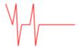
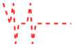
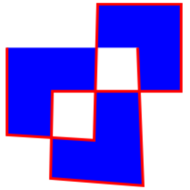

# Polyline

[ Browse the sample](/samples/dotnet/maui-samples/userinterface-shapes)

The .NET Multi-platform App UI (.NET MAUI) [[Polyline (Shapes)|Polyline]] class derives from the [[Shape|Shape]] class, and can be used to draw a series of connected straight lines. A polyline is similar to a polygon, except the last point in a polyline is not connected to the first point. For information on the properties that the [[Polyline (Shapes)|Polyline]] class inherits from the [[Shape|Shape]] class, see [[shapes|Shapes]].

[[Polyline (Shapes)|Polyline]] defines the following properties:

- [[Polyline (Shapes).Points|Points]], of type [[PointCollection|PointCollection]], which is a collection of `Point` structures that describe the vertex points of the polyline.
- [[Polyline (Shapes).FillRule|FillRule]], of type [[FillRule|FillRule]], which specifies how the intersecting areas in the polyline are combined. The default value of this property is `FillRule.EvenOdd`.

These properties are backed by [[BindableProperty|BindableProperty]] objects, which means that they can be targets of data bindings, and styled.

The `PointsCollection` type is an `ObservableCollection` of `Point` objects. The `Point` structure defines `X` and `Y` properties, of type `double`, that represent an x- and y-coordinate pair in 2D space. Therefore, the `Points` property should be set to a list of x-coordinate and y-coordinate pairs that describe the polyline vertex points, delimited by a single comma and/or one or more spaces. For example, "40,10 70,80" and "40 10, 70 80" are both valid.

For more information about the [[FillRule|FillRule]] enumeration, see [[fillrules|Fill rules]].

## Create a Polyline

To draw a polyline, create a [[Polyline (Shapes)|Polyline]] object and set its `Points` property to the vertices of a shape. To give the polyline an outline, set its [[Shape.Stroke|Stroke]] property to a [[Brush|Brush]]-derived object. The [[Shape.StrokeThickness|StrokeThickness]] property specifies the thickness of the polyline outline. For more information about [[Brush|Brush]] objects, see [[brushes|Brushes]].

> [!IMPORTANT]
> If you set the [[Shape.Fill|Fill]] property of a [[Polyline (Shapes)|Polyline]] to a [[Brush|Brush]]-derived object, the interior space of the polyline is painted, even if the start point and end point do not intersect.

The following XAML example shows how to draw a polyline:

```xaml
<Polyline Points="0,0 10,30 15,0 18,60 23,30 35,30 40,0 43,60 48,30 100,30"
          Stroke="Red" />
```

In this example, a red polyline is drawn:



The following XAML example shows how to draw a dashed polyline:

```xaml
<Polyline Points="0,0 10,30 15,0 18,60 23,30 35,30 40,0 43,60 48,30 100,30"
          Stroke="Red"
          StrokeThickness="2"
          StrokeDashArray="1,1"
          StrokeDashOffset="6" />
```

In this example, the polyline is dashed:



For more information about drawing a dashed polyline, see [[index#draw-dashed-shapes|Draw dashed shapes]].

The following XAML example shows a polyline that uses the default fill rule:

```xaml
<Polyline Points="0 48, 0 144, 96 150, 100 0, 192 0, 192 96, 50 96, 48 192, 150 200 144 48"
          Fill="Blue"
          Stroke="Red"
          StrokeThickness="3" />
```

In this example, the fill behavior of the polyline is determined using the [[FillRule.EvenOdd|EvenOdd]] fill rule.



The following XAML example shows a polyline that uses the [[FillRule.Nonzero|Nonzero]] fill rule:

```xaml
<Polyline Points="0 48, 0 144, 96 150, 100 0, 192 0, 192 96, 50 96, 48 192, 150 200 144 48"
          Fill="Black"
          FillRule="Nonzero"
          Stroke="Yellow"
          StrokeThickness="3" />
```


In this example, the fill behavior of the polyline is determined using the [[FillRule.Nonzero|Nonzero]] fill rule.
