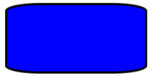

# Rectangle

[ Browse the sample](/samples/dotnet/maui-samples/userinterface-shapes)

The .NET Multi-platform App UI (.NET MAUI) [[Rectangle|Rectangle]] class derives from the [[Shape|Shape]] class, and can be used to draw rectangles and squares. For information on the properties that the [[Rectangle|Rectangle]] class inherits from the [[Shape|Shape]] class, see [[shapes|.NET MAUI Shapes]].

[[Rectangle|Rectangle]] defines the following properties:

- [[Rectangle.RadiusX|RadiusX]], of type `double`, which is the x-axis radius that's used to round the corners of the rectangle. The default value of this property is 0.0.
- [[Rectangle.RadiusY|RadiusY]], of type `double`, which is the y-axis radius that's used to round the corners of the rectangle. The default value of this property is 0.0.

These properties are backed by [[BindableProperty|BindableProperty]] objects, which means that they can be targets of data bindings, and styled.

The [[Rectangle|Rectangle]] class sets the [[Shape.Aspect|Aspect]] property, inherited from the [[Shape|Shape]] class, to `Stretch.Fill`. For more information about the [[Shape.Aspect|Aspect]] property, see [[index#stretch-shapes|Stretch shapes]].

## Create a Rectangle

To draw a rectangle, create a [[Rectangle|Rectangle]] object and sets its [[VisualElement (Controls).WidthRequest|WidthRequest]] and [[VisualElement (Controls).HeightRequest|HeightRequest]] properties. To paint the inside of the rectangle, set its [[Shape.Fill|Fill]] property to a [[Brush|Brush]]-derived object. To give the rectangle an outline, set its [[Shape.Stroke|Stroke]] property to a [[Brush|Brush]]-derived object. The [[Shape.StrokeThickness|StrokeThickness]] property specifies the thickness of the rectangle outline. For more information about [[Brush|Brush]] objects, see [[brushes|Brushes]].

To give the rectangle rounded corners, set its [[Rectangle.RadiusX|RadiusX]] and [[Rectangle.RadiusY|RadiusY]] properties. These properties set the x-axis and y-axis radii that's used to round the corners of the rectangle.

> [!NOTE]
> There's also a [[RoundRectangle|RoundRectangle]] class, that has a `CornerRadius` [[BindableProperty|BindableProperty]], which can be used to draw rectangles with rounded corners.

To draw a square, make the [[VisualElement (Controls).WidthRequest|WidthRequest]] and [[VisualElement (Controls).HeightRequest|HeightRequest]] properties of the [[Rectangle|Rectangle]] object equal.

The following XAML example shows how to draw a filled rectangle:

```xaml
<Rectangle Fill="Red"
           WidthRequest="150"
           HeightRequest="50"
           HorizontalOptions="Start" />
```

In this example, a red filled rectangle with dimensions 150x50 (device-independent units) is drawn:


The following XAML example shows how to draw a filled rectangle, with rounded corners:

```xaml
<Rectangle Fill="Blue"
           Stroke="Black"
           StrokeThickness="3"
           RadiusX="50"
           RadiusY="10"
           WidthRequest="200"
           HeightRequest="100"
           HorizontalOptions="Start" />
```

In this example, a blue filled rectangle with rounded corners is drawn:



For information about drawing a dashed rectangle, see [[index#draw-dashed-shapes|Draw dashed shapes]].
