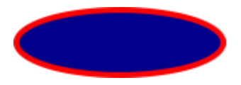
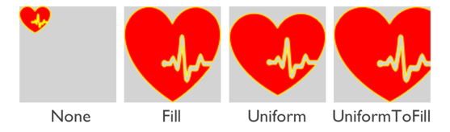
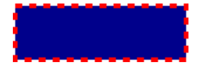
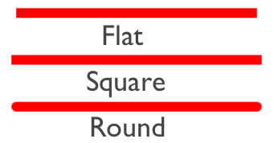
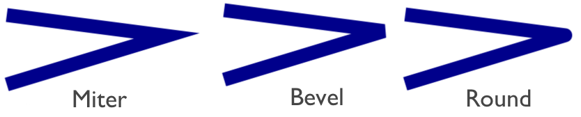

# Shapes

[ Browse the sample](/samples/dotnet/maui-samples/userinterface-shapes)

A .NET Multi-platform App UI (.NET MAUI) [[Shape|Shape]] is a type of [[View|View]] that enables you to draw a shape to the screen. [[Shape|Shape]] objects can be used inside layout classes and most controls, because the [[Shape|Shape]] class derives from the [[View|View]] class. .NET MAUI Shapes is available in the `Shapes` namespace.

[[Shape|Shape]] defines the following properties:

- [[Shape.Aspect|Aspect]], of type [[Stretch|Stretch]], describes how the shape fills its allocated space. The default value of this property is `Stretch.None`.
- [[Shape.Fill|Fill]], of type [[Brush|Brush]], indicates the brush used to paint the shape's interior.
- [[Shape.Stroke|Stroke]], of type [[Brush|Brush]], indicates the brush used to paint the shape's outline.
- [[Shape.StrokeDashArray|StrokeDashArray]], of type `DoubleCollection`, which represents a collection of `double` values that indicate the pattern of dashes and gaps that are used to outline a shape.
- [[Shape.StrokeDashOffset|StrokeDashOffset]], of type `double`, specifies the distance within the dash pattern where a dash begins. The default value of this property is 0.0.
- [[Shape.StrokeDashPattern|StrokeDashPattern]], of type `float[]`, indicates the pattern of dashes and gaps that are used when drawing the stroke for a shape.
- [[Shape.StrokeLineCap|StrokeLineCap]], of type [[PenLineCap|PenLineCap]], describes the shape at the start and end of a line or segment. The default value of this property is `PenLineCap.Flat`.
- [[Shape.StrokeLineJoin|StrokeLineJoin]], of type [[PenLineJoin|PenLineJoin]], specifies the type of join that is used at the vertices of a shape. The default value of this property is `PenLineJoin.Miter`.
- [[Shape.StrokeMiterLimit|StrokeMiterLimit]], of type `double`, specifies the limit on the ratio of the miter length to half the [[Shape.StrokeThickness|StrokeThickness]] of a shape. The default value of this property is 10.0.
- [[Shape.StrokeThickness|StrokeThickness]], of type `double`, indicates the width of the shape outline. The default value of this property is 1.0.

These properties are backed by [[BindableProperty|BindableProperty]] objects, which means that they can be targets of data bindings, and styled.

.NET MAUI defines a number of objects that derive from the [[Shape|Shape]] class. These are [[Ellipse|Ellipse]], [[Line|Line]], [[Path|Path]], [[Polygon (Shapes)|Polygon]], [[Polyline (Shapes)|Polyline]], [[Rectangle|Rectangle]], and [[RoundRectangle|RoundRectangle]].

## Paint shapes

[[Brush|Brush]] objects are used to paint a shapes's [[Shape.Stroke|Stroke]] and [[Shape.Fill|Fill]]:

```xaml
<Ellipse Fill="DarkBlue"
         Stroke="Red"
         StrokeThickness="4"
         WidthRequest="150"
         HeightRequest="50"
         HorizontalOptions="Start" />
```

In this example, the stroke and fill of an [[Ellipse|Ellipse]] are specified:



> [!IMPORTANT]
> [[Brush|Brush]] objects use a type converter that enables [[Color|Color]] values to specified for the [[Shape.Stroke|Stroke]] property.

If you don't specify a [[Brush|Brush]] object for [[Shape.Stroke|Stroke]], or if you set [[Shape.StrokeThickness|StrokeThickness]] to 0, then the border around the shape is not drawn.

For more information about [[Brush|Brush]] objects, see [[brushes|Brushes]]. For more information about valid [[Color|Color]] values, see [[colors|Colors]].

## Stretch shapes

[[Shape|Shape]] objects have an [[Shape.Aspect|Aspect]] property, of type [[Stretch|Stretch]]. This property determines how a [[Shape|Shape]] object's contents is stretched to fill the [[Shape|Shape]] object's layout space. A [[Shape|Shape]] object's layout space is the amount of space the [[Shape|Shape]] is allocated by the .NET MAUI layout system, because of either an explicit [[VisualElement (Controls).WidthRequest|WidthRequest]] and [[VisualElement (Controls).HeightRequest|HeightRequest]] setting or because of its `HorizontalOptions` and `VerticalOptions` settings.

The [[Stretch|Stretch]] enumeration defines the following members:

- `None`, which indicates that the content preserves its original size. This is the default value of the `Shape.Aspect` property.
- [[Shape.Fill|Fill]], which indicates that the content is resized to fill the destination dimensions. The aspect ratio is not preserved.
- `Uniform`, which indicates that the content is resized to fit the destination dimensions, while preserving the aspect ratio.
- `UniformToFill`, indicates that the content is resized to fill the destination dimensions, while preserving the aspect ratio. If the aspect ratio of the destination rectangle differs from the source, the source content is clipped to fit in the destination dimensions.

The following XAML shows how to set the [[Shape.Aspect|Aspect]] property:

```xaml
<Path Aspect="Uniform"
      Stroke="Yellow"
      Fill="Red"
      BackgroundColor="LightGray"
      HorizontalOptions="Start"
      HeightRequest="100"
      WidthRequest="100">
    <Path.Data>
        <!-- Path data goes here -->
    </Path.Data>  
</Path>      
```

In this example, a [[Path|Path]] object draws a heart. The [[Path|Path]] object's [[VisualElement (Controls).WidthRequest|WidthRequest]] and [[VisualElement (Controls).HeightRequest|HeightRequest]] properties are set to 100 device-independent units, and its [[Shape.Aspect|Aspect]] property is set to `Uniform`. As a result, the object's contents are resized to fit the destination dimensions, while preserving the aspect ratio:



## Draw dashed shapes

[[Shape|Shape]] objects have a [[Shape.StrokeDashArray|StrokeDashArray]] property, of type `DoubleCollection`. This property represents a collection of `double` values that indicate the pattern of dashes and gaps that are used to outline a shape. A `DoubleCollection` is an `ObservableCollection` of `double` values. Each `double` in the collection specifies the length of a dash or gap. The first item in the collection, which is located at index 0, specifies the length of a dash. The second item in the collection, which is located at index 1, specifies the length of a gap. Therefore, objects with an even index value specify dashes, while objects with an odd index value specify gaps.

[[Shape|Shape]] objects also have a [[Shape.StrokeDashOffset|StrokeDashOffset]] property, of type `double`, which specifies the distance within the dash pattern where a dash begins. Failure to set this property will result in the [[Shape|Shape]] having a solid outline.

Dashed shapes can be drawn by setting both the [[Shape.StrokeDashArray|StrokeDashArray]] and [[Shape.StrokeDashOffset|StrokeDashOffset]] properties. The [[Shape.StrokeDashArray|StrokeDashArray]] property should be set to one or more `double` values, with each pair delimited by a single comma and/or one or more spaces. For example, "0.5 1.0" and "0.5,1.0" are both valid.

The following XAML example shows how to draw a dashed rectangle:

```xaml
<Rectangle Fill="DarkBlue"
           Stroke="Red"
           StrokeThickness="4"
           StrokeDashArray="1,1"
           StrokeDashOffset="6"
           WidthRequest="150"
           HeightRequest="50"
           HorizontalOptions="Start" />
```

In this example, a filled rectangle with a dashed stroke is drawn:



## Control line ends

A line has three parts: start cap, line body, and end cap. The start and end caps describe the shape at the start and end of a line, or segment.

[[Shape|Shape]] objects have a [[Shape.StrokeLineCap|StrokeLineCap]] property, of type [[PenLineCap|PenLineCap]], that describes the shape at the start and end of a line, or segment. The [[PenLineCap|PenLineCap]] enumeration defines the following members:

- `Flat`, which represents a cap that doesn't extend past the last point of the line. This is comparable to no line cap, and is the default value of the [[Shape.StrokeLineCap|StrokeLineCap]] property.
- `Square`, which represents a rectangle that has a height equal to the line thickness and a length equal to half the line thickness.
- `Round`, which represents a semicircle that has a diameter equal to the line thickness.

> [!IMPORTANT]
> The [[Shape.StrokeLineCap|StrokeLineCap]] property has no effect if you set it on a shape that has no start or end points. For example, this property has no effect if you set it on an [[Ellipse|Ellipse]], or [[Rectangle|Rectangle]].

The following XAML shows how to set the [[Shape.StrokeLineCap|StrokeLineCap]] property:

```xaml
<Line X1="0"
      Y1="20"
      X2="300"
      Y2="20"
      StrokeLineCap="Round"
      Stroke="Red"
      StrokeThickness="12" />
```

In this example, the red line is rounded at the start and end of the line:



## Control line joins

[[Shape|Shape]] objects have a [[Shape.StrokeLineJoin|StrokeLineJoin]] property, of type [[PenLineJoin|PenLineJoin]], that specifies the type of join that is used at the vertices of the shape. The [[PenLineJoin|PenLineJoin]] enumeration defines the following members:

- `Miter`, which represents regular angular vertices. This is the default value of the [[Shape.StrokeLineJoin|StrokeLineJoin]] property.
- `Bevel`, which represents beveled vertices.
- `Round`, which represents rounded vertices.

> [!NOTE]
> When the [[Shape.StrokeLineJoin|StrokeLineJoin]] property is set to `Miter`, the [[Shape.StrokeMiterLimit|StrokeMiterLimit]] property can be set to a `double` to limit the miter length of line joins in the shape.

The following XAML shows how to set the [[Shape.StrokeLineJoin|StrokeLineJoin]] property:

```xaml
<Polyline Points="20 20,250 50,20 120"
          Stroke="DarkBlue"
          StrokeThickness="20"
          StrokeLineJoin="Round" />
```

In this example, the dark blue polyline has rounded joins at its vertices:


