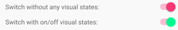
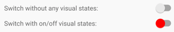

# Switch

[ Browse the sample](/samples/dotnet/maui-samples/userinterface-switch)

The .NET Multi-platform App UI (.NET MAUI) [[Switch (Controls)|Switch]] control is a horizontal toggle button that can be manipulated by the user to toggle between on and off states, which are represented by a `boolean` value.

The following screenshot shows a [[Switch (Controls)|Switch]] control in its on and off toggle states:


The [[Switch (Controls)|Switch]] control defines the following properties:


- `IsToggled` is a `boolean` value that indicates whether the [[Switch (Controls)|Switch]] is on. The default value of this property is `false`.
- `OnColor` is a [[Color|Color]] that affects how the [[Switch (Controls)|Switch]] is rendered in the toggled, or on state.
- `ThumbColor` is the [[Color|Color]] of the switch thumb.


- `IsToggled` is a `boolean` value that indicates whether the [[Switch (Controls)|Switch]] is on. The default value of this property is `false`.
- `OffColor` is a [[Color|Color]] that determines how the [[Switch (Controls)|Switch]] is rendered in the off state.
- `OnColor` is a [[Color|Color]] that determines how the [[Switch (Controls)|Switch]] is rendered in the toggled, or on state.
- `ThumbColor` is the [[Color|Color]] of the switch thumb.


These properties are backed by [[BindableProperty|BindableProperty]] objects, which means they can be styled and be the target of data bindings.

The [[Switch (Controls)|Switch]] control defines a `Toggled` event that's raised when the `IsToggled` property changes, either through user manipulation or when an application sets the `IsToggled` property. The `ToggledEventArgs` object that accompanies the `Toggled` event has a single property named `Value`, of type `bool`. When the event is raised, the value of the `Value` property reflects the new value of the `IsToggled` property.

## Create a Switch

A [[Switch (Controls)|Switch]] can be instantiated in XAML. Its `IsToggled` property can be set to toggle the [[Switch (Controls)|Switch]]. By default, the `IsToggled` property is `false`. The following example shows how to instantiate a [[Switch (Controls)|Switch]] in XAML with the optional `IsToggled` property set:

```xaml
<Switch IsToggled="true"
        SemanticProperties.Description="Toggle setting" />
```

A [[Switch (Controls)|Switch]] can also be created in code:

```csharp
Switch switchControl = new Switch { IsToggled = true };
SemanticProperties.SetDescription(switchControl, "Toggle setting");
```

## Switch appearance


In addition to the properties that [[Switch (Controls)|Switch]] inherits from the [[View|View]] class, [[Switch (Controls)|Switch]] also defines `OnColor` and `ThumbColor` properties. The `OnColor` property can be set to define the [[Switch (Controls)|Switch]] color when it is toggled to its on state, and the `ThumbColor` property can be set to define the [[Color|Color]] of the switch thumb. The following example shows how to instantiate a [[Switch (Controls)|Switch]] in XAML with these properties set:

```xaml
<Switch OnColor="Orange"
        ThumbColor="Green" />
```

The properties can also be set when creating a [[Switch (Controls)|Switch]] in code:

```csharp
Switch switch = new Switch { OnColor = Colors.Orange, ThumbColor = Colors.Green };
```


In addition to the properties that [[Switch (Controls)|Switch]] inherits from the [[View|View]] class, [[Switch (Controls)|Switch]] also defines `OffColor`, `OnColor` and `ThumbColor` properties. The `OffColor` property can be set to define the [[Switch (Controls)|Switch]] color in its off state. The `OnColor` property can be set to define the [[Switch (Controls)|Switch]] color when it's toggled to its on state, and the `ThumbColor` property can be set to define the [[Color|Color]] of the switch thumb. The following example shows how to instantiate a [[Switch (Controls)|Switch]] in XAML with these properties set:

```xaml
<Switch OffColor="Red"
        OnColor="Orange"
        ThumbColor="Green" />
```

The properties can also be set when creating a [[Switch (Controls)|Switch]] in code:

```csharp
Switch switch = new Switch { OffColor = Colors.Red, OnColor = Colors.Orange, ThumbColor = Colors.Green };
```


The following screenshot shows the [[Switch (Controls)|Switch]] in its on and off toggle states, with the `OnColor` and `ThumbColor` properties set:


## Respond to a Switch state change

When the `IsToggled` property changes, either through user manipulation or when an application sets the `IsToggled` property, the `Toggled` event fires. An event handler for this event can be registered to respond to the change:

```xaml
<Switch Toggled="OnToggled" />
```

The code-behind file contains the handler for the `Toggled` event:

```csharp
void OnToggled(object sender, ToggledEventArgs e)
{
    // Perform an action after examining e.Value
}
```

The `sender` argument in the event handler is the [[Switch (Controls)|Switch]] responsible for firing this event. You can use the `sender` property to access the [[Switch (Controls)|Switch]] object, or to distinguish between multiple [[Switch (Controls)|Switch]] objects sharing the same `Toggled` event handler.

The `Toggled` event handler can also be assigned in code:

```csharp
Switch switchControl = new Switch {...};
switchControl.Toggled += (sender, e) =>
{
    // Perform an action after examining e.Value
};
```

## Data bind a Switch

The `Toggled` event handler can be eliminated by using data binding and triggers to respond to a [[Switch (Controls)|Switch]] changing toggle states.

```xaml
<Switch x:Name="styleSwitch" />
<Label Text="Lorem ipsum dolor sit amet, elit rutrum, enim hendrerit augue vitae praesent sed non, lorem aenean quis praesent pede.">
    <Label.Triggers>
        <DataTrigger TargetType="Label"
                     Binding="{Binding x:DataType='Switch', Source={x:Reference styleSwitch}, Path=IsToggled}"
                     Value="true">
            <Setter Property="FontAttributes"
                    Value="Italic, Bold" />
            <Setter Property="FontSize"
                    Value="18" />
        </DataTrigger>
    </Label.Triggers>
</Label>
```

In this example, the [[Label (Controls)|Label]] uses a binding expression in a [[DataTrigger|DataTrigger]] to monitor the `IsToggled` property of the [[Switch (Controls)|Switch]] named `styleSwitch`. When this property becomes `true`, the `FontAttributes` and `FontSize` properties of the [[Label (Controls)|Label]] are changed. When the `IsToggled` property returns to `false`, the `FontAttributes` and `FontSize` properties of the [[Label (Controls)|Label]] are reset to their initial state.

For information about triggers, see [[triggers|Triggers]].

## Switch visual states

[[Switch (Controls)|Switch]] has `On` and `Off` visual states that can be used to initiate a visual change when the `IsToggled` property changes.

The following XAML example shows how to define visual states for the `On` and `Off` states:

```xaml
<Switch IsToggled="True">
    <VisualStateManager.VisualStateGroups>
        <VisualStateGroupList>
             <VisualStateGroup x:Name="CommonStates">
                 <VisualState x:Name="On">
                     <VisualState.Setters>
                         <Setter Property="ThumbColor"
                             Value="MediumSpringGreen" />
                     </VisualState.Setters>
                 </VisualState>
                 <VisualState x:Name="Off">
                     <VisualState.Setters>
                         <Setter Property="ThumbColor"
                             Value="Red" />
                     </VisualState.Setters>
                 </VisualState>
             </VisualStateGroup>
        </VisualStateGroupList>
    </VisualStateManager.VisualStateGroups>
</Switch>
```

In this example, the `On` [[VisualState|VisualState]] specifies that when the `IsToggled` property is `true`, the `ThumbColor` property will be set to medium spring green. The `Off` [[VisualState|VisualState]] specifies that when the `IsToggled` property is `false`, the `ThumbColor` property will be set to red. Therefore, the overall effect is that when the [[Switch (Controls)|Switch]] is in an off position its thumb is red, and its thumb is medium spring green when the [[Switch (Controls)|Switch]] is in an on position:




For more information about visual states, see [[visual-states|Visual states]].

## Disable a Switch

An app may enter a state where the [[Switch (Controls)|Switch]] being toggled is not a valid operation. In such cases, the [[Switch (Controls)|Switch]] can be disabled by setting its `IsEnabled` property to `false`. This will prevent users from being able to manipulate the [[Switch (Controls)|Switch]].
