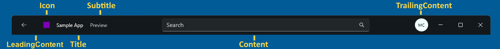

# TitleBar

[ Browse the sample](/samples/dotnet/maui-samples/userinterface-titlebar)

The .NET Multi-platform App UI (.NET MAUI) [[TitleBar|TitleBar]] is a view that enables you to add a custom title bar to a [[Window|Window]] to match the personality of your app. The following diagram shows the components of the [[TitleBar|TitleBar]]:



> [!IMPORTANT]
> [[TitleBar|TitleBar]] is only available on Mac Catalyst and Windows.

[[TitleBar|TitleBar]] defines the following properties:

- [[TitleBar.Content|Content]], of type [[IView|IView]], which specifies the control for the content that's centered in the title bar, and is allocated the space between the leading and trailing content.
- [[TitleBar.DefaultTemplate|DefaultTemplate]], of type [[ControlTemplate|ControlTemplate]], which represents the default template for the title bar.
- [[TitleBar.ForegroundColor|ForegroundColor]], of type [[Color|Color]], which specifies the foreground colour of the title bar, and is used as the color for the title and subtitle text.
- [[TitleBar.Icon|Icon]], of type [[ImageSource|ImageSource]], which represents an optional 16x16px icon image for the title bar.
- [[TitleBar.LeadingContent|LeadingContent]], of type [[IView|IView]], which specifies the control for the content that precedes the icon.
- [[TitleBar.PassthroughElements|PassthroughElements]], of type `IList<IView>`, which represents a list of elements that should prevent dragging in the title bar region and instead directly handle input.
- [[TitleBar.Subtitle|Subtitle]], of type `string`, which specifies the subtitle text of the title bar. This is usually secondary information about the app or window.
- [[TitleBar.Title|Title]], of type `string`, which specifies the title text of the title bar. This is usually the name of the app or indicates the purpose of the window.
- [[TitleBar.TrailingContent|TrailingContent]], of type [[IView|IView]], which specifies the control that follows the `Content` control.

These properties, with the exception of [[TitleBar.DefaultTemplate|DefaultTemplate]] and [[TitleBar.PassthroughElements|PassthroughElements]], are backed by [[BindableProperty|BindableProperty]] objects, which means that they can be styled, and be the target of data bindings.

> [!IMPORTANT]
> Views set as the value of the [[TitleBar.Content|Content]], [[TitleBar.LeadingContent|LeadingContent]], and [[TitleBar.TrailingContent|TrailingContent]] properties will block all input to the title bar region and will directly handle input.

The standard title bar height is 32px, but can be set to a larger value. For information about designing your title bar on Windows, see [Title bar](/windows/apps/design/basics/titlebar-design).

## Create a TitleBar

To add a title bar to a window, set the [[Window.TitleBar|Window.TitleBar]] property to a [[TitleBar|TitleBar]] object.

The following XAML example shows how to add a [[TitleBar|TitleBar]] to a [[Window|Window]]:

```xaml
<Window xmlns="http://schemas.microsoft.com/dotnet/2021/maui"
        xmlns:x="http://schemas.microsoft.com/winfx/2009/xaml"
        xmlns:local="clr-namespace:TitleBarDemo"
        x:Class="TitleBarDemo.MainWindow"
        x:DataType="local:MainWindowViewModel">
    ...
    <Window.TitleBar>
        <TitleBar Title="{Binding Title}"
                  Subtitle="{Binding Subtitle}"
                  IsVisible="{Binding ShowTitleBar}"
                  BackgroundColor="#512BD4"
                  ForegroundColor="White"                  
                  HeightRequest="48">
            <TitleBar.Content>
                <SearchBar Placeholder="Search"
                           PlaceholderColor="White"
                           MaximumWidthRequest="300"
                           HorizontalOptions="Fill"
                           VerticalOptions="Center" />
            </TitleBar.Content>            
        </TitleBar>
    </Window.TitleBar>
</Window>
```

A [[TitleBar|TitleBar]] can also be defined in C# and added to a [[Window|Window]]:

```csharp
Window window = new Window
{
    TitleBar = new TitleBar
    {
        Icon = "titlebar_icon.png"
        Title = "My App",
        Subtitle = "Demo"
        Content = new SearchBar { ... }      
    }
};
```

A [[TitleBar|TitleBar]] is highly customizable through its [[TitleBar.Content|Content]], [[TitleBar.LeadingContent|LeadingContent]], and [[TitleBar.TrailingContent|TrailingContent]] properties:

```xaml
<TitleBar Title="My App"
          BackgroundColor="#512BD4"
          HeightRequest="48">
    <TitleBar.Content>
        <SearchBar Placeholder="Search"
                   MaximumWidthRequest="300"
                   HorizontalOptions="Fill"
                   VerticalOptions="Center" />
    </TitleBar.Content>
    <TitleBar.TrailingContent>
        <ImageButton HeightRequest="36"
                     WidthRequest="36"
                     BorderWidth="0"
                     Background="Transparent">
            <ImageButton.Source>
                <FontImageSource Size="16"
                                 Glyph="&#xE713;"
                                 FontFamily="SegoeMDL2"/>
            </ImageButton.Source>
        </ImageButton>
    </TitleBar.TrailingContent>
</TitleBar>
```

The following screenshot shows the resulting appearance:


> [!NOTE]
> The title bar can be hidden by setting the [[VisualElement (Controls).IsVisible|IsVisible]] property, which causes the window content to be displayed in the title bar region.

## TitleBar visual states

[[TitleBar|TitleBar]] defines the following visual states that can be used to initiate a visual change to the [[TitleBar|TitleBar]]:

- `IconVisible`
- `IconCollapsed`
- `TitleVisible`
- `TitleCollapsed`
- `SubtitleVisible`
- `SubtitleCollapsed`
- `LeadingContentVisible`
- `LeadingContentCollapsed`
- `ContentVisible`
- `ContentCollapsed`
- `TrailingContentVisible`
- `TrailingContentCollapsed`
- `TitleBarTitleActive`
- `TitleBarTitleInactive`

The following XAML example shows how to define a visual state for the `TitleBarTitleActive` and `TitleBarTitleInactive` states:

```xaml
<TitleBar ...>
    <VisualStateManager.VisualStateGroups>
        <VisualStateGroupList>
            <VisualStateGroup x:Name="TitleActiveStates">
                <VisualState x:Name="TitleBarTitleActive">
                    <VisualState.Setters>
                        <Setter Property="BackgroundColor" Value="Transparent" />
                        <Setter Property="ForegroundColor" Value="Black" />
                    </VisualState.Setters>
                </VisualState>
                <VisualState x:Name="TitleBarTitleInactive">
                    <VisualState.Setters>
                        <Setter Property="BackgroundColor" Value="White" />
                        <Setter Property="ForegroundColor" Value="Gray" />
                    </VisualState.Setters>
                </VisualState>
            </VisualStateGroup>
        </VisualStateGroupList>
    </VisualStateManager.VisualStateGroups>
</TitleBar>
```

In this example, the visual state sets the `BackgroundColor` and `ForegroundColor` properties to specific colors based on whether the title bar is active or inactive.

For more information about visual states, see [[visual-states|Visual states]].
