# Draw graphical objects

[ Browse the sample](/samples/dotnet/maui-samples/userinterface-graphicsview)

.NET Multi-platform App UI (.NET MAUI) graphics, in the `Graphics` namespace, enables you to draw graphical objects on a canvas that's defined as an [[ICanvas|ICanvas]] object.

The .NET MAUI [[GraphicsView|GraphicsView]] control provides access to an [[ICanvas|ICanvas]] object, on which properties can be set and methods invoked to draw graphical objects. For more information about the [[GraphicsView|GraphicsView]], see [[graphicsview|GraphicsView]].

> [!NOTE]
> Many of the graphical objects have `Draw` and `Fill` methods, for example `DrawRectangle%2A` and `FillRectangle%2A`. A `Draw` method draws the outline of the shape, which is unfilled. A `Fill` method draws the outline of the shape and also fills it.

Graphical objects are drawn on an [[ICanvas|ICanvas]] using a device-independent unit that's recognized by each platform. This ensures that graphical objects are scaled appropriately to the pixel density of the underlying platform.

## Draw a line

Lines can be drawn on an [[ICanvas|ICanvas]] using the `DrawLine%2A` method, which requires four `float` arguments that represent the start and end points of the line.

The following example shows how to draw a line:

```csharp
canvas.StrokeColor = Colors.Red;
canvas.StrokeSize = 6;
canvas.DrawLine(10, 10, 90, 100);
```

In this example, a red diagonal line is drawn from (10,10) to (90,100):

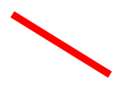

> [!NOTE]
> There's also a `DrawLine%2A` overload that takes two [[PointF|PointF]] arguments.

The following example shows how to draw a dashed line:

```csharp
canvas.StrokeColor = Colors.Red;
canvas.StrokeSize = 4;
canvas.StrokeDashPattern = new float[] { 2, 2 };
canvas.DrawLine(10, 10, 90, 100);
```

In this example, a red dashed diagonal line is drawn from (10,10) to (90,100):

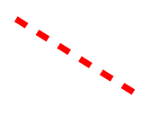

For more information about dashed lines, see [Draw dashed objects](#draw-dashed-objects).

## Draw an ellipse

Ellipses and circles can be drawn on an [[ICanvas|ICanvas]] using the `DrawEllipse%2A` method, which requires `x`, `y`, `width`, and `height` arguments, of type `float`.

The following example shows how to draw an ellipse:

```csharp
canvas.StrokeColor = Colors.Red;
canvas.StrokeSize = 4;
canvas.DrawEllipse(10, 10, 100, 50);
```

In this example, a red ellipse with dimensions 100x50 is drawn at (10,10):

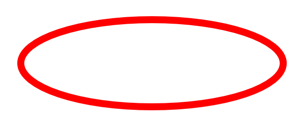

To draw a circle, make the `width` and `height` arguments to the `DrawEllipse%2A` method equal:

```csharp
canvas.StrokeColor = Colors.Red;
canvas.StrokeSize = 4;
canvas.DrawEllipse(10, 10, 100, 100);
```

In this example, a red circle with dimensions 100x100 is drawn at (10,10):

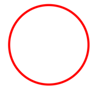

> [!NOTE]
> Circles can also be drawn with the `DrawCircle%2A` method.

For information about drawing a dashed ellipse, see [Draw dashed objects](#draw-dashed-objects).

A filled ellipse can be drawn with the `FillEllipse%2A` method, which also requires `x`, `y`, `width`, and `height` arguments, of type `float`:

```csharp
canvas.FillColor = Colors.Red;
canvas.FillEllipse(10, 10, 150, 50);
```

In this example, a red filled ellipse with dimensions 150x50 is drawn at (10,10):

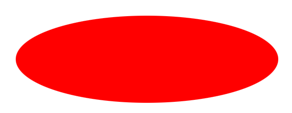

The [[ICanvas.FillColor|FillColor]] property of the [[ICanvas|ICanvas]] object must be set to a [[Color|Color]] before invoking the `FillEllipse%2A` method.

Filled circles can also be drawn with the `FillCircle%2A` method.

> [!NOTE]
> There are `DrawEllipse%2A` and `FillEllipse%2A` overloads that take [[Rect (Graphics)|Rect]] and [[RectF|RectF]] arguments. In addition, there are also `DrawCircle%2A` and `FillCircle%2A` overloads.

## Draw a rectangle

Rectangles and squares can be drawn on an [[ICanvas|ICanvas]] using the `DrawRectangle%2A` method, which requires `x`, `y`, `width`, and `height` arguments, of type `float`.

The following example shows how to draw a rectangle:

```csharp
canvas.StrokeColor = Colors.DarkBlue;
canvas.StrokeSize = 4;
canvas.DrawRectangle(10, 10, 100, 50);
```

In this example, a dark blue rectangle with dimensions 100x50 is drawn at (10,10):

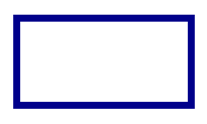

To draw a square, make the `width` and `height` arguments to the `DrawRectangle%2A` method equal:

```csharp
canvas.StrokeColor = Colors.DarkBlue;
canvas.StrokeSize = 4;
canvas.DrawRectangle(10, 10, 100, 100);
```

In this example, a dark blue square with dimensions 100x100 is drawn at (10,10):

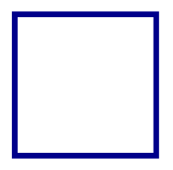

For information about drawing a dashed rectangle, see [Draw dashed objects](#draw-dashed-objects).

A filled rectangle can be drawn with the `FillRectangle%2A` method, which also requires `x`, `y`, `width`, and `height` arguments, of type `float`:

```csharp
canvas.FillColor = Colors.DarkBlue;
canvas.FillRectangle(10, 10, 100, 50);
```

In this example, a dark blue filled rectangle with dimensions 100x50 is drawn at (10,10):


The [[ICanvas.FillColor|FillColor]] property of the [[ICanvas|ICanvas]] object must be set to a [[Color|Color]] before invoking the `FillRectangle%2A` method.

> [!NOTE]
> There are `DrawRectangle%2A` and `FillRectangle%2A` overloads that take [[Rect (Graphics)|Rect]] and [[RectF|RectF]] arguments.

## Draw a rounded rectangle

Rounded rectangles and squares can be drawn on an [[ICanvas|ICanvas]] using the `DrawRoundedRectangle%2A` method, which requires `x`, `y`, `width`, `height`, and `cornerRadius` arguments, of type `float`. The `cornerRadius` argument specifies the radius used to round the corners of the rectangle.

The following example shows how to draw a rounded rectangle:

```csharp
canvas.StrokeColor = Colors.Green;
canvas.StrokeSize = 4;
canvas.DrawRoundedRectangle(10, 10, 100, 50, 12);
```

In this example, a green rectangle with rounded corners and dimensions 100x50 is drawn at (10,10):

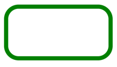

For information about drawing a dashed rounded rectangle, see [Draw dashed objects](#draw-dashed-objects).

A filled rounded rectangle can be drawn with the `FillRoundedRectangle%2A` method, which also requires `x`, `y`, `width`, `height`, and `cornerRadius` arguments, of type `float`:

```csharp
canvas.FillColor = Colors.Green;
canvas.FillRoundedRectangle(10, 10, 100, 50, 12);
```

In this example, a green filled rectangle with rounded corners and dimensions 100x50 is drawn at (10,10):

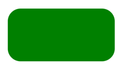

The [[ICanvas.FillColor|FillColor]] property of the [[ICanvas|ICanvas]] object must be set to a [[Color|Color]] before invoking the `FillRoundedRectangle%2A` method.

> [!NOTE]
> There are `DrawRoundedRectangle%2A` and `FillRoundedRectangle%2A` overloads that take [[Rect (Graphics)|Rect]] and [[RectF|RectF]] arguments, and overloads that enable the radius of each corner to be separately specified.

## Draw an arc

Arcs can be drawn on an [[ICanvas|ICanvas]] using the `DrawArc%2A` method, which requires `x`, `y`, `width`, `height`, `startAngle`, and `endAngle` arguments of type `float`, and `clockwise` and `closed` arguments of type `bool`. The `startAngle` argument specifies the angle from the x-axis to the starting point of the arc. The `endAngle` argument specifies the angle from the x-axis to the end point of the arc. The `clockwise` argument specifies the direction in which the arc is drawn, and the `closed` argument specifies whether the end point of the arc will be connected to the start point.

The following example shows how to draw an arc:

```csharp
canvas.StrokeColor = Colors.Teal;
canvas.StrokeSize = 4;
canvas.DrawArc(10, 10, 100, 100, 0, 180, true, false);
```

In this example, a teal arc of dimensions 100x100 is drawn at (10,10). The arc is drawn in a clockwise direction from 0 degrees to 180 degrees, and isn't closed:


For information about drawing a dashed arc, see [Draw dashed objects](#draw-dashed-objects).

A filled arc can be drawn with the `FillArc%2A` method, which requires `x`, `y`, `width`, `height`, `startAngle`, and `endAngle` arguments of type `float`, and a `clockwise` argument of type `bool`:

```csharp
canvas.FillColor = Colors.Teal;
canvas.FillArc(10, 10, 100, 100, 0, 180, true);
```

In this example, a filled teal arc of dimensions 100x100 is drawn at (10,10). The arc is drawn in a clockwise direction from 0 degrees to 180 degrees, and is closed automatically:

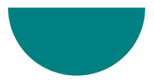

The [[ICanvas.FillColor|FillColor]] property of the [[ICanvas|ICanvas]] object must be set to a [[Color|Color]] before invoking the `FillArc%2A` method.

> [!NOTE]
> There are `DrawArc%2A` and `FillArc%2A` overloads that take [[Rect (Graphics)|Rect]] and [[RectF|RectF]] arguments.

## Draw a path

A path is a collection of one or more *contours*. Each contour is a collection of *connected* straight lines and curves. Contours are not connected to each other but they might visually overlap. Sometimes a single contour can overlap itself.

Paths are used to draw curves and complex shapes and can be drawn on an [[ICanvas|ICanvas]] using the `DrawPath%2A` method, which requires a [[PathF|PathF]] argument.

A contour generally begins with a call to the `PathF.MoveTo%2A` method, which you can express either as a [[PointF|PointF]] value or as separate `x` and `y` coordinates. The `MoveTo%2A` call establishes a point at the beginning of the contour and an initial current point. You can then call the following methods to continue the contour with a line or curve from the current point to a point specified in the method, which then becomes the new current point:

- `LineTo%2A` to add a straight line to the path.
- `AddArc%2A` to add an arc, which is a line on the circumference of a circle or ellipse.
- `CurveTo%2A` to add a cubic Bezier spline.
- `QuadTo%2A` to add a quadratic Bezier spline.

None of these methods contain all of the data necessary to describe the line or curve. Instead, each method works with the current point established by the method call immediately preceding it. For example, the `LineTo%2A` method adds a straight line to the contour based on the current point.

A contour ends with another call to `MoveTo%2A`, which begins a new contour, or a call to `Close%2A`, which closes the contour. The `Close%2A` method automatically appends a straight line from the current point to the first point of the contour, and marks the path as closed.

The [[PathF|PathF]] class also defines other methods and properties. The following methods add entire contours to the path:

- `AppendEllipse%2A` appends a closed ellipse contour to the path.
- `AppendCircle%2A` appends a closed circle contour to the path.
- `AppendRectangle%2A` appends a closed rectangle contour to the path.
- `AppendRoundedRectangle%2A` appends a closed rectangle with rounded corners to the path.

The following example shows how to draw a path:

```csharp
PathF path = new PathF();
path.MoveTo(40, 10);
path.LineTo(70, 80);
path.LineTo(10, 50);
path.Close();
canvas.StrokeColor = Colors.Green;
canvas.StrokeSize = 6;
canvas.DrawPath(path);
```

In this example, a closed green triangle is drawn:

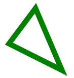

A filled path can be drawn with the `FillPath%2A`, which also requires a [[PathF|PathF]] argument:

```csharp
PathF path = new PathF();
path.MoveTo(40, 10);
path.LineTo(70, 80);
path.LineTo(10, 50);
canvas.FillColor = Colors.SlateBlue;
canvas.FillPath(path);
```

In this example, a filled slate blue triangle is drawn:


The [[ICanvas.FillColor|FillColor]] property of the [[ICanvas|ICanvas]] object must be set to a [[Color|Color]] before invoking the `FillPath%2A` method.

> [!IMPORTANT]
> The `FillPath%2A` method has an overload that enables a [[WindingMode|WindingMode]] to be specified, which sets the fill algorithm that's used. For more information, see [[windingmodes|Winding modes]].

## Draw an image

Images can be drawn on an [[ICanvas|ICanvas]] using the `DrawImage%2A` method, which requires an [[IImage (Graphics)|IImage]] argument, and `x`, `y`, `width`, and `height` arguments, of type `float`.

The following example shows how to load an image and draw it to the canvas:

```csharp
using System.Reflection;
using IImage = Microsoft.Maui.Graphics.IImage;
using Microsoft.Maui.Graphics.Platform;

IImage image;
Assembly assembly = GetType().GetTypeInfo().Assembly;
using (Stream stream = assembly.GetManifestResourceStream("GraphicsViewDemos.Resources.Images.dotnet_bot.png"))
{
    image = PlatformImage.FromStream(stream);
}

if (image != null)
{
    canvas.DrawImage(image, 10, 10, image.Width, image.Height);
}
```

In this example, an image is retrieved from the assembly and loaded as a stream. It's then drawn at actual size at (10,10):


> [!IMPORTANT]
> Loading an image that's embedded in an assembly requires the image to have its build action set to **Embedded Resource** rather than **MauiImage**.

## Draw a string

Strings can be drawn on an [[ICanvas|ICanvas]] using one of the `DrawString%2A` overloads. The appearance of each string can be defined by setting the [[ICanvas.Font|Font]], [[ICanvas.FontColor|FontColor]], and [[ICanvas.FontSize|FontSize]] properties. String alignment can be specified by horizontal and vertical alignment options that perform alignment within the string's bounding box.

> [!NOTE]
> The bounding box for a string is defined by its `x`, `y`, `width`, and `height` arguments.

The following examples show how to draw strings:

```csharp
canvas.FontColor = Colors.Blue;
canvas.FontSize = 18;

canvas.Font = Font.Default;
canvas.DrawString("Text is left aligned.", 20, 20, 380, 100, HorizontalAlignment.Left, VerticalAlignment.Top);
canvas.DrawString("Text is centered.", 20, 60, 380, 100, HorizontalAlignment.Center, VerticalAlignment.Top);
canvas.DrawString("Text is right aligned.", 20, 100, 380, 100, HorizontalAlignment.Right, VerticalAlignment.Top);

canvas.Font = Font.DefaultBold;
canvas.DrawString("This text is displayed using the bold system font.", 20, 140, 350, 100, HorizontalAlignment.Left, VerticalAlignment.Top);

canvas.Font = new Font("Arial");
canvas.FontColor = Colors.Black;
canvas.SetShadow(new SizeF(6, 6), 4, Colors.Gray);
canvas.DrawString("This text has a shadow.", 20, 200, 300, 100, HorizontalAlignment.Left, VerticalAlignment.Top);
```

In this example, strings with different appearance and alignment options are displayed:

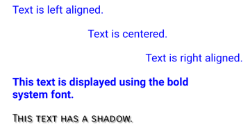

> [!NOTE]
> The `DrawString%2A` overloads also enable truncation and line spacing to be specified.

For information about drawing shadows, see [Draw a shadow](#draw-a-shadow).

## Draw attributed text

Attributed text can be drawn on an [[ICanvas|ICanvas]] using the `DrawText%2A` method, which requires an [[IAttributedText|IAttributedText]] argument, and `x`, `y`, `width`, and `height` arguments, of type `float`. Attributed text is a string with associated attributes for parts of its text, that typically represents styling data.

The following example shows how to draw attributed text:

```csharp
using Microsoft.Maui.Graphics.Text;
...

canvas.Font = new Font("Arial");
canvas.FontSize = 18;
canvas.FontColor = Colors.Blue;

string markdownText = @"This is *italic text*, **bold text**, __underline text__, and ***bold italic text***.";
IAttributedText attributedText = MarkdownAttributedTextReader.Read(markdownText); // Requires the Microsoft.Maui.Graphics.Text.Markdig package
canvas.DrawText(attributedText, 10, 10, 400, 400);
```

In this example, markdown is converted to attributed text and displayed with the correct styling:

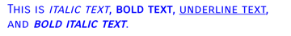

> [!IMPORTANT]
> Drawing attributed text requires you to have added the `Microsoft.Maui.Graphics.Text.Markdig` NuGet package to your project.

## Draw with fill and stroke

Graphical objects with both fill and stroke can be drawn to the canvas by calling a draw method *after* a fill method. For example, to draw an outlined rectangle, set the [[ICanvas.FillColor|FillColor]] and [[ICanvas.StrokeColor|StrokeColor]] properties to colors, then call the `FillRectangle%2A` method followed by the `DrawRectangle%2A` method.

The following example draws a filled circle, with a stroke outline, as a path:

```csharp
float radius = Math.Min(dirtyRect.Width, dirtyRect.Height) / 4;

PathF path = new PathF();
path.AppendCircle(dirtyRect.Center.X, dirtyRect.Center.Y, radius);

canvas.StrokeColor = Colors.Blue;
canvas.StrokeSize = 10;
canvas.FillColor = Colors.Red;

canvas.FillPath(path);
canvas.DrawPath(path);
```

In this example, the stroke and fill colors for a [[PathF|PathF]] object are specified. The filled circle is drawn, then the outline stroke of the circle:

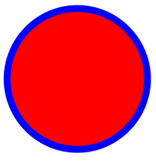

> [!WARNING]
> Calling a draw method before a fill method will result in an incorrect z-order. The fill will be drawn over the stroke, and the stroke won't be visible.

## Draw a shadow

Graphical objects drawn on an [[ICanvas|ICanvas]] can have a shadow applied using the `SetShadow%2A` method, which takes the following arguments:

- `offset`, of type [[SizeF|SizeF]], specifies an offset for the shadow, which represents the position of a light source that creates the shadow.
- `blur`, of type `float`, represents the amount of blur to apply to the shadow.
- `color`, of type [[Color|Color]], defines the color of the shadow.

The following examples show how to add shadows to filled objects:

```csharp
canvas.FillColor = Colors.Red;
canvas.SetShadow(new SizeF(10, 10), 4, Colors.Grey);
canvas.FillRectangle(10, 10, 90, 100);

canvas.FillColor = Colors.Green;
canvas.SetShadow(new SizeF(10, -10), 4, Colors.Grey);
canvas.FillEllipse(110, 10, 90, 100);

canvas.FillColor = Colors.Blue;
canvas.SetShadow(new SizeF(-10, 10), 4, Colors.Grey);
canvas.FillRoundedRectangle(210, 10, 90, 100, 25);
```

In these examples, shadows whose light sources are in different positions are added to the filled objects, with identical amounts of blur:

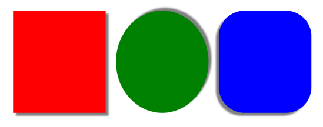

## Draw dashed objects

[[ICanvas|ICanvas]] objects have a [[ICanvas.StrokeDashPattern|StrokeDashPattern]] property, of type `float[]`. This property is an array of `float` values that indicate the pattern of dashes and gaps that are to be used when drawing the stroke for an object. Each `float` in the array specifies the length of a dash or gap. The first item in the array specifies the length of a dash, while the second item in the array specifies the length of a gap. Therefore, `float` values with an even index value specify dashes, while `float` values with an odd index value specify gaps.

The following example shows how to draw a dashed square, using a regular dash:

```csharp
canvas.StrokeColor = Colors.Red;
canvas.StrokeSize = 4;
canvas.StrokeDashPattern = new float[] { 2, 2 };
canvas.DrawRectangle(10, 10, 90, 100);
```

In this example, a square with a regular dashed stroke is drawn:

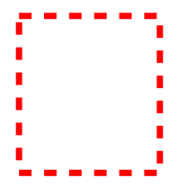

The following example shows how to draw a dashed square, using an irregular dash:

```csharp
canvas.StrokeColor = Colors.Red;
canvas.StrokeSize = 4;
canvas.StrokeDashPattern = new float[] { 4, 4, 1, 4 };
canvas.DrawRectangle(10, 10, 90, 100);
```

In this example, a square with an irregular dashed stroke is drawn:

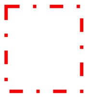

## Control line ends

A line has three parts: start cap, line body, and end cap. The start and end caps describe the start and end of a line.

[[ICanvas|ICanvas]] objects have a [[ICanvas.StrokeLineCap|StrokeLineCap]] property, of type [[LineCap|LineCap]], that describes the start and end of a line. The [[LineCap|LineCap]] enumeration defines the following members:

- `Butt`, which represents a line with a square end, drawn to extend to the exact endpoint of the line. This is the default value of the [[ICanvas.StrokeLineCap|StrokeLineCap]] property.
- `Round`, which represents a line with a rounded end.
- `Square`, which represents a line with a square end, drawn to extend beyond the endpoint to a distance equal to half the line width.

The following example shows how to set the [[ICanvas.StrokeLineCap|StrokeLineCap]] property:

```csharp
canvas.StrokeSize = 10;
canvas.StrokeColor = Colors.Red;
canvas.StrokeLineCap = LineCap.Round;
canvas.DrawLine(10, 10, 110, 110);
```

In this example, the red line is rounded at the start and end of the line:

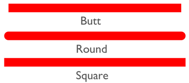

## Control line joins

[[ICanvas|ICanvas]] objects have a [[ICanvas.StrokeLineJoin|StrokeLineJoin]] property, of type [[LineJoin|LineJoin]], that specifies the type of join that is used at the vertices of an object. The [[LineJoin|LineJoin]] enumeration defines the following members:

- `Miter`, which represents angular vertices that produce a sharp or clipped corner. This is the default value of the [[ICanvas.StrokeLineJoin|StrokeLineJoin]] property.
- `Round`, which represents rounded vertices that produce a circular arc at the corner.
- `Bevel`, which represents beveled vertices that produce a diagonal corner.

> [!NOTE]
> When the [[ICanvas.StrokeLineJoin|StrokeLineJoin]] property is set to `Miter`, the `MiterLimit` property can be set to a `float` to limit the miter length of line joins in the object.

The following example shows how to set the [[ICanvas.StrokeLineJoin|StrokeLineJoin]] property:

```csharp
PathF path = new PathF();
path.MoveTo(10, 10);
path.LineTo(110, 50);
path.LineTo(10, 110);

canvas.StrokeSize = 20;
canvas.StrokeColor = Colors.Blue;
canvas.StrokeLineJoin = LineJoin.Round;
canvas.DrawPath(path);
```

In this example, the blue [[PathF|PathF]] object has rounded joins at its vertices:

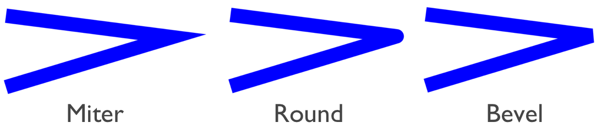

## Clip objects

Graphical objects that are drawn to an [[ICanvas|ICanvas]] can be clipped prior to drawing, with the following methods:

- `ClipPath%2A` clips an object so that only the area that's within the region of a [[PathF|PathF]] object will be visible.
- `ClipRectangle%2A` clips an object so that only the area that's within the region of a rectangle will be visible. The rectangle can be specified using `float` arguments, or by a [[Rect (Graphics)|Rect]] or [[RectF|RectF]] argument.
- `SubtractFromClip%2A` clips an object so that only the area that's outside the region of a rectangle will be visible. The rectangle can be specified using `float` arguments, or by a [[Rect (Graphics)|Rect]] or [[RectF|RectF]] argument.

The following example shows how to use the `ClipPath%2A` method to clip an image:

```csharp
using System.Reflection;
using IImage = Microsoft.Maui.Graphics.IImage;
using Microsoft.Maui.Graphics.Platform;

IImage image;
Assembly assembly = GetType().GetTypeInfo().Assembly;
using (Stream stream = assembly.GetManifestResourceStream("GraphicsViewDemos.Resources.Images.dotnet_bot.png"))
{
    image = PlatformImage.FromStream(stream);
}

if (image != null)
{
    PathF path = new PathF();
    path.AppendCircle(100, 90, 80);
    canvas.ClipPath(path);  // Must be called before DrawImage
    canvas.DrawImage(image, 10, 10, image.Width, image.Height);
}
```

In this example, the image is clipped using a [[PathF|PathF]] object that defines a circle that's centered at (100,90) with a radius of 80. The result is that only the part of the image within the circle is visible:

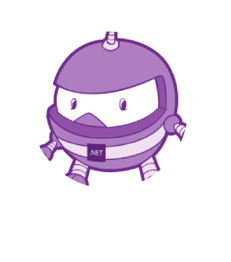

> [!IMPORTANT]
> The `ClipPath%2A` method has an overload that enables a [[WindingMode|WindingMode]] to be specified, which sets the fill algorithm that's used when clipping. For more information, see [[windingmodes|Winding modes]].

The following example shows how to use the `SubtractFromClip%2A` method to clip an image:

```csharp
using System.Reflection;
using IImage = Microsoft.Maui.Graphics.IImage;
using Microsoft.Maui.Graphics.Platform;

IImage image;
Assembly assembly = GetType().GetTypeInfo().Assembly;
using (Stream stream = assembly.GetManifestResourceStream("GraphicsViewDemos.Resources.Images.dotnet_bot.png"))
{
    image = PlatformImage.FromStream(stream);
}

if (image != null)
{
    canvas.SubtractFromClip(60, 60, 90, 90);
    canvas.DrawImage(image, 10, 10, image.Width, image.Height);
}
```

In this example, the area defined by the rectangle that's specified by the arguments supplied to the `SubtractFromClip%2A` method is clipped from the image. The result is that only the parts of the image outside the rectangle are visible:

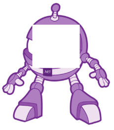
