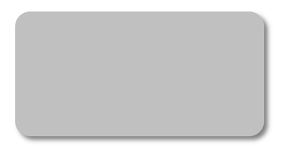
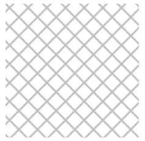
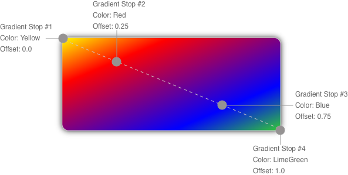
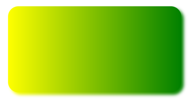
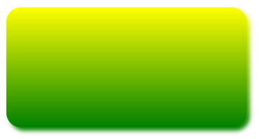
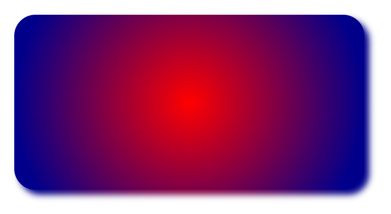
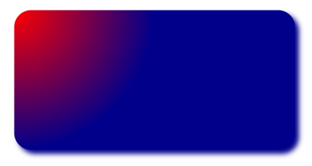

# Paint graphical objects

[ Browse the sample](/samples/dotnet/maui-samples/userinterface-graphicsview)

.NET Multi-platform App UI (.NET MAUI) graphics includes the ability to paint graphical objects with solid colors, gradients, repeating images, and patterns.

The [[Paint|Paint]] class is an abstract class that paints an object with its output. Classes that derive from [[Paint|Paint]] describe different ways of painting an object. The following list describes the different paint types available in .NET MAUI graphics:

- [[SolidPaint|SolidPaint]], which paints an object with a solid color. For more information, see [Paint a solid color](#paint-a-solid-color).
- [[ImagePaint|ImagePaint]], which paints an object with an image. For more information, see [Paint an image](#paint-an-image).
- [[PatternPaint|PatternPaint]], which paints an object with a pattern. For more information, see [Paint a pattern](#paint-a-pattern).
- [[GradientPaint|GradientPaint]], which paints an object with a gradient. For more information, see [Paint a gradient](#paint-a-gradient).

Instances of these types can be painted on an [[ICanvas|ICanvas]], typically by using the `SetFillPaint%2A` method to set the paint as the fill of a graphical object.

The [[Paint|Paint]] class also defines [[Paint.BackgroundColor|BackgroundColor]], and [[Paint.ForegroundColor|ForegroundColor]] properties, of type [[Color|Color]], that can be used to optionally define background and foreground colors for a [[Paint|Paint]] object.

## Paint a solid color

The [[SolidPaint|SolidPaint]] class, that's derived from the [[Paint|Paint]] class, is used to paint a graphical object with a solid color.

The [[SolidPaint|SolidPaint]] class defines a [[SolidPaint.Color|Color]] property, of type [[Color|Color]], which represents the color of the paint. The class also has an [[SolidPaint.IsTransparent|IsTransparent]] property that returns a `bool` that represents whether the color has an alpha value of less than 1.

### Create a SolidPaint object

The color of a [[SolidPaint|SolidPaint]] object is typically specified through its constructor, using a [[Color|Color]] argument:

```csharp
SolidPaint solidPaint = new SolidPaint(Colors.Silver);

RectF solidRectangle = new RectF(100, 100, 200, 100);
canvas.SetFillPaint(solidPaint, solidRectangle);
canvas.SetShadow(new SizeF(10, 10), 10, Colors.Grey);
canvas.FillRoundedRectangle(solidRectangle, 12);
```

The [[SolidPaint|SolidPaint]] object is specified as the first argument to the `SetFillPaint%2A` method. Therefore, a filled rounded rectangle is painted with a silver [[SolidPaint|SolidPaint]] object:



Alternatively, the color can be specified with the [[SolidPaint.Color|Color]] property:

```csharp
SolidPaint solidPaint = new SolidPaint
{
    Color = Colors.Silver
};

RectF solidRectangle = new RectF(100, 100, 200, 100);
canvas.SetFillPaint(solidPaint, solidRectangle);
canvas.SetShadow(new SizeF(10, 10), 10, Colors.Grey);
canvas.FillRoundedRectangle(solidRectangle, 12);
```

## Paint an image

The [[ImagePaint|ImagePaint]] class, that's derived from the [[Paint|Paint]] class, is used to paint a graphical object with an image.

The [[ImagePaint|ImagePaint]] class defines an [[ImagePaint.Image|Image]] property, of type [[IImage (Graphics)|IImage]], which represents the image to paint. The class also has an [[ImagePaint.IsTransparent|IsTransparent]] property that returns `false`.

### Create an ImagePaint object

To paint an object with an image, load the image and assign it to the [[ImagePaint.Image|Image]] property of the [[ImagePaint|ImagePaint]] object.

> [!NOTE]
> Loading an image that's embedded in an assembly requires the image to have its build action set to **Embedded Resource**.

The following example shows how to load an image and fill a rectangle with it:

```csharp
using System.Reflection;
using IImage = Microsoft.Maui.Graphics.IImage;
using Microsoft.Maui.Graphics.Platform;

IImage image;
Assembly assembly = GetType().GetTypeInfo().Assembly;
using (Stream stream = assembly.GetManifestResourceStream("GraphicsViewDemos.Resources.Images.dotnet_bot.png"))
{
    image = PlatformImage.FromStream(stream);
}

if (image != null)
{
    ImagePaint imagePaint = new ImagePaint
    {
        Image = image.Downsize(100)
    };
    canvas.SetFillPaint(imagePaint, RectF.Zero);
    canvas.FillRectangle(0, 0, 240, 300);
}
```

In this example, the image is retrieved from the assembly and loaded as a stream. The image is resized using the `Downsize%2a` method, with the argument specifying that its largest dimension should be set to 100 pixels. For more information about downsizing an image, see [[images#downsize-an-image|Downsize an image]].

The [[ImagePaint.Image|Image]] property of the [[ImagePaint|ImagePaint]] object is set to the downsized version of the image, and the [[ImagePaint|ImagePaint]] object is set as the paint to fill an object with. A rectangle is then drawn that's filled with the paint:


> [!NOTE]
> An [[ImagePaint|ImagePaint]] object can also be created from an [[IImage (Graphics)|IImage]] object by the `AsPaint` extension method.

Alternatively, the `SetFillImage%2A` extension method can be used to simplify the code:

```csharp
if (image != null)
{
    canvas.SetFillImage(image.Downsize(100));
    canvas.FillRectangle(0, 0, 240, 300);
}
```

## Paint a pattern

The [[PatternPaint|PatternPaint]] class, that's derived from the [[Paint|Paint]] class, is used to paint a graphical object with a pattern.

The [[PatternPaint|PatternPaint]] class defines a [[PatternPaint.Pattern|Pattern]] property, of type [[IPattern|IPattern]], which represents the pattern to paint. The class also has an [[PatternPaint.IsTransparent|IsTransparent]] property that returns a `bool` that represents whether the background or foreground color of the paint has an alpha value of less than 1.

### Create a PatternPaint object

To paint an area with a pattern, create the pattern and assign it to the [[PatternPaint.Pattern|Pattern]] property of a [[PatternPaint|PatternPaint]] object.

The following example shows how to create a pattern and fill an object with it:

```csharp
IPattern pattern;

// Create a 10x10 template for the pattern
using (PictureCanvas picture = new PictureCanvas(0, 0, 10, 10))
{
    picture.StrokeColor = Colors.Silver;
    picture.DrawLine(0, 0, 10, 10);
    picture.DrawLine(0, 10, 10, 0);
    pattern = new PicturePattern(picture.Picture, 10, 10);
}

// Fill the rectangle with the 10x10 pattern
PatternPaint patternPaint = new PatternPaint
{
    Pattern = pattern
};
canvas.SetFillPaint(patternPaint, RectF.Zero);
canvas.FillRectangle(10, 10, 250, 250);
```

In this example, the pattern is a 10x10 area that contains a diagonal line from (0,0) to (10,10), and a diagonal line from (0,10) to (10,0). The [[PatternPaint.Pattern|Pattern]] property of the [[PatternPaint|PatternPaint]] object is set to the pattern, and the [[PatternPaint|PatternPaint]] object is set as the paint to fill an object with. A rectangle is then drawn that's filled with the paint:



> [!NOTE]
> A [[PatternPaint|PatternPaint]] object can also be created from a `PicturePattern` object by the `AsPaint` extension method.

## Paint a gradient

The [[GradientPaint|GradientPaint]] class, that's derived from the [[Paint|Paint]] class, is an abstract base class that describes a gradient, which is composed of gradient steps. A [[GradientPaint|GradientPaint]] paints a graphical object with multiple colors that blend into each other along an axis. Classes that derive from [[GradientPaint|GradientPaint]] describe different ways of interpreting gradients stops, and .NET MAUI graphics provides the following gradient paints:

- [[LinearGradientPaint|LinearGradientPaint]], which paints an object with a linear gradient. For more information, see [Paint a linear gradient](#paint-a-linear-gradient).
- [[RadialGradientPaint|RadialGradientPaint]], which paints an object with a radial gradient. For more information, see [Paint a radial gradient](#paint-a-radial-gradient).

The [[GradientPaint|GradientPaint]] class defines the [[GradientPaint.GradientStops|GradientStops]] property, of type [[PaintGradientStop|PaintGradientStop]], which represents the brush's gradient stops, each of which specifies a color and an offset along the gradient axis.

### Gradient stops

Gradient stops are the building blocks of a gradient, and specify the colors in the gradient and their location along the gradient axis. Gradient stops are specified using [[PaintGradientStop|PaintGradientStop]] objects.

The [[PaintGradientStop|PaintGradientStop]] class defines the following properties:

- [[PaintGradientStop.Color|Color]], of type [[Color|Color]], which represents the color of the gradient stop.
- [[PaintGradientStop.Offset|Offset]], of type `float`, which represents the location of the gradient stop within the gradient vector. Valid values are in the range 0.0-1.0. The closer this value is to 0, the closer the color is to the start of the gradient. Similarly, the closer this value is to 1, the closer the color is to the end of the gradient.

> [!IMPORTANT]
> The coordinate system used by gradients is relative to a bounding box for the graphical object. 0 indicates 0 percent of the bounding box, and 1 indicates 100 percent of the bounding box. Therefore, (0.5,0.5) describes a point in the middle of the bounding box, and (1,1) describes a point at the bottom right of the bounding box.

Gradient stops can be added to a [[GradientPaint|GradientPaint]] object with the `AddOffset%2A` method.

The following example creates a diagonal [[LinearGradientPaint|LinearGradientPaint]] with four colors:

```csharp
LinearGradientPaint linearGradientPaint = new LinearGradientPaint
{
    StartColor = Colors.Yellow,
    EndColor = Colors.Green,
    StartPoint = new Point(0, 0),
    EndPoint = new Point(1, 1)
};

linearGradientPaint.AddOffset(0.25f, Colors.Red);
linearGradientPaint.AddOffset(0.75f, Colors.Blue);

RectF linearRectangle = new RectF(10, 10, 200, 100);
canvas.SetFillPaint(linearGradientPaint, linearRectangle);
canvas.SetShadow(new SizeF(10, 10), 10, Colors.Grey);
canvas.FillRoundedRectangle(linearRectangle, 12);                                                     
```

The color of each point between gradient stops is interpolated as a combination of the color specified by the two bounding gradient stops. The following diagram shows the gradient stops from the previous example:



In this diagram, the circles mark the position of gradient stops, and the dashed line shows the gradient axis. The first gradient stop specifies the color yellow at an offset of 0.0. The second gradient stop specifies the color red at an offset of 0.25. The points between these two gradient stops gradually change from yellow to red as you move from left to right along the gradient axis. The third gradient stop specifies the color blue at an offset of 0.75. The points between the second and third gradient stops gradually change from red to blue. The fourth gradient stop specifies the color lime green at offset of 1.0. The points between the third and fourth gradient stops gradually change from blue to lime green.

## Paint a linear gradient

The [[LinearGradientPaint|LinearGradientPaint]] class, that's derived from the [[GradientPaint|GradientPaint]] class, paints a graphical object with a linear gradient. A linear gradient blends two or more colors along a line known as the gradient axis. [[PaintGradientStop|PaintGradientStop]] objects are used to specify the colors in the gradient and their positions. For more information about [[PaintGradientStop|PaintGradientStop]] objects, see [Paint a gradient](#paint-a-gradient).

The [[LinearGradientPaint|LinearGradientPaint]] class defines the following properties:

- [[LinearGradientPaint.StartPoint|StartPoint]], of type [[Point|Point]], which represents the starting two-dimensional coordinates of the linear gradient. The class constructor initializes this property to (0,0).
- [[LinearGradientPaint.EndPoint|EndPoint]], of type [[Point|Point]], which represents the ending two-dimensional coordinates of the linear gradient. The class constructor initializes this property to (1,1).

### Create a LinearGradientPaint object

A linear gradient's gradient stops are positioned along the gradient axis. The orientation and size of the gradient axis can be changed using the [[LinearGradientPaint.StartPoint|StartPoint]] and [[LinearGradientPaint.EndPoint|EndPoint]] properties. By manipulating these properties, you can create horizontal, vertical, and diagonal gradients, reverse the gradient direction, condense the gradient spread, and more.

The [[LinearGradientPaint.StartPoint|StartPoint]] and [[LinearGradientPaint.EndPoint|EndPoint]] properties are relative to the graphical object being painted. (0,0) represents the top-left corner of the object being painted, and (1,1) represents the bottom-right corner of the object being painted. The following diagram shows the gradient axis for a diagonal linear gradient brush:


In this diagram, the dashed line shows the gradient axis, which highlights the interpolation path of the gradient from the start point to the end point.

#### Create a horizontal linear gradient

To create a horizontal linear gradient, create a [[LinearGradientPaint|LinearGradientPaint]] object and set its [[GradientPaint.StartColor|StartColor]] and [[GradientPaint.EndColor|EndColor]] properties. Then, set its [[LinearGradientPaint.EndPoint|EndPoint]] to (1,0).

The following example shows how to create a horizontal [[LinearGradientPaint|LinearGradientPaint]]:

```csharp
LinearGradientPaint linearGradientPaint = new LinearGradientPaint
{
    StartColor = Colors.Yellow,
    EndColor = Colors.Green,
    // StartPoint is already (0,0)
    EndPoint = new Point(1, 0)
};

RectF linearRectangle = new RectF(10, 10, 200, 100);
canvas.SetFillPaint(linearGradientPaint, linearRectangle);
canvas.SetShadow(new SizeF(10, 10), 10, Colors.Grey);
canvas.FillRoundedRectangle(linearRectangle, 12);
```

In this example, the rounded rectangle is painted with a linear gradient that interpolates horizontally from yellow to green:



#### Create a vertical linear gradient

To create a vertical linear gradient, create a [[LinearGradientPaint|LinearGradientPaint]] object and set its [[GradientPaint.StartColor|StartColor]] and [[GradientPaint.EndColor|EndColor]] properties. Then, set its [[LinearGradientPaint.EndPoint|EndPoint]] to (0,1).

The following example shows how to create a vertical [[LinearGradientPaint|LinearGradientPaint]]:

```csharp
LinearGradientPaint linearGradientPaint = new LinearGradientPaint
{
    StartColor = Colors.Yellow,
    EndColor = Colors.Green,
    // StartPoint is already (0,0)
    EndPoint = new Point(0, 1)
};

RectF linearRectangle = new RectF(10, 10, 200, 100);
canvas.SetFillPaint(linearGradientPaint, linearRectangle);
canvas.SetShadow(new SizeF(10, 10), 10, Colors.Grey);
canvas.FillRoundedRectangle(linearRectangle, 12);
```

In this example, the rounded rectangle is painted with a linear gradient that interpolates vertically from yellow to green:



#### Create a diagonal linear gradient

To create a diagonal linear gradient, create a [[LinearGradientPaint|LinearGradientPaint]] object and set its [[GradientPaint.StartColor|StartColor]] and [[GradientPaint.EndColor|EndColor]] properties.

The following example shows how to create a diagonal [[LinearGradientPaint|LinearGradientPaint]]:

```csharp
LinearGradientPaint linearGradientPaint = new LinearGradientPaint
{
    StartColor = Colors.Yellow,
    EndColor = Colors.Green,
    // StartPoint is already (0,0)
    // EndPoint is already (1,1)
};

RectF linearRectangle = new RectF(10, 10, 200, 100);
canvas.SetFillPaint(linearGradientPaint, linearRectangle);
canvas.SetShadow(new SizeF(10, 10), 10, Colors.Grey);
canvas.FillRoundedRectangle(linearRectangle, 12);
```

In this example, the rounded rectangle is painted with a linear gradient that interpolates diagonally from yellow to green:


## Paint a radial gradient

The [[RadialGradientPaint|RadialGradientPaint]] class, that's derived from the [[GradientPaint|GradientPaint]] class, paints a graphical object with a radial gradient. A radial gradient blends two or more colors across a circle. [[PaintGradientStop|PaintGradientStop]] objects are used to specify the colors in the gradient and their positions. For more information about [[PaintGradientStop|PaintGradientStop]] objects, see [Paint a gradient](#paint-a-gradient).

The [[RadialGradientPaint|RadialGradientPaint]] class defines the following properties:

- [[RadialGradientPaint.Center|Center]], of type [[Point|Point]], which represents the center point of the circle for the radial gradient. The class constructor initializes this property to (0.5,0.5).
- [[RadialGradientPaint.Radius|Radius]], of type `double`, which represents the radius of the circle for the radial gradient. The class constructor initializes this property to 0.5.

### Create a RadialGradientPaint object

A radial gradient's gradient stops are positioned along a gradient axis defined by a circle. The gradient axis radiates from the center of the circle to its circumference. The position and size of the circle can be changed using the [[RadialGradientPaint.Center|Center]] and [[RadialGradientPaint.Radius|Radius]] properties. The circle defines the end point of the gradient. Therefore, a gradient stop at 1.0 defines the color at the circle's circumference. A gradient stop at 0.0 defines the color at the center of the circle.

To create a radial gradient, create a [[RadialGradientPaint|RadialGradientPaint]] object and set its [[GradientPaint.StartColor|StartColor]] and [[GradientPaint.EndColor|EndColor]] properties. Then, set its [[RadialGradientPaint.Center|Center]] and [[RadialGradientPaint.Radius|Radius]] properties.

The following example shows how to create a centered [[RadialGradientPaint|RadialGradientPaint]]:

```csharp
RadialGradientPaint radialGradientPaint = new RadialGradientPaint
{
    StartColor = Colors.Red,
    EndColor = Colors.DarkBlue
    // Center is already (0.5,0.5)
    // Radius is already 0.5
};

RectF radialRectangle = new RectF(10, 10, 200, 100);
canvas.SetFillPaint(radialGradientPaint, radialRectangle);
canvas.SetShadow(new SizeF(10, 10), 10, Colors.Grey);
canvas.FillRoundedRectangle(radialRectangle, 12);
```

In this example, the rounded rectangle is painted with a radial gradient that interpolates from red to dark blue. The center of the radial gradient is positioned in the center of the rectangle:



The following example moves the center of the radial gradient to the top-left corner of the rectangle:

```csharp
RadialGradientPaint radialGradientPaint = new RadialGradientPaint
{
    StartColor = Colors.Red,
    EndColor = Colors.DarkBlue,
    Center = new Point(0.0, 0.0)
    // Radius is already 0.5
};

RectF radialRectangle = new RectF(10, 10, 200, 100);
canvas.SetFillPaint(radialGradientPaint, radialRectangle);
canvas.SetShadow(new SizeF(10, 10), 10, Colors.Grey);
canvas.FillRoundedRectangle(radialRectangle, 12);
```

In this example, the rounded rectangle is painted with a radial gradient that interpolates from red to dark blue. The center of the radial gradient is positioned in the top-left of the rectangle:



The following example moves the center of the radial gradient to the bottom-right corner of the rectangle:

```csharp
RadialGradientPaint radialGradientPaint = new RadialGradientPaint
{
    StartColor = Colors.Red,
    EndColor = Colors.DarkBlue,
    Center = new Point(1.0, 1.0)
    // Radius is already 0.5
};

RectF radialRectangle = new RectF(10, 10, 200, 100);
canvas.SetFillPaint(radialGradientPaint, radialRectangle);
canvas.SetShadow(new SizeF(10, 10), 10, Colors.Grey);
canvas.FillRoundedRectangle(radialRectangle, 12);
```

In this example, the rounded rectangle is painted with a radial gradient that interpolates from red to dark blue. The center of the radial gradient is positioned in the bottom-right of the rectangle:


