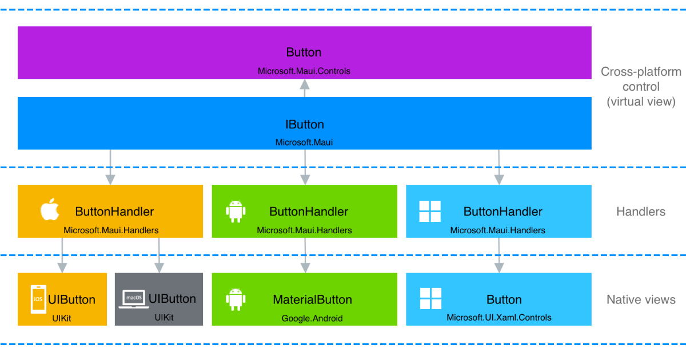

# Handlers

.NET Multi-platform App UI (.NET MAUI) provides a collection of cross-platform controls that can be used to display data, initiate actions, indicate activity, display collections, pick data, and more. Each control has an interface representation that abstracts the control. Cross-platform controls that implement these interfaces are known as *virtual views*. *Handlers* map these virtual views to controls on each platform, which are known as *native views*. Handlers are also responsible for instantiating the underlying native view, and mapping the cross-platform control API to the native view API. For example, on iOS a handler maps a .NET MAUI [[Button (Controls)|Button]] to an iOS `UIButton`. On Android, the [[Button (Controls)|Button]] is mapped to a `MaterialButton`:

.NET MAUI handlers are accessed through their control-specific interface, such as `IButton` for a [[Button (Controls)|Button]]. This avoids the cross-platform control having to reference its handler, and the handler having to reference the cross-platform control.

Each handler class exposes the native view for the cross-platform control via its `PlatformView` property. This property can be accessed to set native view properties, invoke native view methods, and subscribe to native view events. In addition, the cross-platform control implemented by the handler is exposed via its `VirtualView` property.

When you create a cross-platform control whose implementation is provided on each platform by native views, you should implement a handler that maps the cross-platform control API to the native view APIs. For more information, see [[create|Create custom controls with handlers]].

You can also customize handlers to augment the appearance and behavior of existing cross-platform controls beyond the customization that's possible through the control's API. This handler customization modifies the native views for the cross-platform control. Handlers are global, and customizing a handler for a control will result in all controls of the same type being customized in your app. For more information, see [[customize|Customize .NET MAUI controls with handlers]].

## Mappers

A key concept of .NET MAUI handlers is mappers. Each handler typically provides a *property mapper*, and sometimes a *command mapper*, that maps the cross-platform control's API to the native view's API.

A *property mapper* defines what Actions to take when a property change occurs in the cross-platform control. It's a `Dictionary` that maps the cross-platform control's properties to their associated Actions. Each platform handler then provides implementations of the Actions, which manipulate the native view API. This ensures that when a property is set on a cross-platform control, the underlying native view is updated as required.

A *command mapper* defines what Actions to take when the cross-platform control sends commands to native views. They're similar to property mappers, but allow for additional data to be passed. A command in this context doesn't mean an `ICommand` implementation. Instead, a command is just an instruction, and optionally its data, that's sent to a native view. The command mapper is a `Dictionary` that maps the cross-platform control's command to their associated Actions. Each handler then provides implementations of the Actions, which manipulate the native view API. This ensures that when a cross-platform control sends a command to its native view, the native view is updated as required. For example, when a [[ScrollView (Controls)|ScrollView]] is scrolled, the `ScrollViewHandler` uses a command mapper to invoke an Action that accepts a scroll position argument. The Action then instructs the underlying native view to scroll to that position.

The advantage of using *mappers* to update native views is that native views can be decoupled from cross-platform controls. This removes the need for native views to subscribe to and unsubscribe from cross-platform control events. It also allows for easy customization because mappers can be modified without subclassing.

## Handler lifecycle

All handler-based .NET MAUI controls support two handler lifecycle events:

- `HandlerChanging` is raised when a new handler is about to be created for a cross-platform control, and when an existing handler is about to be removed from a cross-platform control. The `HandlerChangingEventArgs` object that accompanies this event has `NewHandler` and `OldHandler` properties, of type `IElementHandler`. When the `NewHandler` property isn't `null`, the event indicates that a new handler is about to be created for a cross-platform control. When the `OldHandler` property isn't `null`, the event indicates that the existing native control is about be removed from the cross-platform control, and therefore any native events should be unwired and other cleanup performed.
- `HandlerChanged` is raised after the handler for a cross-platform control has been created. This event indicates that the native control that implements the cross-platform control is available, and all the property values set on the cross-platform control have been applied to the native control.

> [!NOTE]
> The `HandlerChanging` event is raised on a cross-platform control before the `HandlerChanged` event.

In addition to these events, each cross-platform control also has an overridable `OnHandlerChanging` method that's invoked when the `HandlerChanging` event is raised, and a `OnHandlerChanged` method that's invoked when the `HandlerChanged` event is raised.

## View handlers

The following table lists the types that implement views in .NET MAUI:

| View | Interface | Handler | Property Mapper | Command Mapper |
| -- | -- | -- | -- | -- |
| [[ActivityIndicator|ActivityIndicator]] | [[IActivityIndicator|IActivityIndicator]] | [[ActivityIndicatorHandler|ActivityIndicatorHandler]] | [[ActivityIndicatorHandler.Mapper|Mapper]] | [[ActivityIndicatorHandler.CommandMapper|CommandMapper]] |
| [[BlazorWebView (Maui)|BlazorWebView]] | [[IBlazorWebView|IBlazorWebView]] | [[BlazorWebViewHandler|BlazorWebViewHandler]] | [[BlazorWebViewHandler.BlazorWebViewMapper|BlazorWebViewMapper]] | |
| [[Border|Border]] | [[IBorderView|IBorderView]] | [[BorderHandler|BorderHandler]] | [[BorderHandler.Mapper|Mapper]] | [[BorderHandler.CommandMapper|CommandMapper]] |
| [[BoxView (Controls)|BoxView]] | [[IShapeView|IShapeView]], [[IShape|IShape]] | [[ShapeViewHandler|ShapeViewHandler]] | [[ShapeViewHandler.Mapper|Mapper]] | [[ShapeViewHandler.CommandMapper|CommandMapper]] |
| [[Button (Controls)|Button]] | [[IButton|IButton]] | [[ButtonHandler|ButtonHandler]] | [[ButtonHandler.ImageButtonMapper|ImageButtonMapper]], [[ButtonHandler.TextButtonMapper|TextButtonMapper]], [[ButtonHandler.Mapper|Mapper]] | [[ButtonHandler.CommandMapper|CommandMapper]] |
| [[CarouselView|CarouselView]] | | [[CarouselViewHandler|CarouselViewHandler]] | [[CarouselViewHandler.Mapper|Mapper]] | |
| [[Cell (Controls)|Cell]] | | `CellRenderer` | `Mapper` | [[CommandMapper{TVirtualView}|CommandMapper]] |
| [[CheckBox|CheckBox]] | [[ICheckBox|ICheckBox]] | [[CheckBoxHandler|CheckBoxHandler]] | [[CheckBoxHandler.Mapper|Mapper]] | [[CheckBoxHandler.CommandMapper|CommandMapper]] |
| [[CollectionView|CollectionView]] |  | [[CollectionViewHandler|CollectionViewHandler]] | <[[CollectionViewHandler.Mapper|Mapper]] | |
| [[ContentView (Controls)|ContentView]] | [[IContentView|IContentView]] | [[ContentViewHandler|ContentViewHandler]] | [[ContentViewHandler.Mapper|Mapper]] | [[ContentViewHandler.CommandMapper|CommandMapper]] |
| [[DatePicker (Controls)|DatePicker]] | [[IDatePicker|IDatePicker]] | [[DatePickerHandler|DatePickerHandler]] | [[DatePickerHandler.Mapper|Mapper]] | [[DatePickerHandler.CommandMapper|CommandMapper]] |
| [[Editor|Editor]] | [[IEditor|IEditor]] | [[EditorHandler|EditorHandler]] | [[EditorHandler.Mapper|Mapper]] | [[EditorHandler.CommandMapper|CommandMapper]] |
| [[Ellipse|Ellipse]] | [[IShape|IShape]] | [[ShapeViewHandler|ShapeViewHandler]] | [[ShapeViewHandler.Mapper|Mapper]] | [[ShapeViewHandler.CommandMapper|CommandMapper]] |
| [[Entry (Controls)|Entry]] | [[IEntry|IEntry]] | [[EntryHandler|EntryHandler]] | [[EntryHandler.Mapper|Mapper]] | [[EntryHandler.CommandMapper|CommandMapper]] |
| [[EntryCell|EntryCell]] | | `EntryCellRenderer` | `Mapper` | [[CommandMapper{TVirtualView}|CommandMapper]] |
| [[Frame|Frame]] | | `FrameRenderer` | `Mapper` | [[CommandMapper{TVirtualView}|CommandMapper]] |
| [[GraphicsView|GraphicsView]] | [[IGraphicsView|IGraphicsView]] | [[GraphicsViewHandler|GraphicsViewHandler]] | [[GraphicsViewHandler.Mapper|Mapper]] | [[GraphicsViewHandler.CommandMapper|CommandMapper]] |
| [[Image (Controls)|Image]] | [[IImage (Maui)|IImage]] | [[ImageHandler|ImageHandler]] | [[ImageHandler.Mapper|Mapper]] | [[ImageHandler.CommandMapper|CommandMapper]] |
| [[ImageButton (Controls)|ImageButton]] | [[IImageButton|IImageButton]] | [[ImageButtonHandler|ImageButtonHandler]] | [[ImageButtonHandler.ImageMapper|ImageMapper]], [[ImageButtonHandler.Mapper|Mapper]] | |
| [[ImageCell|ImageCell]] | | `ImageCellRenderer` | `Mapper` | [[CommandMapper{TVirtualView}|CommandMapper]] |
| [[IndicatorView|IndicatorView]] | [[IIndicatorView|IIndicatorView]] | [[IndicatorViewHandler|IndicatorViewHandler]] | [[IndicatorViewHandler.Mapper|Mapper]] | [[IndicatorViewHandler.CommandMapper|CommandMapper]] |
| [[Label (Controls)|Label]] | [[ILabel|ILabel]] | [[LabelHandler|LabelHandler]] | [[LabelHandler.Mapper|Mapper]] | [[LabelHandler.CommandMapper|CommandMapper]] |
| [[Line|Line]] | [[IShape|IShape]] | [[LineHandler|LineHandler]] | [[LineHandler.Mapper|Mapper]] | [[ShapeViewHandler.CommandMapper|CommandMapper]] |
| [[ListView (Controls)|ListView]] | | `ListViewRenderer` | `Mapper` | [[CommandMapper{TVirtualView}|CommandMapper]] |
| [[Map (Maps)|Map]] | [[IMap (Maps)|IMap]] | [[MapHandler|MapHandler]] | [[MapHandler.Mapper|Mapper]] | [[MapHandler.CommandMapper|CommandMapper]] |
| [[Path|Path]] | [[IShape|IShape]] | [[PathHandler|PathHandler]] | [[PathHandler.Mapper|Mapper]] | [[ShapeViewHandler.CommandMapper|CommandMapper]] |
| [[Picker (Controls)|Picker]] | [[IPicker|IPicker]] | [[PickerHandler|PickerHandler]] | [[PickerHandler.Mapper|Mapper]] | [[PickerHandler.CommandMapper|CommandMapper]] |
| [[Polygon (Shapes)|Polygon]] | [[IShape|IShape]] | [[PolygonHandler|PolygonHandler]] | [[PolygonHandler.Mapper|Mapper]] | [[ShapeViewHandler.CommandMapper|CommandMapper]] |
| [[Polyline (Shapes)|Polyline]] | [[IShape|IShape]] | [[PolylineHandler|PolylineHandler]] | [[PolylineHandler.Mapper|Mapper]] | [[ShapeViewHandler.CommandMapper|CommandMapper]] |
| [[ProgressBar (Controls)|ProgressBar]] | [[IProgress|IProgress]] | [[ProgressBarHandler|ProgressBarHandler]] | [[ProgressBarHandler.Mapper|Mapper]] | [[ProgressBarHandler.CommandMapper|CommandMapper]] |
| [[RadioButton|RadioButton]] | [[IRadioButton|IRadioButton]] | [[RadioButtonHandler|RadioButtonHandler]] | [[RadioButtonHandler.Mapper|Mapper]] | [[RadioButtonHandler.CommandMapper|CommandMapper]] |
| [[Rectangle|Rectangle]] | [[IShape|IShape]] | [[RectangleHandler|RectangleHandler]] | [[RectangleHandler.Mapper|Mapper]] | [[ShapeViewHandler.CommandMapper|CommandMapper]] |
| [[RefreshView (Controls)|RefreshView]] | [[IRefreshView|IRefreshView]] | [[RefreshViewHandler|RefreshViewHandler]] | [[RefreshViewHandler.Mapper|Mapper]] | [[RefreshViewHandler.CommandMapper|CommandMapper]] |
| [[RoundRectangle|RoundRectangle]] | [[IShape|IShape]] | [[RoundRectangleHandler|RoundRectangleHandler]] | [[RoundRectangleHandler.Mapper|Mapper]] | [[ShapeViewHandler.CommandMapper|CommandMapper]] |
| [[ScrollView (Controls)|ScrollView]] | [[IScrollView|IScrollView]] | [[ScrollViewHandler|ScrollViewHandler]] | [[ScrollViewHandler.Mapper|Mapper]] | [[ScrollViewHandler.CommandMapper|CommandMapper]] |
| [[SearchBar (Controls)|SearchBar]] | [[ISearchBar|ISearchBar]] | [[SearchBarHandler|SearchBarHandler]] | [[SearchBarHandler.Mapper|Mapper]] | [[SearchBarHandler.CommandMapper|CommandMapper]] |
| [[Slider (Controls)|Slider]] | [[ISlider|ISlider]] | [[SliderHandler|SliderHandler]] | [[SliderHandler.Mapper|Mapper]] | [[SliderHandler.CommandMapper|CommandMapper]] |
| [[Stepper|Stepper]] | [[IStepper|IStepper]] | [[StepperHandler|StepperHandler]] | [[StepperHandler.Mapper|Mapper]] | [[StepperHandler.CommandMapper|CommandMapper]] |
| [[SwipeView (Controls)|SwipeView]] | [[ISwipeView|ISwipeView]] | [[SwipeViewHandler|SwipeViewHandler]] | [[SwipeViewHandler.Mapper|Mapper]] | [[SwipeViewHandler.CommandMapper|CommandMapper]] |
| [[Switch (Controls)|Switch]] | [[ISwitch|ISwitch]] | [[SwitchHandler|SwitchHandler]] | [[SwitchHandler.Mapper|Mapper]] | [[SwitchHandler.CommandMapper|CommandMapper]] |
| [[SwitchCell|SwitchCell]] | | `SwitchCellRenderer` | `Mapper` | [[CommandMapper{TVirtualView}|CommandMapper]] |
| [[TableView|TableView]] | | `TableViewRenderer` | `Mapper` | [[CommandMapper{TVirtualView}|CommandMapper]] |
| [[TextCell|TextCell]] | | `TextCellRenderer` | `Mapper` | [[CommandMapper{TVirtualView}|CommandMapper]] |
| [[TimePicker (Controls)|TimePicker]] | [[ITimePicker|ITimePicker]] | [[TimePickerHandler|TimePickerHandler]] | [[TimePickerHandler.Mapper|Mapper]] | [[TimePickerHandler.CommandMapper|CommandMapper]] |
| [[ViewCell (Controls)|ViewCell]] | | `ViewCellRenderer` | `Mapper` | [[CommandMapper{TVirtualView}|CommandMapper]] |
| [[WebView (Controls)|WebView]] | [[IWebView|IWebView]] | [[WebViewHandler|WebViewHandler]] | [[WebViewHandler.Mapper|Mapper]] | [[WebViewHandler.CommandMapper|CommandMapper]] |

## Page handlers

The following table lists the types that implement pages in .NET MAUI:

| Page | Android Handler | iOS/Mac Catalyst Handler | Windows Handler | Property Mapper | Command Mapper |
| -- | -- | -- | -- | -- | -- |
| [[ContentPage|ContentPage]] | [[PageHandler|PageHandler]] | [[PageHandler|PageHandler]] | [[PageHandler|PageHandler]] | [[PageHandler.Mapper|Mapper]] | [[PageHandler.CommandMapper|CommandMapper]] |
| [[FlyoutPage (Controls)|FlyoutPage]] | [[FlyoutViewHandler|FlyoutViewHandler]] | PhoneFlyoutPageRenderer | [[FlyoutViewHandler|FlyoutViewHandler]] | `Mapper` | [[CommandMapper{TVirtualView}|CommandMapper]] |
| [[NavigationPage (Controls)|NavigationPage]] | [[NavigationViewHandler|NavigationViewHandler]] | NavigationRenderer | [[NavigationViewHandler|NavigationViewHandler]] | `Mapper` | [[CommandMapper{TVirtualView}|CommandMapper]] |
| [[TabbedPage (Controls)|TabbedPage]] | [[TabbedViewHandler|TabbedViewHandler]] | TabbedRenderer | [[TabbedViewHandler|TabbedViewHandler]] | `Mapper` | [[CommandMapper{TVirtualView}|CommandMapper]] |
| [[Shell|Shell]] | `ShellHandler` | ShellRenderer | ShellRenderer | `Mapper` | [[CommandMapper{TVirtualView}|CommandMapper]] |

<!--
xrefs not used on:

1. Mapper and CommandMapper because the properties are in different files (handlers vs compatibility renderers).
1. Renderer classes because they are platform-specific, and the API docs only exist for the xplat layer.
1. No API doc for ShellHandler.

-->
