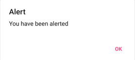
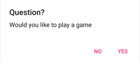
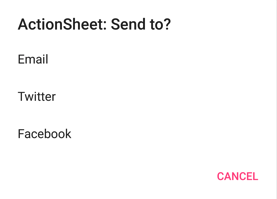
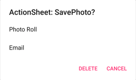

Displaying an alert, asking a user to make a choice, or displaying a prompt is a common UI task. .NET Multi-platform App UI (.NET MAUI) has three methods on the [[Page (Controls)|Page]] class for interacting with the user via a pop-up: `DisplayAlertAsync%2A`, `DisplayActionSheetAsync%2A`, and `DisplayPromptAsync%2A`. Pop-ups are rendered with native controls on each platform.

These methods are asynchronous and should be awaited to keep the UI responsive. Invoke them from UI-thread contexts (for example, page event handlers).

## Display an alert

All .NET MAUI-supported platforms have a pop-up to alert the user or ask simple questions of them. To display alerts, use the `DisplayAlertAsync%2A` method on any [[Page (Controls)|Page]]. The following example shows a simple message to the user:

```csharp
await DisplayAlertAsync("Alert", "You have been alerted", "OK");
```



Once the alert is dismissed the user continues interacting with the app.

> [!NOTE]
> On Android, alerts can be dismissed by tapping on the page outside the alert. On desktop platforms, alerts can be dismissed with the escape key.

The `DisplayAlertAsync%2A` method can also be used to capture a user's response by presenting two buttons and returning a `bool`. To get a response from an alert, supply text for both buttons and `await` the method:

```csharp
bool answer = await DisplayAlertAsync("Question?", "Would you like to play a game", "Yes", "No");
Debug.WriteLine("Answer: " + answer);
```



After the user selects one of the options the response will be returned as a `bool`.

The `DisplayAlertAsync%2A` method also has overloads that accept a `FlowDirection` argument that specifies the direction in which UI elements flow within the alert. For more information about flow direction, see [[localization#right-to-left-localization|Right to left localization]].

> [!WARNING]
> By default on Windows, when an alert is displayed any access keys that are defined on the page behind the alert can still be activated. For more information, see [[visualelement-access-keys|VisualElement access keys on Windows]].

## Guide users through tasks

An action sheet presents the user with a set of alternatives for how to proceed with a task. To display an action sheet, use the `DisplayActionSheetAsync%2A` method on any [[Page (Controls)|Page]], passing the message and button labels as strings:

```csharp
string action = await DisplayActionSheetAsync("ActionSheet: Send to?", "Cancel", null, "Email", "Twitter", "Facebook");
Debug.WriteLine("Action: " + action);
```



After the user taps one of the buttons, the button label will be returned as a `string`.

> [!NOTE]
> Action sheets can be dismissed on touch platforms, and Mac Catalyst, by tapping on the page outside the action sheet. On Windows, action sheets can be dismissed with the escape key and by clicking on the page outside the action sheet.

Action sheets also support a destroy button, which is a button that represents destructive behavior. The destroy button can be specified as the third string argument to the `DisplayActionSheetAsync%2A` method, or can be left `null`. The following example specifies a destroy button:

```csharp
async void OnActionSheetCancelDeleteClicked(object sender, EventArgs e)
{
  string action = await DisplayActionSheetAsync("ActionSheet: SavePhoto?", "Cancel", "Delete", "Photo Roll", "Email");
  Debug.WriteLine("Action: " + action);
}
```



> [!NOTE]
> On iOS, the destroy button is rendered differently to the other buttons in the action sheet.

The `DisplayActionSheetAsync%2A` method also has an overload that accepts a `FlowDirection` argument that specifies the direction in which UI elements flow within the action sheet. For more information about flow direction, see [[localization#right-to-left-localization|Right to left localization]].
