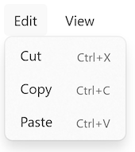
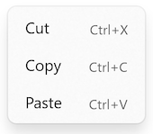

# Keyboard accelerators

Keyboard accelerators are keyboard shortcuts that improve the usability and accessibility of your .NET Multi-platform App UI (.NET MAUI) apps on Mac Catalyst and Windows by providing an intuitive way for users to invoke common actions or commands without navigating the app UI directly.

A keyboard accelerator is composed of two components:

- Modifiers, which include Shift, Ctrl, and Alt.
- Keys, which include alphanumeric keys and special keys.

In .NET MAUI, keyboard accelerators are associated with commands exposed in menus, and should be specified with the menu item. Specifically, .NET MAUI keyboard accelerators can be attached to menu items in the menu bar on Mac Catalyst and Windows, and menu items in context menus on Windows. For more information about menu bars, see [[menu-bar|Display a menu bar in a .NET MAUI desktop app]]. For more information about context menus, see [[context-menu|Display a context menu in a .NET MAUI desktop app]].

The following screenshots show menu bar items and context menu items that include keyboard accelerators:




A keyboard accelerator is represented by the [[KeyboardAccelerator|KeyboardAccelerator]] class, which represents a shortcut key for a [[MenuFlyoutItem|MenuFlyoutItem]]. The [[KeyboardAccelerator|KeyboardAccelerator]] class defines the following properties:

- [[KeyboardAccelerator.Modifiers|Modifiers]], of type [[KeyboardAcceleratorModifiers|KeyboardAcceleratorModifiers]], which represents the modifier value, such as Ctrl or Shift, for the keyboard shortcut.
- [[KeyboardAccelerator.Key|Key]], of type `string?`, which represents the key value for the keyboard shortcut.

These properties are backed by [[BindableProperty|BindableProperty]] objects, which means that they can be targets of data bindings.

The [[KeyboardAcceleratorModifiers|KeyboardAcceleratorModifiers]] enumeration defines the following members that be used as values for the [[KeyboardAccelerator.Modifiers|Modifiers]] property:

- `None`, which indicates no modifier.
- `Shift`, which indicates the Shift modifier on Mac Catalyst and Windows.
- `Ctrl`, which indicates the Control modifier on Mac Catalyst and Windows.
- `Alt`, which indicates the Option modifier on Mac Catalyst, and the Menu modifier on Windows.
- `Cmd`, which indicates the Command modifier on Mac Catalyst.
- `Windows`, which indicates the Windows modifier on Windows.

> [!IMPORTANT]
> Keyboard accelerators can be attached to [[MenuFlyoutItem|MenuFlyoutItem]] objects in a [[MenuBarItem|MenuBarItem]] on Mac Catalyst and Windows, and in a [[MenuFlyout|MenuFlyout]] on Windows.

<!-- Mac Catalyst support for keyboard accelerators in context menu items is pending. -->

The following table outlines the keyboard accelerator formats .NET MAUI supports:

| Platform | Single key | Multi-key |
| -------- | ---------- | --------- |
| Mac Catalyst | Keyboard accelerators without a modifier, with a single key. For example, using the F1 key to invoke the action associated with a menu item. | Keyboard accelerators with one or more modifiers, with a single key. For example, using Cmd+Shift+S or Cmd+S to invoke the action associated with a menu item. |
| Windows | Keyboard accelerators with and without a modifier, with a single key. For example, using the F1 key to invoke the action associated with a menu item. | Keyboard accelerators with one or more modifiers, with a single key. For example, using Ctrl+Shift+F or Ctrl+F to invoke the action associated with a menu item. |

## Create a keyboard accelerator

A [[KeyboardAccelerator|KeyboardAccelerator]] can be attached to a [[MenuFlyoutItem|MenuFlyoutItem]] by adding it to its [[MenuFlyoutItem.KeyboardAccelerators|KeyboardAccelerators]] collection:

```xaml
<MenuFlyoutItem Text="Cut"
                Clicked="OnCutMenuFlyoutItemClicked">
    <MenuFlyoutItem.KeyboardAccelerators>
        <KeyboardAccelerator Modifiers="Ctrl"
                             Key="X" />
    </MenuFlyoutItem.KeyboardAccelerators>
</MenuFlyoutItem>
```

Keyboard accelerators can also be specified in code:

```csharp
cutMenuFlyoutItem.KeyboardAccelerators.Add(new KeyboardAccelerator
{
    Modifiers = KeyboardAcceleratorModifiers.Ctrl,
    Key = "X"
});
```

When a keyboard accelerator modifier and key is pressed, the action associated with the [[MenuFlyoutItem|MenuFlyoutItem]] is invoked.

> [!IMPORTANT]
> While multiple [[KeyboardAccelerator|KeyboardAccelerator]] objects can be added to the `MenuFlyoutItem.KeyboardAccelerators` collection, only the first [[KeyboardAccelerator|KeyboardAccelerator]] in the collection will have its shortcut displayed on the [[MenuFlyoutItem|MenuFlyoutItem]]. In addition, on Mac Catalyst, only the keyboard shortcut for the first [[KeyboardAccelerator|KeyboardAccelerator]] in the collection will cause the action associated with the [[MenuFlyoutItem|MenuFlyoutItem]] to be invoked. However, on Windows, the keyboard shortcuts for all of the [[KeyboardAccelerator|KeyboardAccelerator]] objects in the `MenuFlyoutItem.KeyboardAccelerators` collection will cause the [[MenuFlyoutItem|MenuFlyoutItem]] action to be invoked.

### Specify multiple modifiers

Multiple modifiers can be specified on a [[KeyboardAccelerator|KeyboardAccelerator]] on both platforms:

```xaml
<MenuFlyoutItem Text="Refresh"
                Command="{Binding RefreshCommand}">
    <MenuFlyoutItem.KeyboardAccelerators>
        <KeyboardAccelerator Modifiers="Shift,Ctrl"
                             Key="R" />
    </MenuFlyoutItem.KeyboardAccelerators>
</MenuFlyoutItem>
```

The equivalent C# code is:

```csharp
refreshMenuFlyoutItem.KeyboardAccelerators.Add(new KeyboardAccelerator
{
    Modifiers = KeyboardAcceleratorModifiers.Shift | KeyboardAcceleratorModifiers.Ctrl,
    Key = "R"
});
```

## Specify keyboard accelerators per platform

Different keyboard accelerator modifiers and keys can be specified per platform in XAML with the [[OnPlatformExtension|`OnPlatform`]] markup extension:

```xaml
<MenuFlyoutItem Text="Change Theme"
                Command="{Binding ChangeThemeCommand}">
    <MenuFlyoutItem.KeyboardAccelerators>
        <KeyboardAccelerator Modifiers="{OnPlatform MacCatalyst=Cmd, WinUI=Windows}"
                             Key="{OnPlatform MacCatalyst=T, WinUI=C}" />
    </MenuFlyoutItem.KeyboardAccelerators>
</MenuFlyoutItem>
```

The equivalent C# code is:

```csharp
KeyboardAcceleratorModifiers modifier = KeyboardAcceleratorModifiers.None;
string key = string.Empty;

if (DeviceInfo.Current.Platform == DevicePlatform.MacCatalyst)
{
    modifier = KeyboardAcceleratorModifiers.Cmd;
    key = "T";
}
else if (DeviceInfo.Current.Platform == DevicePlatform.WinUI)
{
    modifier = KeyboardAcceleratorModifiers.Windows;
    key = "C";
}

myMenuFlyoutItem.KeyboardAccelerators.Add(new KeyboardAccelerator
{
    Modifiers = modifier,
    Key = key
});
```

## Use special keys in a keyboard accelerator

On Windows, special keys can be specified via a string constant or with an integer. For a list of constants and integers, see the table in `VirtualKey`.

> [!NOTE]
> On Windows, single key accelerators (all alphanumeric and punctuation keys, Delete, F2, Spacebar, Esc, Multimedia Key) and multi-key accelerators (Ctrl+Shift+M) are supported. However, Gamepad virtual keys aren't supported.

On Mac Catalyst, special keys can be specified via a string constant. For a list of constants that represent the text input strings that correspond to special keys, see [Input strings for special keys](https://developer.apple.com/documentation/uikit/uikeycommand/input_strings_for_special_keys?language=objc) on developer.apple.com.

The following XAML shows an example of defining a keyboard accelerator that uses a special key:

```xaml
<MenuFlyoutItem Text="Help"
                Command="{Binding HelpCommand}">
    <MenuFlyoutItem.KeyboardAccelerators>
        <!-- Alternatively, 112 can be used to specify F1 on Windows -->
        <KeyboardAccelerator Modifiers="None"
                             Key="{OnPlatform MacCatalyst=UIKeyInputF1, WinUI=F1}" />
    </MenuFlyoutItem.KeyboardAccelerators>
</MenuFlyoutItem>
```

In this example the keyboard accelerator is the F1 key, which is specified via a constant on both platforms. On Windows, it could also be specified by the integer 112.

## Localize a keyboard acclerator

Keyboard accelerator keys can be localized via a .NET resource file. The localized key can then be retrieved by using the `x:Static` markup extension:

```xaml
<MenuFlyoutItem Text="Cut"
                Clicked="OnCutMenuFlyoutItemClicked">
    <MenuFlyoutItem.KeyboardAccelerators>
        <KeyboardAccelerator Modifiers="Ctrl"
                             Key="{x:Static local:AppResources.CutAcceleratorKey}" />
    </MenuFlyoutItem.KeyboardAccelerators>
</MenuFlyoutItem>
```

For more information, see [[localization|Localization]].

## Disable a keyboard accelerator

When a [[MenuFlyoutItem|MenuFlyoutItem]] is disabled, the associated keyboard accelerator is also disabled:

```xaml
<MenuFlyoutItem Text="Cut"
                Clicked="OnCutMenuFlyoutItemClicked"
                IsEnabled="false">
    <MenuFlyoutItem.KeyboardAccelerators>
        <KeyboardAccelerator Modifiers="Ctrl"
                             Key="X" />
    </MenuFlyoutItem.KeyboardAccelerators>
</MenuFlyoutItem>
```

In this example, because the `IsEnabled` property of the [[MenuFlyoutItem|MenuFlyoutItem]] is set to `false`, the associated Ctrl+X keyboard accelerator can't be invoked.
