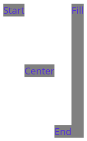
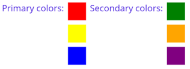

# HorizontalStackLayout

The .NET Multi-platform App UI (.NET MAUI) [[HorizontalStackLayout|HorizontalStackLayout]] organizes child views in a one-dimensional horizontal stack, and is a more performant alternative to a [[StackLayout (Controls)|StackLayout]]. In addition, a [[HorizontalStackLayout|HorizontalStackLayout]] can be used as a parent layout that contains other child layouts.

The [[HorizontalStackLayout|HorizontalStackLayout]] defines the following properties:

- `Spacing`, of type `double`, indicates the amount of space between each child view. The default value of this property is 0.

This property is backed by a [[BindableProperty|BindableProperty]] object, which means that it can be the target of data bindings and styled.

The following XAML shows how to create a [[HorizontalStackLayout|HorizontalStackLayout]] that contains different child views:

```xaml
<ContentPage xmlns="http://schemas.microsoft.com/dotnet/2021/maui"
             xmlns:x="http://schemas.microsoft.com/winfx/2009/xaml"
             x:Class="StackLayoutDemos.Views.HorizontalStackLayoutPage">
    <HorizontalStackLayout Margin="20">
       <Rectangle Fill="Red"
                  HeightRequest="30"
                  WidthRequest="30" />
       <Label Text="Red"
              FontSize="18" />
    </HorizontalStackLayout>
</ContentPage>
```

This example creates a [[HorizontalStackLayout|HorizontalStackLayout]] containing a [[Rectangle|Rectangle]] and a [[Label (Controls)|Label]] object. By default, there is no space between the child views:


> [!NOTE]
> The value of the `Margin` property represents the distance between an element and its adjacent elements. For more information, see [[align-position#position-controls|Position controls]].

## Space between child views

The spacing between child views in a [[HorizontalStackLayout|HorizontalStackLayout]] can be changed by setting the `Spacing` property to a `double` value:

```xaml
<ContentPage xmlns="http://schemas.microsoft.com/dotnet/2021/maui"
             xmlns:x="http://schemas.microsoft.com/winfx/2009/xaml"
             x:Class="StackLayoutDemos.Views.HorizontalStackLayoutPage">
    <HorizontalStackLayout Margin="20"
                           Spacing="10">
       <Rectangle Fill="Red"
                  HeightRequest="30"
                  WidthRequest="30" />
       <Label Text="Red"
              FontSize="18" />
    </HorizontalStackLayout>
</ContentPage>
```

This example creates a [[HorizontalStackLayout|HorizontalStackLayout]] containing a [[Rectangle|Rectangle]] and a [[Label (Controls)|Label]] object, that have ten device-independent units of space between them:


> [!TIP]
> The `Spacing` property can be set to negative values to make child views overlap.

## Position and size child views

The size and position of child views within a [[HorizontalStackLayout|HorizontalStackLayout]] depends upon the values of the child views' [[VisualElement (Controls).HeightRequest|HeightRequest]] and [[VisualElement (Controls).WidthRequest|WidthRequest]] properties, and the values of their `VerticalOptions` properties. In a [[HorizontalStackLayout|HorizontalStackLayout]], child views expand to fill the available height when their size isn't explicitly set.

The `VerticalOptions` properties of a [[HorizontalStackLayout|HorizontalStackLayout]], and its child views, can be set to fields from the `LayoutOptions` struct, which encapsulates an *alignment* layout preference. This layout preference determines the position and size of a child view within its parent layout.

The following XAML example sets alignment preferences on each child view in the [[HorizontalStackLayout|HorizontalStackLayout]]:

```xaml
<ContentPage xmlns="http://schemas.microsoft.com/dotnet/2021/maui"
             xmlns:x="http://schemas.microsoft.com/winfx/2009/xaml"
             x:Class="StackLayoutDemos.Views.HorizontalStackLayoutPage">
    <HorizontalStackLayout Margin="20"
                           HeightRequest="200">
        <Label Text="Start"
               BackgroundColor="Gray"
               VerticalOptions="Start" />
        <Label Text="Center"
               BackgroundColor="Gray"
               VerticalOptions="Center" />
        <Label Text="End"
               BackgroundColor="Gray"
               VerticalOptions="End" />
        <Label Text="Fill"
               BackgroundColor="Gray"
               VerticalOptions="Fill" />
    </HorizontalStackLayout>
</ContentPage>
```

In this example, alignment preferences are set on the [[Label (Controls)|Label]] objects to control their position within the [[HorizontalStackLayout|HorizontalStackLayout]]. The `Start`, `Center`, `End`, and `Fill` fields are used to define the alignment of the [[Label (Controls)|Label]] objects within the parent [[HorizontalStackLayout|HorizontalStackLayout]]:



A [[HorizontalStackLayout|HorizontalStackLayout]] only respects the alignment preferences on child views that are in the opposite direction to the orientation of the layout. Therefore, the [[Label (Controls)|Label]] child views within the [[HorizontalStackLayout|HorizontalStackLayout]] set their `VerticalOptions` properties to one of the alignment fields:

- `Start`, which positions the [[Label (Controls)|Label]] at the start of the [[HorizontalStackLayout|HorizontalStackLayout]].
- `Center`, which vertically centers the [[Label (Controls)|Label]] in the [[HorizontalStackLayout|HorizontalStackLayout]].
- `End`, which positions the [[Label (Controls)|Label]] at the end of the [[HorizontalStackLayout|HorizontalStackLayout]].
- `Fill`, which ensures that the [[Label (Controls)|Label]] fills the height of the [[HorizontalStackLayout|HorizontalStackLayout]].

For more information about alignment, see [[align-position|Align and position .NET MAUI controls]].

## Nest HorizontalStackLayout objects

A [[HorizontalStackLayout|HorizontalStackLayout]] can be used as a parent layout that contains other nested child layouts.

The following XAML shows an example of nesting [[VerticalStackLayout|VerticalStackLayout]] objects in a [[HorizontalStackLayout|HorizontalStackLayout]]:

```xaml
<ContentPage xmlns="http://xamarin.com/schemas/2014/forms"
             xmlns:x="http://schemas.microsoft.com/winfx/2009/xaml"
             x:Class="StackLayoutDemos.Views.HorizontalStackLayoutPage">
    <HorizontalStackLayout Margin="20"
                           Spacing="6">
        <Label Text="Primary colors:" />
        <VerticalStackLayout Spacing="6">
            <Rectangle Fill="Red"
                       WidthRequest="30"
                       HeightRequest="30" />
            <Rectangle Fill="Yellow"
                       WidthRequest="30"
                       HeightRequest="30" />
            <Rectangle Fill="Blue"
                       WidthRequest="30"
                       HeightRequest="30" />
        </VerticalStackLayout>
        <Label Text="Secondary colors:" />
        <VerticalStackLayout Spacing="6">
            <Rectangle Fill="Green"
                       WidthRequest="30"
                       HeightRequest="30" />
            <Rectangle Fill="Orange"
                       WidthRequest="30"
                       HeightRequest="30" />
            <Rectangle Fill="Purple"
                       WidthRequest="30"
                       HeightRequest="30" />
        </VerticalStackLayout>
    </HorizontalStackLayout>
</ContentPage>
```

In this example, the parent [[HorizontalStackLayout|HorizontalStackLayout]] contains two nested [[VerticalStackLayout|VerticalStackLayout]] objects:



> [!IMPORTANT]
> The deeper you nest layout objects the more layout calculations will be performed, which may impact performance. For more information, see [[performance#choose-the-correct-layout|Choose the correct layout]].
