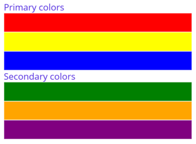
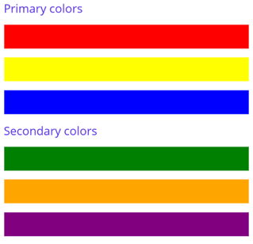
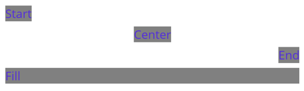
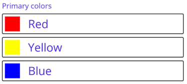

# VerticalStackLayout

The .NET Multi-platform App UI (.NET MAUI) [[VerticalStackLayout|VerticalStackLayout]] organizes child views in a one-dimensional vertical stack, and is a more performant alternative to a [[StackLayout (Controls)|StackLayout]]. In addition, a [[VerticalStackLayout|VerticalStackLayout]] can be used as a parent layout that contains other child layouts.

The [[VerticalStackLayout|VerticalStackLayout]] defines the following properties:

- `Spacing`, of type `double`, indicates the amount of space between each child view. The default value of this property is 0.

This property is backed by a [[BindableProperty|BindableProperty]] object, which means that it can be the target of data bindings and styled.

The following XAML shows how to create a [[VerticalStackLayout|VerticalStackLayout]] that contains different child views:

```xaml
<ContentPage xmlns="http://schemas.microsoft.com/dotnet/2021/maui"
             xmlns:x="http://schemas.microsoft.com/winfx/2009/xaml"
             x:Class="StackLayoutDemos.Views.VerticalStackLayoutPage">
    <VerticalStackLayout Margin="20">
        <Label Text="Primary colors" />
        <Rectangle Fill="Red"
                   HeightRequest="30"
                   WidthRequest="300" />
        <Rectangle Fill="Yellow"
                   HeightRequest="30"
                   WidthRequest="300" />
        <Rectangle Fill="Blue"
                   HeightRequest="30"
                   WidthRequest="300" />
        <Label Text="Secondary colors" />
        <Rectangle Fill="Green"
                   HeightRequest="30"
                   WidthRequest="300" />
        <Rectangle Fill="Orange"
                   HeightRequest="30"
                   WidthRequest="300" />
        <Rectangle Fill="Purple"
                   HeightRequest="30"
                   WidthRequest="300" />
    </VerticalStackLayout>
</ContentPage>
```

This example creates a [[VerticalStackLayout|VerticalStackLayout]] containing [[Label (Controls)|Label]] and [[Rectangle|Rectangle]] objects. By default, there is no space between the child views:



> [!NOTE]
> The value of the `Margin` property represents the distance between an element and its adjacent elements. For more information, see [[align-position#position-controls|Position controls]].

## Space between child views

The spacing between child views in a [[VerticalStackLayout|VerticalStackLayout]] can be changed by setting the `Spacing` property to a `double` value:

```xaml
<ContentPage xmlns="http://schemas.microsoft.com/dotnet/2021/maui"
             xmlns:x="http://schemas.microsoft.com/winfx/2009/xaml"
             x:Class="StackLayoutDemos.Views.VerticalStackLayoutPage">
    <VerticalStackLayout Margin="20"
                         Spacing="10">
        <Label Text="Primary colors" />
        <Rectangle Fill="Red"
                   HeightRequest="30"
                   WidthRequest="300" />
        <Rectangle Fill="Yellow"
                   HeightRequest="30"
                   WidthRequest="300" />
        <Rectangle Fill="Blue"
                   HeightRequest="30"
                   WidthRequest="300" />
        <Label Text="Secondary colors" />
        <Rectangle Fill="Green"
                   HeightRequest="30"
                   WidthRequest="300" />
        <Rectangle Fill="Orange"
                   HeightRequest="30"
                   WidthRequest="300" />
        <Rectangle Fill="Purple"
                   HeightRequest="30"
                   WidthRequest="300" />
    </VerticalStackLayout>
</ContentPage>
```

This example creates a [[VerticalStackLayout|VerticalStackLayout]] containing [[Label (Controls)|Label]] and [[Rectangle|Rectangle]] objects that have ten device-independent units of space between the child views:



> [!TIP]
> The `Spacing` property can be set to negative values to make child views overlap.

## Position and size child views

The size and position of child views within a [[VerticalStackLayout|VerticalStackLayout]] depends upon the values of the child views' [[VisualElement (Controls).HeightRequest|HeightRequest]] and [[VisualElement (Controls).WidthRequest|WidthRequest]] properties, and the values of their `HorizontalOptions` properties. In a [[VerticalStackLayout|VerticalStackLayout]], child views expand to fill the available width when their size isn't explicitly set.

The `HorizontalOptions` properties of a [[VerticalStackLayout|VerticalStackLayout]], and its child views, can be set to fields from the `LayoutOptions` struct, which encapsulates an *alignment* layout preference. This layout preference determines the position and size of a child view within its parent layout.

> [!TIP]
> Don't set the `HorizontalOptions` property of a [[VerticalStackLayout|VerticalStackLayout]] unless you need to. The default value of `LayoutOptions.Fill` allows for the best layout optimization. Changing this property has a cost and consumes memory, even when setting it back to its default value.

The following XAML example sets alignment preferences on each child view in the [[VerticalStackLayout|VerticalStackLayout]]:

```xaml
<ContentPage xmlns="http://schemas.microsoft.com/dotnet/2021/maui"
             xmlns:x="http://schemas.microsoft.com/winfx/2009/xaml"
             x:Class="StackLayoutDemos.Views.VerticalStackLayoutPage">
    <VerticalStackLayout Margin="20"
                         Spacing="6">
        <Label Text="Start"
               BackgroundColor="Gray"
               HorizontalOptions="Start" />
        <Label Text="Center"
               BackgroundColor="Gray"
               HorizontalOptions="Center" />
        <Label Text="End"
               BackgroundColor="Gray"
               HorizontalOptions="End" />
        <Label Text="Fill"
               BackgroundColor="Gray"
               HorizontalOptions="Fill" />
    </VerticalStackLayout>
</ContentPage>
```

In this example, alignment preferences are set on the [[Label (Controls)|Label]] objects to control their position within the [[VerticalStackLayout|VerticalStackLayout]]. The `Start`, `Center`, `End`, and `Fill` fields are used to define the alignment of the [[Label (Controls)|Label]] objects within the parent [[VerticalStackLayout|VerticalStackLayout]]:



A [[VerticalStackLayout|VerticalStackLayout]] only respects the alignment preferences on child views that are in the opposite direction to the orientation of the layout. Therefore, the [[Label (Controls)|Label]] child views within the [[VerticalStackLayout|VerticalStackLayout]] set their `HorizontalOptions` properties to one of the alignment fields:

- `Start`, which positions the [[Label (Controls)|Label]] on the left-hand side of the [[VerticalStackLayout|VerticalStackLayout]].
- `Center`, which centers the [[Label (Controls)|Label]] in the [[VerticalStackLayout|VerticalStackLayout]].
- `End`, which positions the [[Label (Controls)|Label]] on the right-hand side of the [[VerticalStackLayout|VerticalStackLayout]].
- `Fill`, which ensures that the [[Label (Controls)|Label]] fills the width of the [[VerticalStackLayout|VerticalStackLayout]].

<!--
For more information about alignment, see [[layout-options|Layout Options in .NET MAUI]].
-->

## Nest VerticalStackLayout objects

A [[VerticalStackLayout|VerticalStackLayout]] can be used as a parent layout that contains other nested child layouts.

The following XAML shows an example of nesting [[HorizontalStackLayout|HorizontalStackLayout]] objects in a [[VerticalStackLayout|VerticalStackLayout]]:

```xaml
<ContentPage xmlns="http://xamarin.com/schemas/2014/forms"
             xmlns:x="http://schemas.microsoft.com/winfx/2009/xaml"
             x:Class="StackLayoutDemos.Views.VerticalStackLayoutPage">
    <VerticalStackLayout Margin="20"
                         Spacing="6">
       <Label Text="Primary colors" />
       <Border Stroke="Black"
               Padding="5">
           <HorizontalStackLayout Spacing="15">
               <Rectangle Fill="Red"
                          HeightRequest="30"
                          WidthRequest="30" />
               <Label Text="Red"
                      FontSize="18" />
           </HorizontalStackLayout>
       </Border>
       <Border Stroke="Black"
               Padding="5">
           <HorizontalStackLayout Spacing="15">
               <Rectangle Fill="Yellow"
                          HeightRequest="30"
                          WidthRequest="30" />
               <Label Text="Yellow"
                      FontSize="18" />
           </HorizontalStackLayout>
       </Border>
       <Border Stroke="Black"
               Padding="5">
           <HorizontalStackLayout Spacing="15">
               <Rectangle Fill="Blue"
                          HeightRequest="30"
                          WidthRequest="30" />
               <Label Text="Blue"
                      FontSize="18" />
           </HorizontalStackLayout>
       </Border>
    </VerticalStackLayout>
</ContentPage>
```

In this example, the parent [[VerticalStackLayout|VerticalStackLayout]] contains nested [[HorizontalStackLayout|HorizontalStackLayout]] objects inside [[Border|Border]] objects:



> [!IMPORTANT]
> The deeper you nest layout objects the more layout calculations will be performed, which may impact performance. For more information, see [[performance#choose-the-correct-layout|Choose the correct layout]].
