# Material 3

Material 3 (also known as Material You) is the latest evolution of Google's Material Design system, offering a more personalized and adaptive user interface. In .NET Multi-platform App UI (.NET MAUI), Material 3 design is available on the Android platform but is not enabled by default.

## Overview

Material 3 introduces several improvements over Material 2, including:

- Dynamic color schemes that adapt to user preferences and system themes
- Updated component designs with refined shapes and elevations
- More flexible customization options

Without enabling Material 3, your .NET MAUI Android app will continue to use Material 2 styles, which may not provide the latest design patterns and user experience enhancements.

## Enable Material 3

To enable Material 3 design on Android, set the `UseMaterial3` build property to `true` in your project file (.csproj).

Add the following property to a `<PropertyGroup>` in your project file:

```xml
<PropertyGroup>
  <UseMaterial3>true</UseMaterial3>
</PropertyGroup>
```

### Full example

The following example shows a complete project file with the `UseMaterial3` property enabled:

```xml
<Project Sdk="Microsoft.NET.Sdk">

  <PropertyGroup>
    <TargetFrameworks>net10.0-android;net10.0-ios;net10.0-maccatalyst</TargetFrameworks>
    <TargetFrameworks Condition="$([MSBuild]::IsOSPlatform('windows'))">$(TargetFrameworks);net10.0-windows10.0.19041.0</TargetFrameworks>
    
    <OutputType>Exe</OutputType>
    <RootNamespace>MyMauiApp</RootNamespace>
    <UseMaui>true</UseMaui>
    <SingleProject>true</SingleProject>
    <ImplicitUsings>enable</ImplicitUsings>
    
    <!-- Enable Material 3 design on Android -->
    <UseMaterial3>true</UseMaterial3>
    
    <!-- Display name -->
    <ApplicationTitle>MyMauiApp</ApplicationTitle>
    
    <!-- App Identifier -->
    <ApplicationId>com.companyname.mymauiapp</ApplicationId>
    
    <!-- Versions -->
    <ApplicationDisplayVersion>1.0</ApplicationDisplayVersion>
    <ApplicationVersion>1</ApplicationVersion>
    
    <SupportedOSPlatformVersion Condition="$([MSBuild]::GetTargetPlatformIdentifier('$(TargetFramework)')) == 'ios'">15.0</SupportedOSPlatformVersion>
    <SupportedOSPlatformVersion Condition="$([MSBuild]::GetTargetPlatformIdentifier('$(TargetFramework)')) == 'maccatalyst'">15.0</SupportedOSPlatformVersion>
    <SupportedOSPlatformVersion Condition="$([MSBuild]::GetTargetPlatformIdentifier('$(TargetFramework)')) == 'android'">21.0</SupportedOSPlatformVersion>
    <SupportedOSPlatformVersion Condition="$([MSBuild]::GetTargetPlatformIdentifier('$(TargetFramework)')) == 'windows'">10.0.17763.0</SupportedOSPlatformVersion>
    <TargetPlatformMinVersion Condition="$([MSBuild]::GetTargetPlatformIdentifier('$(TargetFramework)')) == 'windows'">10.0.17763.0</TargetPlatformMinVersion>
  </PropertyGroup>

  <ItemGroup>
    <PackageReference Include="Microsoft.Maui.Controls" Version="$(MauiVersion)" />
  </ItemGroup>

</Project>
```

## Platform availability

The `UseMaterial3` build property is specific to the Android platform. It has no effect on other platforms such as iOS, macOS, or Windows. On these platforms, .NET MAUI apps use the native design systems and controls specific to each platform.

> [!NOTE]
> Material 3 styling only applies on Android when `UseMaterial3` is set to `true`. Controls on iOS, macOS, and Windows are unaffected.

### Entry

The [[entry|Entry]] control on Android is rendered using Material 3's `TextInputLayout` with an outlined text field when the feature is enabled. The following visual changes apply:

- **Outlined text field**: The entry renders as an outlined box with a visible border, replacing the legacy underline-only `EditText` styling, conforming to the [Material 3 text field specification](https://m3.material.io/components/text-fields/specs).

The following screenshot shows the difference between Material 2 and Material 3.


      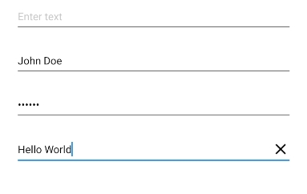
      **Material 2**


      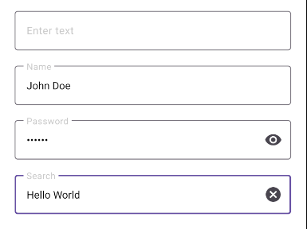
      **Material 3**


For more information about the underlying Android controls, see [TextInputLayout](https://developer.android.com/reference/com/google/android/material/textfield/TextInputLayout) and [TextInputEditText](https://developer.android.com/reference/com/google/android/material/textfield/TextInputEditText).

### Editor

The [[editor|Editor]] control on Android uses the Material 3 text field when the feature is enabled.

The following screenshot shows the difference between Material 2 and Material 3.


      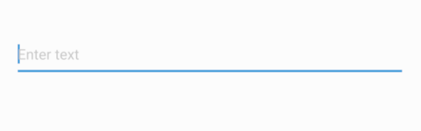
      **Material 2**


      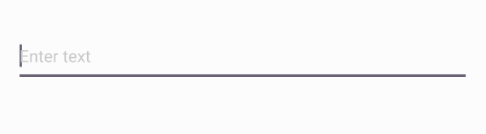
      **Material 3**


For more information about the underlying Android control, see [TextInputEditText](https://developer.android.com/reference/com/google/android/material/textfield/TextInputEditText).

### SearchBar

The [[searchbar|SearchBar]] control on Android uses a Material 3-styled inline text input field. The field includes a leading search icon and a trailing clear button that appears whenever the field contains text. The search field uses Material 3 color tokens that adapt to light and dark themes.

The following screenshot shows the difference between Material 2 and Material 3.


      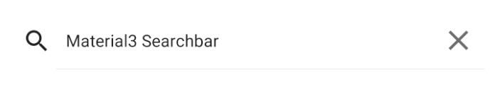
      **Material 2**


      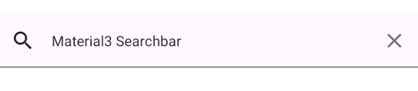
      **Material 3**


For more information about the underlying Android component, see [SearchBar](https://developer.android.com/reference/com/google/android/material/search/SearchBar).

### RadioButton

The [[radiobutton|RadioButton]] control on Android automatically adopts Material 3 styling when the feature is enabled.

The following screenshot shows the difference between Material 2 and Material 3.


      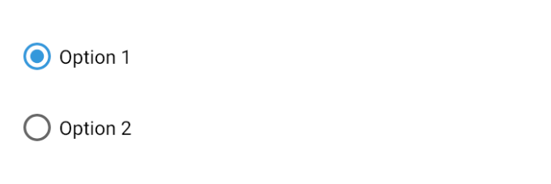
      **Material 2**


      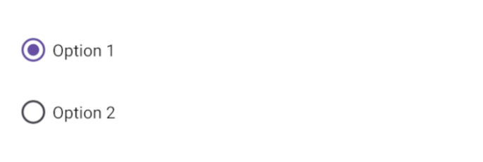
      **Material 3**


For more information about the underlying Android control, see [MaterialRadioButton](https://developer.android.com/reference/com/google/android/material/radiobutton/MaterialRadioButton).

### ProgressBar

The [[progressbar|ProgressBar]] control on Android uses the Material 3 linear progress indicator when the feature is enabled.

The following screenshot shows the difference between Material 2 and Material 3.


      
      **Material 2**


      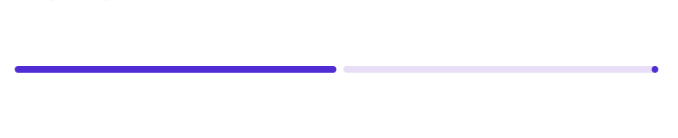
      **Material 3**


For more information about the underlying Android control, see [LinearProgressIndicator](https://developer.android.com/reference/com/google/android/material/progressindicator/LinearProgressIndicator).

### Slider

The [[slider|Slider]] control on Android automatically adopts Material 3 styling when the feature is enabled.

The following screenshot shows the difference between Material 2 and Material 3.


      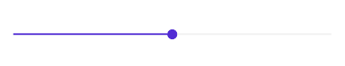
      **Material 2**


      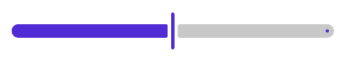
      **Material 3**


For more information about the underlying Android control, see [Material Slider](https://developer.android.com/reference/com/google/android/material/slider/Slider).

### Picker

The [[picker|Picker]] control on Android uses the Material 3 picker when the feature is enabled.

The following screenshot shows the difference between Material 2 and Material 3.


      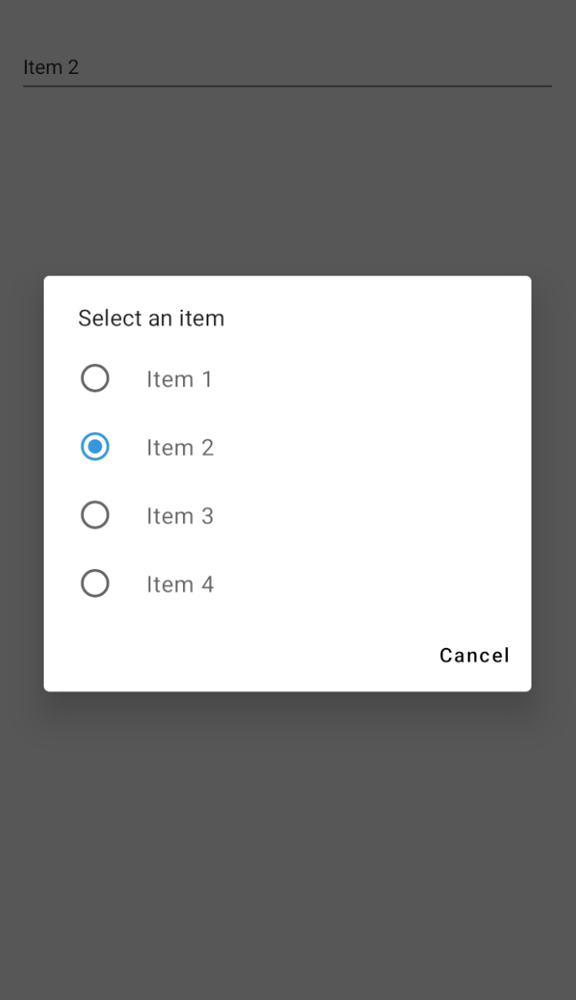
      **Material 2**


      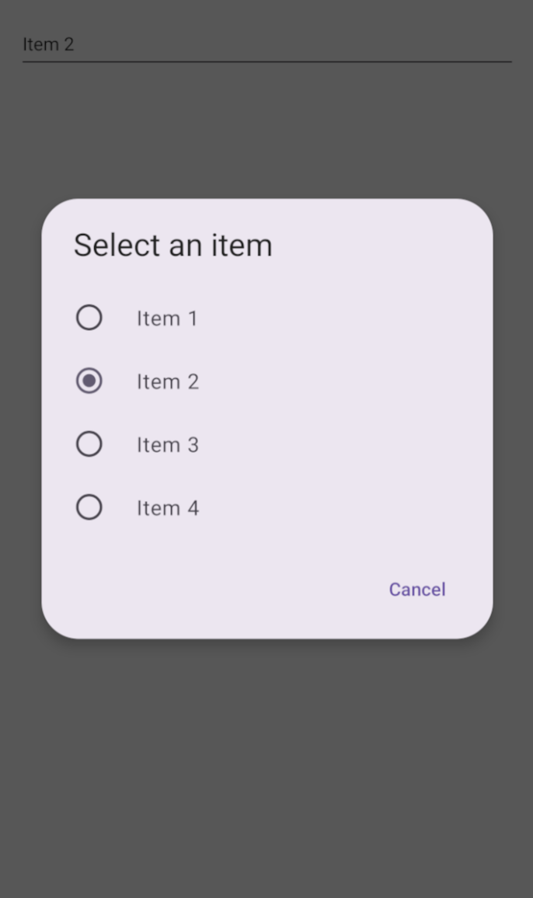
      **Material 3**


For more information about the underlying Android controls, see [TextInputEditText](https://developer.android.com/reference/com/google/android/material/textfield/TextInputEditText) and [MaterialAlertDialogBuilder](https://developer.android.com/reference/com/google/android/material/dialog/MaterialAlertDialogBuilder).

### TimePicker

The [[timepicker|TimePicker]] control on Android uses the Material 3 time picker dialog when the feature is enabled.

The following screenshot shows the difference between Material 2 and Material 3.


      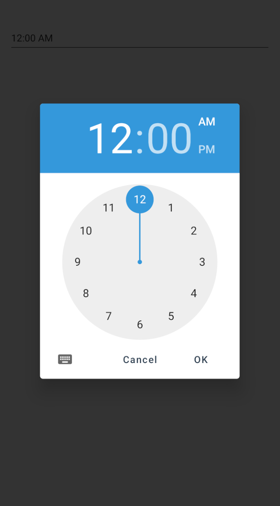
      **Material 2**


      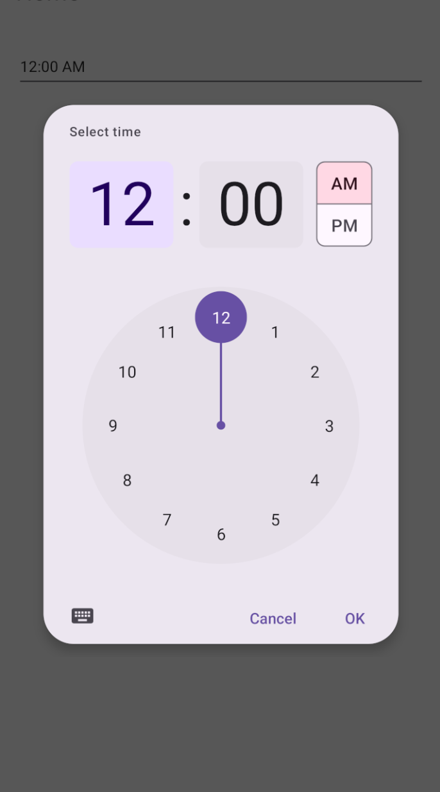
      **Material 3**


For more information about the underlying Android control, see [MaterialTimePicker](https://developer.android.com/reference/com/google/android/material/timepicker/MaterialTimePicker).

### DatePicker

The [[datepicker|DatePicker]] control on Android replaces the system date picker dialog with Google's Material 3 `MaterialDatePicker` full-screen calendar overlay when the feature is enabled. The dialog always opens in calendar mode and uses Material 3 color tokens that adapt to light and dark themes. `MinimumDate` and `MaximumDate` are applied as immutable calendar constraints each time the dialog is opened.

The following screenshot shows the difference between Material 2 and Material 3.


      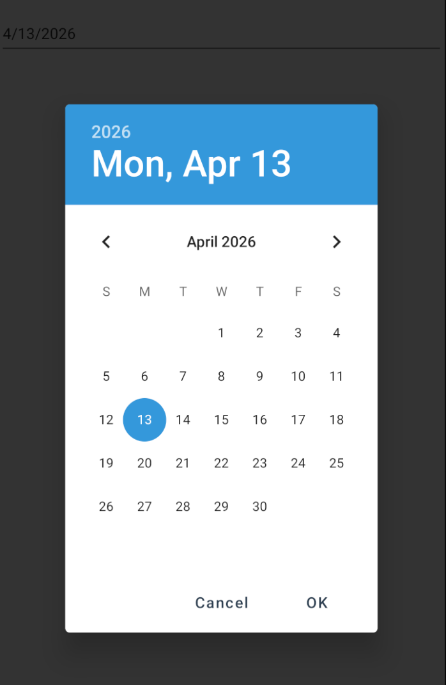
      **Material 2**


      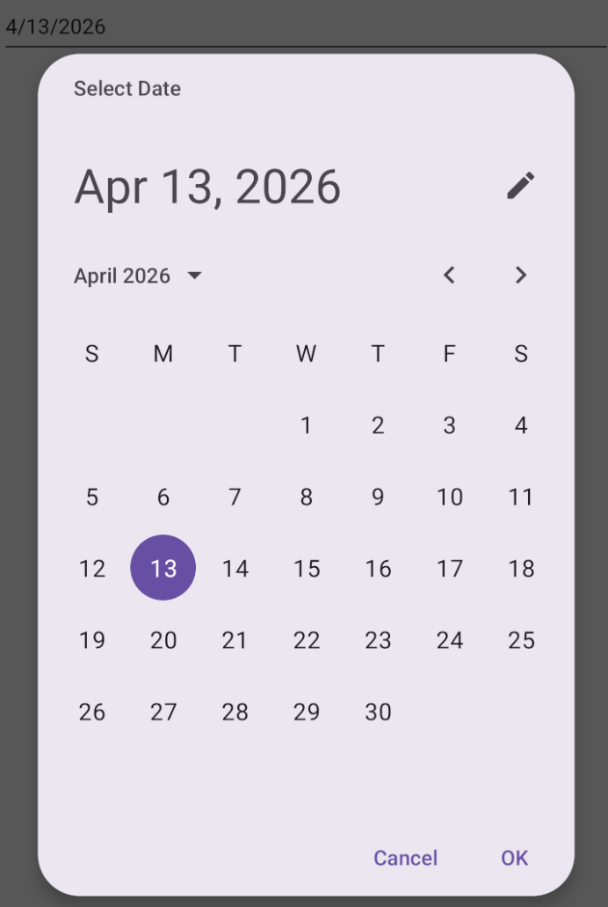
      **Material 3**


> [!IMPORTANT]
> `MinimumDate` and `MaximumDate` cannot be updated dynamically while the date picker dialog is open. Calendar constraints are immutable after the dialog is built and are re-applied fresh each time the dialog is shown.

For more information about the underlying Android component, see [MaterialDatePicker](https://developer.android.com/reference/com/google/android/material/datepicker/MaterialDatePicker).


### ImageButton

The [[imagebutton|ImageButton]] control on Android is rendered using the Material 3 `ShapeableImageView` when the feature is enabled, picking up Material 3 shape, ripple, and elevation behaviors that match other Material 3 buttons.

For more information about the underlying Android control, see [ShapeableImageView](https://developer.android.com/reference/com/google/android/material/imageview/ShapeableImageView).

### Switch

The [[switch|Switch]] control on Android is rendered using the Material 3 `MaterialSwitch` when the feature is enabled, replacing the legacy `SwitchCompat` track and thumb with the updated Material 3 design.

For more information about the underlying Android control, see [MaterialSwitch](https://developer.android.com/reference/com/google/android/material/materialswitch/MaterialSwitch).

### Shell

When the feature is enabled, the [[shell|Shell]] tab bar on Android is rendered using the Material 3 navigation components. Bottom tabs use the Material 3 `BottomNavigationView` and top tabs use the Material 3 `TabLayout`, both of which adopt Material 3 color tokens, shape, and selection states. Tab badges set with `BadgeText`, `BadgeColor`, and `BadgeTextColor` are rendered through the Material 3 `BadgeDrawable`.

For more information about the underlying Android controls, see [BottomNavigationView](https://developer.android.com/reference/com/google/android/material/bottomnavigation/BottomNavigationView) and [TabLayout](https://developer.android.com/reference/com/google/android/material/tabs/TabLayout).


## Considerations

When enabling Material 3 in your .NET MAUI Android app, consider the following:

- **Visual changes**: Enabling Material 3 will change the appearance of UI controls throughout your app. Test your app's UI thoroughly to ensure the new styles work well with your design.
- **Dynamic theming**: Material 3 supports dynamic color schemes based on the user's wallpaper and preferences. Ensure your app's custom colors and themes work well with this feature.
- **Backward compatibility**: Material 3 requires Android 5.0 (API level 21) or higher, which is the minimum version supported by .NET MAUI.
- **Default behavior**: If the `UseMaterial3` property is not set or is set to `false`, your app will use Material 2 design by default.

> [!NOTE]
> When `UseMaterial3` is enabled in a default .NET MAUI app, controls are still rendered using the default .NET MAUI styles rather than Material 3 styles. This happens because the default styles and color tokens defined in `Styles.xaml` and `Colors.xaml` override the Material 3 styles.
>
> For example, buttons don't automatically adopt Material 3 attributes such as a rounded corner radius or color tokens, because their styles are already customized in the default configuration.
>
> To apply Material 3 design tokens—including CornerRadius and colors—refer to the styles and color definitions used in the [.NET MAUI Material 3 demo](https://github.com/dotnet/maui-samples/tree/main/10.0/UserInterface/Material3Demo/HealthProfile/HealthProfile/Resources/Styles). Updating your app to use those styles ensures proper adoption of Material 3 styling.

The following screenshot shows the difference between the default .NET MAUI button style and a button styled with Material 3 design tokens:


      
      **Default .NET MAUI style**


      
      **Material 3 style**


