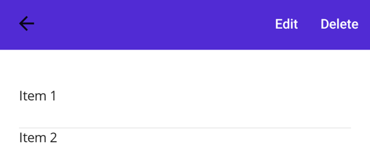

# Display menu items

The .NET Multi-platform App UI (.NET MAUI) [[MenuItem|MenuItem]] class can be used to define menu items for menus such as [[ListView (Controls)|ListView]] item context menus and Shell app flyout menus.

The following screenshots show [[MenuItem|MenuItem]] objects in a [[ListView (Controls)|ListView]] context menu on Android:



The [[MenuItem|MenuItem]] class defines the following properties:

- [[MenuItem.Command|Command]], of type `ICommand`, allows binding user actions, such as finger taps or clicks, to commands defined on a viewmodel.
- [[MenuItem.CommandParameter|CommandParameter]], of type `object`, specifies the parameter that should be passed to the `Command`.
- [[MenuItem.IconImageSource|IconImageSource]], of type [[ImageSource|ImageSource]], defines the menu item icon.
- [[MenuItem.IsDestructive|IsDestructive]], of type `bool`, indicates whether the [[MenuItem|MenuItem]] removes its associated UI element from the list.
- [[MenuItem.IsEnabled|IsEnabled]], of type `bool`, indicates whether the menu item responds to user input.
- [[MenuItem.Text|Text]], of type `string`, specifies the menu item text.

These properties are backed by [[BindableProperty|BindableProperty]] objects, which means that they can be targets of data bindings.

## Create a MenuItem

To create a menu item, for example as a context menu on a [[ListView (Controls)|ListView]] object's items, create a [[MenuItem|MenuItem]] object within a [[ViewCell (Controls)|ViewCell]] object that's used as the [[DataTemplate|DataTemplate]] object for the [[ListView (Controls)|ListView]]s `ItemTemplate`. When the [[ListView (Controls)|ListView]] object is populated it will create each item using the [[DataTemplate|DataTemplate]], exposing the [[MenuItem|MenuItem]] choices when the context menu is activated for an item.

The following example shows how to create a [[MenuItem|MenuItem]] within the context of a [[ListView (Controls)|ListView]] object:

```xaml
<ListView>
    <ListView.ItemTemplate>
        <DataTemplate x:DataType="local:Monkey">
            <ViewCell>
                <ViewCell.ContextActions>
                    <MenuItem Text="Context menu option" />
                </ViewCell.ContextActions>
                <Label Text="{Binding Name}" />
            </ViewCell>
        </DataTemplate>
    </ListView.ItemTemplate>
</ListView>
```

This example will result in a [[MenuItem|MenuItem]] object that has text. However, the appearance of a [[MenuItem|MenuItem]] varies across platforms.

A [[MenuItem|MenuItem]] can also be created in code:

```csharp
// Return a ViewCell instance that is used as the template for each list item
DataTemplate dataTemplate = new DataTemplate(() =>
{
    // A Label displays the list item text
    Label label = new Label();
    label.SetBinding(Label.TextProperty, static (Monkey monkey) => monkey.Name);

    // A ViewCell serves as the DataTemplate
    ViewCell viewCell = new ViewCell
    {
        View = label
    };

    // Add a MenuItem to the ContextActions
    MenuItem menuItem = new MenuItem
    {
        Text = "Context menu option"
    };
    viewCell.ContextActions.Add(menuItem);

    // Return the custom ViewCell to the DataTemplate constructor
    return viewCell;
});

ListView listView = new ListView
{
    ...
    ItemTemplate = dataTemplate
};
```

A context menu in a [[ListView (Controls)|ListView]] is activated and displayed differently on each platform. On Android, the context menu is activated by long-press on a list item. The context menu replaces the title and navigation bar area and [[MenuItem|MenuItem]] options are displayed as horizontal buttons. On iOS, the context menu is activated by swiping on a list item. The context menu is displayed on the list item and `MenuItems` are displayed as horizontal buttons. On Windows, the context menu is activated by right-clicking on a list item. The context menu is displayed near the cursor as a vertical list.

<!-- No MenuItems in this scenario on Mac Catalyst -->

## Define MenuItem behavior

The [[MenuItem|MenuItem]] class defines a [[MenuItem.Clicked|Clicked]] event. An event handler can be attached to this event to react to taps or clicks on [[MenuItem|MenuItem]] objects:

```xaml
<MenuItem ...
          Clicked="OnItemClicked" />
```

An event handler can also be attached in code:

```csharp
MenuItem item = new MenuItem { ... };
item.Clicked += OnItemClicked;
```

These examples reference an `OnItemClicked` event handler, which is shown in the following example:

```csharp
void OnItemClicked(object sender, EventArgs e)
{
    MenuItem menuItem = sender as MenuItem;

    // Access the list item through the BindingContext
    var contextItem = menuItem.BindingContext;

    // Do something with the contextItem here
}
```

## Define MenuItem appearance

Icons are specified using the [[MenuItem.IconImageSource|IconImageSource]] property. If an icon is specified, the text specified by the [[MenuItem.Text|Text]] property won't be displayed. The following screenshot shows a [[MenuItem|MenuItem]] with an icon on Android:


[[MenuItem|MenuItem]] objects only display icons on Android. On other platforms, only the text specified by the [[MenuItem.Text|Text]] property will be displayed.

> [!NOTE]
> Images can be stored in a single location in your app project. For more information, see [[images|Add images to a .NET MAUI project]].

## Enable or disable a MenuItem at runtime

To enable or disable a [[MenuItem|MenuItem]] at runtime, bind its `Command` property to an `ICommand` implementation, and ensure that a `canExecute` delegate enables and disables the `ICommand` as appropriate.

> [!IMPORTANT]
> Don't bind the `IsEnabled` property to another property when using the `Command` property to enable or disable the [[MenuItem|MenuItem]].
