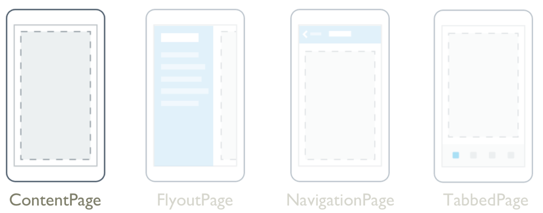
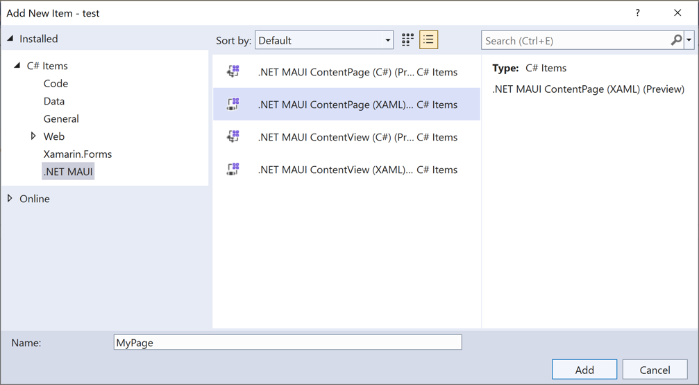

# ContentPage



The .NET Multi-platform App UI (.NET MAUI) [[ContentPage|ContentPage]] displays a single view, which is often a layout such as as [[Grid (Controls)|Grid]] or [[StackLayout (Controls)|StackLayout]], and is the most common page type.

[[ContentPage|ContentPage]] defines the following properties:


- [[ContentPage.Content|Content]] property, of type [[View|View]], which defines the view that represents the page's content.
- [[ContentPage.HideSoftInputOnTapped|HideSoftInputOnTapped]], of type `bool`, which indicates whether tapping anywhere on the page will cause the soft input keyboard to hide if it's visible on Android and iOS.


- [[ContentPage.Content|Content]] property, of type [[View|View]], which defines the view that represents the page's content.
- [[ContentPage.HideSoftInputOnTapped|HideSoftInputOnTapped]], of type `bool`, which indicates whether tapping anywhere on the page will cause the soft input keyboard to hide if it's visible on Android, iOS, and Mac Catalyst.


These properties are backed by [[BindableProperty|BindableProperty]] objects, which means that they can be the target of data bindings, and styled.

In addition, [[ContentPage|ContentPage]] inherits `Title`, `IconImageSource`, `BackgroundImageSource`, `IsBusy`, and `Padding` bindable properties from the [[Page (Controls)|Page]] class.

> [!NOTE]
> The `Content` property is the content property of the [[ContentPage|ContentPage]] class, and therefore does not need to be explicitly set from XAML.

.NET MAUI apps typically contain multiple pages that derive from [[ContentPage|ContentPage]], and navigation between these pages can be performed. For more information about page navigation, see [[navigationpage|NavigationPage]].

A [[ContentPage|ContentPage]] can be templated with a control template. For more information, see [[controltemplate|Control templates]].

## Create a ContentPage

To add a [[ContentPage|ContentPage]] to a .NET MAUI app:

1. In **Solution Explorer** right-click on your project or folder in your project, and select **New Item...**.
1. In the **Add New Item** dialog, expand **Installed > C# Items**, select **.NET MAUI**, and select the **.NET MAUI ContentPage (XAML)** item template, enter a suitable page name, and click the **Add** button:

    

Visual Studio then creates a new [[ContentPage|ContentPage]]-derived page, which will be similar to the following example:

```xaml
<ContentPage xmlns="http://schemas.microsoft.com/dotnet/2021/maui"
             xmlns:x="http://schemas.microsoft.com/winfx/2009/xaml"
             x:Class="MyMauiApp.MyPage"
             Title="MyPage"
             BackgroundColor="White">
    <StackLayout>
        <Label Text="Welcome to .NET MAUI!"
                VerticalOptions="Center"
                HorizontalOptions="Center" />
        <!-- Other views go here -->
    </StackLayout>
</ContentPage>
```

The child of a [[ContentPage|ContentPage]] is typically a layout, such as [[Grid (Controls)|Grid]] or [[StackLayout (Controls)|StackLayout]], with the layout typically containing multiple views. However, the child of the [[ContentPage|ContentPage]] can be a view that displays a collection, such as [[CollectionView|CollectionView]].

> [!NOTE]
> The value of the `Title` property will be shown on the navigation bar, when the app performs navigation using a [[NavigationPage (Controls)|NavigationPage]]. For more information, see [[navigationpage|NavigationPage]].
