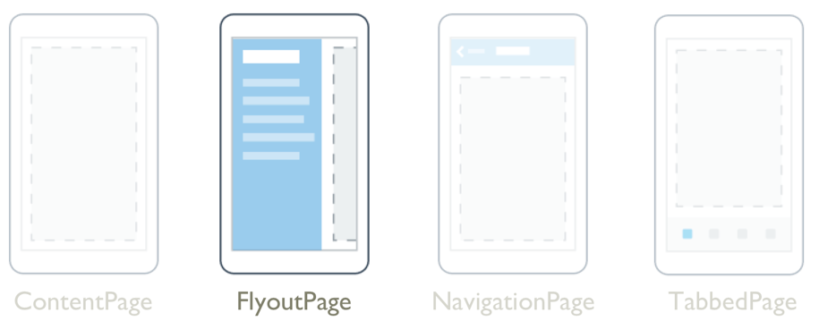

# FlyoutPage

[ Browse the sample](/samples/dotnet/maui-samples/navigation-flyoutpage)



The .NET Multi-platform App UI (.NET MAUI) [[FlyoutPage (Controls)|FlyoutPage]] is a page that manages two related pages of information – a flyout page that presents items, and a detail page that presents details about items on the flyout page.

A [[FlyoutPage (Controls)|FlyoutPage]] has two layout behaviors:

- In a popover layout, the detail page covers or partially covers the flyout page. Selecting an item on the flyout page will navigate to the corresponding detail page. Apps running on phones always use this layout behavior.
- In a split layout, the flyout page is displayed on the left and the detail page is on the right. Apps running on tablets or the desktop can use this layout behavior, with Windows using it by default.

For more information about layout behavior, see [Layout behavior](#layout-behavior).

[[FlyoutPage (Controls)|FlyoutPage]] defines the following properties:

- `Detail`, of type [[Page (Controls)|Page]], defines the detail page displayed for the selected item in the flyout page.
- `Flyout`, of type [[Page (Controls)|Page]], defines the flyout page.
- `FlyoutLayoutBehavior`, of type `FlyoutLayoutBehavior`, indicates the layout behavior of flyout and detail pages.
- `IsGestureEnabled`, of type `bool`, determines whether a swipe gesture will switch between flyout and detail pages. The default value of this property is `true`.
- `IsPresented`, of type `bool`, determines whether the flyout or detail page is displayed. The default value of this property is `false`, which displays the detail page. It should be set to `true` to display the flyout page.

The `IsGestureEnabled`, `IsPresented`, and `FlyoutLayoutBehavior` properties are backed by [[BindableProperty|BindableProperty]] objects, which means that they can be targets of data bindings, and styled.

[[FlyoutPage (Controls)|FlyoutPage]] also defines an `IsPresentedChanged` event, that's raised when the `IsPresented` property changes value.

> [!WARNING]
> [[FlyoutPage (Controls)|FlyoutPage]] is incompatible with .NET MAUI Shell apps, and an exception will be thrown if you attempt to use [[FlyoutPage (Controls)|FlyoutPage]] in a Shell app. For more information about Shell apps, see [[shell|Shell]].

## Create a FlyoutPage

To create a flyout page, create a [[FlyoutPage (Controls)|FlyoutPage]] object and set it's `Flyout` and `Detail` properties. The `Flyout` property should be set to [[ContentPage|ContentPage]] object, and the `Detail` property should be set to a [[TabbedPage (Controls)|TabbedPage]], [[NavigationPage (Controls)|NavigationPage]], or [[ContentPage|ContentPage]] object. This will help to ensure a consistent user experience across all platforms.

> [!IMPORTANT]
> A [[FlyoutPage (Controls)|FlyoutPage]] is designed to be the root page of an app, and using it as a child page in other page types could result in unexpected and inconsistent behavior.

The following example shows a [[FlyoutPage (Controls)|FlyoutPage]] that sets the `Flyout` and `Detail` properties:

```xaml
<FlyoutPage xmlns="http://schemas.microsoft.com/dotnet/2021/maui"
            xmlns:x="http://schemas.microsoft.com/winfx/2009/xaml"
            xmlns:local="clr-namespace:FlyoutPageNavigation"
            x:Class="FlyoutPageNavigation.MainPage">
    <FlyoutPage.Flyout>
        <local:FlyoutMenuPage x:Name="flyoutPage" />
    </FlyoutPage.Flyout>
    <FlyoutPage.Detail>
        <NavigationPage>
            <x:Arguments>
                <local:ContactsPage />
            </x:Arguments>
        </NavigationPage>
    </FlyoutPage.Detail>
</FlyoutPage>
```

In this example, the `Flyout` property is set to a [[ContentPage|ContentPage]] object, and the `Detail` property is set to a [[NavigationPage (Controls)|NavigationPage]] containing a [[ContentPage|ContentPage]] object.

The following example shows the definition of the `FlyoutMenuPage` object, which is of type [[ContentPage|ContentPage]]:

```xaml
<ContentPage xmlns="http://schemas.microsoft.com/dotnet/2021/maui"
             xmlns:x="http://schemas.microsoft.com/winfx/2009/xaml"
             xmlns:local="clr-namespace:FlyoutPageNavigation"
             x:Class="FlyoutPageNavigation.FlyoutMenuPage"
             Padding="0,40,0,0"
             IconImageSource="hamburger.png"
             Title="Personal Organiser">
    <CollectionView x:Name="collectionView"
                    x:FieldModifier="public"
                    SelectionMode="Single">
        <CollectionView.ItemsSource>
            <x:Array Type="{x:Type local:FlyoutPageItem}">
                <local:FlyoutPageItem Title="Contacts"
                                      IconSource="contacts.png"
                                      TargetType="{x:Type local:ContactsPage}" />
                <local:FlyoutPageItem Title="TodoList"
                                      IconSource="todo.png"
                                      TargetType="{x:Type local:TodoListPage}" />
                <local:FlyoutPageItem Title="Reminders"
                                      IconSource="reminders.png"
                                      TargetType="{x:Type local:ReminderPage}" />
            </x:Array>
        </CollectionView.ItemsSource>
        <CollectionView.ItemTemplate>
            <DataTemplate x:DataType="local:FlyoutPageItem">
                <Grid Padding="5,10">
                    <Grid.ColumnDefinitions>
                        <ColumnDefinition Width="30"/>
                        <ColumnDefinition Width="*" />
                    </Grid.ColumnDefinitions>
                    <Image Source="{Binding IconSource}" />
                    <Label Grid.Column="1"
                           Margin="20,0"
                           Text="{Binding Title}"
                           FontSize="20"
                           FontAttributes="Bold"
                           VerticalOptions="Center" />
                </Grid>
            </DataTemplate>
        </CollectionView.ItemTemplate>
    </CollectionView>
</ContentPage>
```

In this example, the flyout page consists of a [[CollectionView|CollectionView]] that's populated with data by setting its `ItemsSource` property to an array of `FlyoutPageItem` objects. The following example shows the definition of the `FlyoutPageItem` class:

```csharp
public class FlyoutPageItem
{
    public string Title { get; set; }
    public string IconSource { get; set; }
    public Type TargetType { get; set; }
}
```

A [[DataTemplate|DataTemplate]] is assigned to the `CollectionView.ItemTemplate` property, to display each `FlyoutPageItem`. The [[DataTemplate|DataTemplate]] contains a [[Grid (Controls)|Grid]] that consists of an [[Image (Controls)|Image]] and a [[Label (Controls)|Label]]. The [[Image (Controls)|Image]] displays the `IconSource` property value, and the [[Label (Controls)|Label]] displays the `Title` property value, for each `FlyoutPageItem`. In addition, the flyout page has its `Title` and `IconImageSource` properties set. The icon will appear on the detail page, provided that the detail page has a title bar.

> [!NOTE]
> The `Flyout` page must have its `Title` property set, or an exception will occur.

The following screenshot shows the resulting flyout:


### Create and display the detail page

The `FlyoutMenuPage` object contains a [[CollectionView|CollectionView]] that's referenced from the `MainPage` class. This allows the `MainPage` class to register a handler for the `SelectionChanged` event. This enables the `MainPage` object to set the `Detail` property to the page that represents the selected [[CollectionView|CollectionView]] item. The following example shows the event handler:

```csharp
public partial class MainPage : FlyoutPage
{
    public MainPage()
    {
        ...
        flyoutPage.collectionView.SelectionChanged += OnSelectionChanged;
    }

    void OnSelectionChanged(object sender, SelectionChangedEventArgs e)
    {
        var item = e.CurrentSelection.FirstOrDefault() as FlyoutPageItem;
        if (item != null)
        {            
            Detail = new NavigationPage((Page)Activator.CreateInstance(item.TargetType));
            if (!((IFlyoutPageController)this).ShouldShowSplitMode)
                IsPresented = false;
        }
    }
}
```

In this example, the `OnSelectionChanged` event handler retrieves the `CurrentSelection` from the [[CollectionView|CollectionView]] object and sets the detail page to an instance of the page type stored in the `TargetType` property of the `FlyoutPageItem`. The detail page is displayed by setting the `FlyoutPage.IsPresented` property to `false`, provided that the `FlyoutPage` isn't using a split layout. When the `FlyoutPage` is using a split layout, the flyout and detail pages are both displayed and so it's not necessary to set the `FlyoutPage.IsPresented` property.

## Layout behavior

How the [[FlyoutPage (Controls)|FlyoutPage]] displays the flyout and detail pages depends on the form factor of the device the app is running on, the orientation of the device, and the value of the `FlyoutLayoutBehavior` property. This property should be set to a value of the `FlyoutLayoutBehavior` enumeration, which defines the following members:

- `Default` – pages are displayed using the platform default.
- `Popover` – the flyout page covers, or partially covers the detail page.
- `Split` – the flyout page is displayed on the left and the detail page is on the right.
- `SplitOnLandscape` – a split screen is used when the device is in landscape orientation.
- `SplitOnPortrait` – a split screen is used when the device is in portrait orientation.

The following example shows how to set the `FlyoutLayoutBehavior` property on a [[FlyoutPage (Controls)|FlyoutPage]]:

```xaml
<FlyoutPage ...
            FlyoutLayoutBehavior="Split">
  ...
</FlyoutPage>
```

> [!IMPORTANT]
> The value of the `FlyoutLayoutBehavior` property only affects apps running on tablets or the desktop. Apps running on phones always have the `Popover` behavior.
