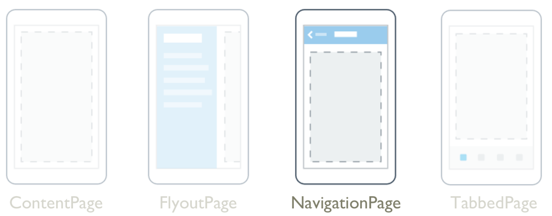
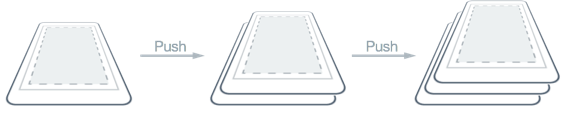
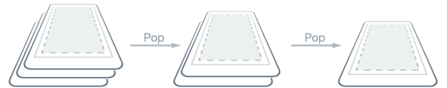
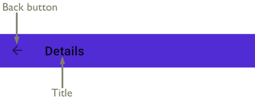
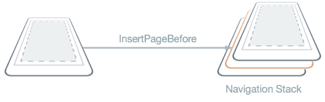
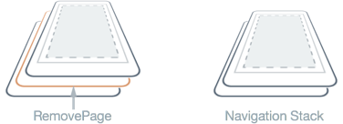
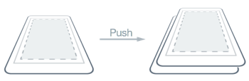
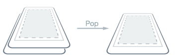

# NavigationPage



The .NET Multi-platform App UI (.NET MAUI) [[NavigationPage (Controls)|NavigationPage]] provides a hierarchical navigation experience where you're able to navigate through pages, forwards and backwards, as desired. [[NavigationPage (Controls)|NavigationPage]] provides navigation as a last-in, first-out (LIFO) stack of [[Page (Controls)|Page]] objects.

[[NavigationPage (Controls)|NavigationPage]] defines the following properties:

- `BarBackground`, of type [[Brush|Brush]], specifies the background of the navigation bar as a [[Brush|Brush]].
- `BarBackgroundColor`, of type [[Color|Color]], specifies the background color of the navigation bar.
- `BackButtonTitle`, of type `string`, represents the text to use for the back button. This is an attached property.
- `BarTextColor`, of type [[Color|Color]], specifies the color of the text on the navigation bar.
- `CurrentPage`, of type [[Page (Controls)|Page]], represents the page that's on top of the navigation stack. This is a read-only property.
- `HasNavigationBar`, of type `bool`, represents whether a navigation bar is present on the [[NavigationPage (Controls)|NavigationPage]]. The default value of this property is `true`. This is an attached property.
- `HasBackButton`, of type `bool`, represents whether the navigation bar includes a back button. The default value of this property is `true`. This is an attached property.
- `IconColor`, of type [[Color|Color]], defines the background color of the icon in the navigation bar. This is an attached property.
- `RootPage`, of type [[Page (Controls)|Page]], represents the root page of the navigation stack. This is a read-only property.
- `TitleIconImageSource`, of type [[ImageSource|ImageSource]], defines the icon that represents the title on the navigation bar. This is an attached property.
- `TitleView`, of type [[View|View]], defines the view that can be displayed in the navigation bar. This is an attached property.

These properties are backed by [[BindableProperty|BindableProperty]] objects, which means that they can be targets of data bindings, and styled.

The [[NavigationPage (Controls)|NavigationPage]] class also defines three events:

- `Pushed` is raised when a page is pushed onto the navigation stack.
- `Popped` is raised when a page is popped from the navigation stack.
- `PoppedToRoot` is raised when the last non-root page is popped from the navigation stack.

All three events receive `NavigationEventArgs` objects that define a read-only [[Page (Controls)|Page]] property, which retrieves the page that was popped from the navigation stack, or the newly visible page on the stack.

> [!WARNING]
> [[NavigationPage (Controls)|NavigationPage]] is incompatible with .NET MAUI Shell apps, and an exception will be thrown if you attempt to use [[NavigationPage (Controls)|NavigationPage]] in a Shell app. For more information about Shell apps, see [[shell|Shell]].

## Perform modeless navigation

.NET MAUI supports modeless page navigation. A modeless page stays on screen and remains available until you navigate to another page.

A [[NavigationPage (Controls)|NavigationPage]] is typically used to navigate through a stack of [[ContentPage|ContentPage]] objects. When one page navigates to another, the new page is pushed on the stack and becomes the active page:



When the second page returns back to the first page, a page is popped from the stack, and the new topmost page then becomes active:



A [[NavigationPage (Controls)|NavigationPage]] consists of a navigation bar, with the active page being displayed below the navigation bar. The following diagram shows the main components of the navigation bar:



An optional icon can be displayed between the back button and the title.

Navigation methods are exposed by the `Navigation` property on any [[Page (Controls)|Page]] derived types. These methods provide the ability to push pages onto the navigation stack, to pop pages from the stack, and to manipulate the stack.

> [!TIP]
> It's recommended that a [[NavigationPage (Controls)|NavigationPage]] should only be populated with [[ContentPage|ContentPage]] objects.

### Create the root page


An app that is structured around multiple pages always has a *root* page, which is the first page added to the navigation stack. This is accomplished by creating a [[NavigationPage (Controls)|NavigationPage]] object whose constructor argument is the root page of the app, and setting the resulting object as the value of the `App.MainPage` property:

```csharp
public partial class App : Application
{
    public App()
    {
        InitializeComponent();
        MainPage = new NavigationPage(new MainPage());
    }
}
```


An app that is structured around multiple pages always has a *root* page, which is the first page added to the navigation stack. This is accomplished by creating a [[NavigationPage (Controls)|NavigationPage]] object whose constructor argument is the root page of the app, and setting the resulting object as the root page of a [[Window|Window]]:

```csharp
public partial class App : Application
{
    public App()
    {
        InitializeComponent();
    }

    protected override Window CreateWindow(IActivationState? activationState)
    {
        return new Window(new NavigationPage(new MainPage()));
    }    
}
```


> [!NOTE]
> The `RootPage` property of a [[NavigationPage (Controls)|NavigationPage]] provides access to the first page in the navigation stack.

### Push pages to the navigation stack

A page can be navigated to by calling the `PushAsync` method on the `Navigation` property of the current page. The `Navigation` property is available on any [[Page (Controls)|Page]]-derived type. The following example shows a button click event handler in a page's code-behind file that navigates to `DetailsPage`:

```csharp
async void OnNavigateButtonClicked(object sender, EventArgs e)
{
    await Navigation.PushAsync(new DetailsPage());
}
```

In this example, the `DetailsPage` object is pushed onto the navigation stack, where it becomes the active page.

> [!NOTE]
> The `PushAsync` method has an override that includes a `bool` argument that specifies whether to display a page transition during navigation. The `PushAsync` method that lacks the `bool` argument enables the page transition by default.

### Pop pages from the navigation stack

The active page can be popped from the navigation stack by pressing the *Back* button on a device, regardless of whether this is a physical button on the device or an on-screen button.

To programmatically return to the previous page, the `PopAsync` method should be called on the `Navigation` property of the current page:

```csharp
async void OnBackButtonClicked(object sender, EventArgs e)
{
    await Navigation.PopAsync();
}
```

In this example, the current page is removed from the navigation stack, with the new topmost page becoming the active page.

> [!NOTE]
> The `PopAsync` method has an override that includes a `bool` argument that specifies whether to display a page transition during navigation. The `PopAsync` method that lacks the `bool` argument enables the page transition by default.

In addition, the `Navigation` property of each page also exposes a `PopToRootAsync` method that pops all but the root page off the navigation stack, therefore making the app's root page the active page.

## Manipulate the navigation stack

The `Navigation` property of a [[Page (Controls)|Page]] exposes a `NavigationStack` property from which the pages in the navigation stack can be obtained. While .NET MAUI maintains access to the navigation stack, the `Navigation` property provides the `InsertPageBefore` and `RemovePage` methods for manipulating the stack by inserting pages or removing them.

The `InsertPageBefore` method inserts a specified page in the navigation stack before an existing specified page, as shown in the following diagram:



The `RemovePage` method removes the specified page from the navigation stack, as shown in the following diagram:



Together, these methods enable a custom navigation experience, such as replacing a login page with a new page following a successful login.

## Perform modal navigation

.NET MAUI supports modal page navigation. A modal page encourages users to complete a self-contained task that cannot be navigated away from until the task is completed or cancelled.

A modal page can be any of the page types supported by .NET MAUI. To display a page modally, the app should push it onto the modal stack, where it will become the active page:



To return to the previous page the app should pop the current page from the modal stack, and the new topmost page becomes the active page:



Modal navigation methods are exposed by the `Navigation` property on any [[Page (Controls)|Page]] derived types. These methods provide the ability to push pages onto the modal stack, and pop pages from the modal stack. The `Navigation` property also exposes a `ModalStack` property from which pages in the modal stack can be obtained. However, there is no concept of performing modal stack manipulation, or popping to the root page in modal navigation. This is because these operations are not universally supported on the underlying platforms.

> [!NOTE]
> A [[NavigationPage (Controls)|NavigationPage]] object is not required for performing modal page navigation.

### Push pages to the modal stack

A page can be modally navigated to by calling the `PushModalAsync` method on the `Navigation` property of the current page:

```csharp
async void OnOpenModalButtonClicked(object sender, EventArgs e)
{
    await Navigation.PushModalAsync(new DetailsPage());
}
```

In this example, the `DetailsPage` object is pushed onto the modal stack, where it becomes the active page.

> [!NOTE]
> The `PushModalAsync` method has an override that includes a `bool` argument that specifies whether to display a page transition during navigation. The `PushModalAsync` method that lacks the `bool` argument enables the page transition by default.

### Pop pages from the modal stack

The active page can be popped from the modal stack by pressing the *Back* button on a device, regardless of whether this is a physical button on the device or an on-screen button.

To programmatically return to the original page, the `PopModalAsync` method should be called on the `Navigation` property of the current page:

```csharp
async void OnCloseModalButtonClicked(object sender, EventArgs e)
{
    await Navigation.PopModalAsync();
}
```

In this example, the current page is removed from the modal stack, with the new topmost page becoming the active page.

> [!NOTE]
> The `PopModalAsync` method has an override that includes a `bool` argument that specifies whether to display a page transition during navigation. The `PopModalAsync` method that lacks the `bool` argument enables the page transition by default.

### Disable the back button

On Android, you can always return to the previous page by pressing the standard *Back* button on the device. If the modal page requires a self-contained task to be completed before leaving the page, the app must disable the *Back* button. This can be accomplished by overriding the `Page.OnBackButtonPressed` method on the modal page.

## Page navigation events

The [[Page (Controls)|Page]] class defines `NavigatedTo`, `NavigatingFrom`, and `NavigatedFrom` navigation events that are raised during page navigation. The `NavigatingFrom` event is raised when the current page is about to be navigated away from. The `NavigatedFrom` event is raised after the current page has been navigated away from. The `NavigatedTo` event is raised after navigating to the current page.

> [!NOTE]
> On iOS and Mac Catalyst, these events can be raised before native animation completes when navigating between pages.


The `NavigatedToEventArgs` class defines the following properties:

- `PreviousPage`, of type [[Page (Controls)|Page]], represents the page that was navigated from.
- `NavigationType`, of type [[NavigationType|NavigationType]], represents the type of navigation that occurred.

The `NavigatingFromEventArgs` class defines the following properties:

- `DestinationPage`, of type [[Page (Controls)|Page]], represents the page being navigated to.
- `NavigationType`, of type [[NavigationType|NavigationType]], represents the type of navigation that is occurring.

The `NavigatedFromEventArgs` class defines the following properties:

- `DestinationPage`, of type [[Page (Controls)|Page]], represents the page that was navigated to.
- `NavigationType`, of type [[NavigationType|NavigationType]], represents the type of navigation that occurred.

The [[NavigationType|NavigationType]] enumeration defines the following members:

- `Push`, indicates that a page was pushed onto the navigation stack.
- `Pop`, indicates that a page was popped from the navigation stack.
- `PopToRoot`, indicates that all pages except the root page were popped from the navigation stack.
- `Insert`, indicates that a page was inserted into the navigation stack.
- `Remove`, indicates that a page was removed from the navigation stack.
- `Replace`, indicates that a page was replaced in the navigation stack.


The following example shows how to subscribe to the navigation events:


```csharp
public partial class MainPage : ContentPage
{
    public MainPage()
    {
        InitializeComponent();

        NavigatedTo += OnNavigatedTo;
        NavigatingFrom += OnNavigatingFrom;
        NavigatedFrom += OnNavigatedFrom;
    }

    void OnNavigatedTo(object sender, NavigatedToEventArgs args)
    {
        // Invoked when the page has been navigated to
    }

    void OnNavigatingFrom(object sender, NavigatingFromEventArgs args)
    {
        // Invoked when the page is being navigated away from
    }

    void OnNavigatedFrom(object sender, NavigatedFromEventArgs args)
    {
        // Invoked when the page has been navigated away from
    }
}
```


```csharp
public partial class MainPage : ContentPage
{
    public MainPage()
    {
        InitializeComponent();

        NavigatedTo += OnNavigatedTo;
        NavigatingFrom += OnNavigatingFrom;
        NavigatedFrom += OnNavigatedFrom;
    }

    void OnNavigatedTo(object sender, NavigatedToEventArgs args)
    {
        // Invoked when the page has been navigated to
        Page? previousPage = args.PreviousPage;
        NavigationType navigationType = args.NavigationType;
    }

    void OnNavigatingFrom(object sender, NavigatingFromEventArgs args)
    {
        // Invoked when the page is being navigated away from
        Page? destinationPage = args.DestinationPage;
        NavigationType navigationType = args.NavigationType;
    }

    void OnNavigatedFrom(object sender, NavigatedFromEventArgs args)
    {
        // Invoked when the page has been navigated away from
        Page? destinationPage = args.DestinationPage;
        NavigationType navigationType = args.NavigationType;
    }
}
```


Rather than subscribing to the events, a [[Page (Controls)|Page]]-derived class can override the `OnNavigatedTo%2A`, `OnNavigatingFrom%2A`, and `OnNavigatedFrom%2A` methods:


```csharp
public partial class MainPage : ContentPage
{
    protected override void OnNavigatedTo(NavigatedToEventArgs args)
    {
        base.OnNavigatedTo(args);

        // Invoked when the page has been navigated to
    }

    protected override void OnNavigatingFrom(NavigatingFromEventArgs args)
    {
        base.OnNavigatingFrom(args);

        // Invoked when the page is being navigated away from
    }

    protected override void OnNavigatedFrom(NavigatedFromEventArgs args)
    {
        base.OnNavigatedFrom(args);

        // Invoked when the page has been navigated away from
    }
}
```


```csharp
public partial class MainPage : ContentPage
{
    protected override void OnNavigatedTo(NavigatedToEventArgs args)
    {
        base.OnNavigatedTo(args);

        // Invoked when the page has been navigated to
        Page? previousPage = args.PreviousPage;
        NavigationType navigationType = args.NavigationType;
    }

    protected override void OnNavigatingFrom(NavigatingFromEventArgs args)
    {
        base.OnNavigatingFrom(args);

        // Invoked when the page is being navigated away from
        Page? destinationPage = args.DestinationPage;
        NavigationType navigationType = args.NavigationType;
    }

    protected override void OnNavigatedFrom(NavigatedFromEventArgs args)
    {
        base.OnNavigatedFrom(args);

        // Invoked when the page has been navigated away from
        Page? destinationPage = args.DestinationPage;
        NavigationType navigationType = args.NavigationType;
    }
}
```


These methods can be overridden to perform work immediately after navigation. For example, in the `OnNavigatedTo` method you might populate a collection of items from a database or web service.

## Pass data during navigation

Sometimes it's necessary for a page to pass data to another page during navigation. Two standard techniques for accomplishing this are passing data through a page constructor, and by setting the new page's `BindingContext` to the data.

### Pass data through a page constructor

The simplest technique for passing data to another page during navigation is through a page constructor argument:

```csharp
Contact contact = new Contact
{
    Name = "Jane Doe",
    Age = 30,
    Occupation = "Developer",
    Country = "USA"
};
...
await Navigation.PushModalAsync(new DetailsPage(contact));
```

In this example, a `Contact` object is passed as a constructor argument to `DetailPage`. The `Contact` object can then be displayed by `DetailsPage`.

### Pass data through a BindingContext

An alternative approach for passing data to another page during navigation is by setting the new page's `BindingContext` to the data:

```csharp
Contact contact = new Contact
{
    Name = "Jane Doe",
    Age = 30,
    Occupation = "Developer",
    Country = "USA"
};

await Navigation.PushAsync(new DetailsPage
{
    BindingContext = contact  
});
```

The advantage of passing navigation data via a page's `BindingContext` is that the new page can use data binding to display the data:

```xaml
<ContentPage xmlns="http://schemas.microsoft.com/dotnet/2021/maui"
             xmlns:x="http://schemas.microsoft.com/winfx/2009/xaml"
             xmlns:local="clr-namespace:MyMauiApp"
             x:Class="MyMauiApp.DetailsPage"
             Title="Details"
             x:DataType="local:Contact">
    <StackLayout>
        <Label Text="{Binding Name}" />
        <Label Text="{Binding Occupation}" />
    </StackLayout>
</ContentPage>
```

For more information about data binding, see [[data-binding|Data binding]].

## Display views in the navigation bar

Any .NET MAUI [[View|View]] can be displayed in the navigation bar of a [[NavigationPage (Controls)|NavigationPage]]. This is accomplished by setting the `NavigationPage.TitleView` attached property to a [[View|View]]. This attached property can be set on any [[Page (Controls)|Page]], and when the [[Page (Controls)|Page]] is pushed onto a [[NavigationPage (Controls)|NavigationPage]], the [[NavigationPage (Controls)|NavigationPage]] will respect the value of the property.

The following example shows how to set the `NavigationPage.TitleView` attached property:

```xaml
<ContentPage xmlns="http://schemas.microsoft.com/dotnet/2021/maui"
             xmlns:x="http://schemas.microsoft.com/winfx/2009/xaml"
             x:Class="NavigationPageTitleView.TitleViewPage">
    <NavigationPage.TitleView>
        <Slider HeightRequest="44"
                WidthRequest="300" />
    </NavigationPage.TitleView>
    ...
</ContentPage>
```

The equivalent C# code is:

```csharp
Slider titleView = new Slider { HeightRequest = 44, WidthRequest = 300 };
NavigationPage.SetTitleView(this, titleView);
```

In this example, a [[Slider (Controls)|Slider]] is displayed in the navigation bar of the [[NavigationPage (Controls)|NavigationPage]], to control zooming.

> [!IMPORTANT]
> Many views won't appear in the navigation bar unless the size of the view is specified with the [[VisualElement (Controls).WidthRequest|WidthRequest]] and [[VisualElement (Controls).HeightRequest|HeightRequest]] properties.

Because the [[Layout (Controls)|Layout]] class derives from the [[View|View]] class, the `TitleView` attached property can be set to display a layout class that contains multiple views. However, this can result in clipping if the view displayed in the navigation bar is larger than the default size of the navigation bar. However, on Android, the height of the navigation bar can be changed by setting the `NavigationPage.BarHeight` bindable property to a `double` representing the new height. <!--For more information, see [[navigationpage-bar-height|Set the navigation bar height on a NavigationPage]].-->

Alternatively, an extended navigation bar can be suggested by placing some of the content in the navigation bar, and some in a view at the top of the page content that you color match to the navigation bar. In addition, on iOS the separator line and shadow that's at the bottom of the navigation bar can be removed by setting the `NavigationPage.HideNavigationBarSeparator` bindable property to `true`. <!--For more information, see [[navigation-bar-separator|Hiding the Navigation Bar Separator on a NavigationPage]].-->

> [!TIP]
> The `BackButtonTitle`, `Title`, `TitleIconImageSource`, and `TitleView` properties can all define values that occupy space on the navigation bar. While the navigation bar size varies by platform and screen size, setting all of these properties will result in conflicts due to the limited space available. Instead of attempting to use a combination of these properties, you may find that you can better achieve your desired navigation bar design by only setting the `TitleView` property.
