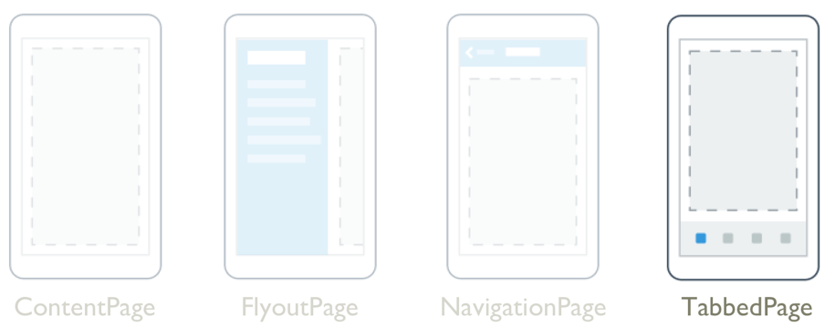
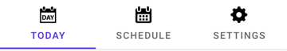
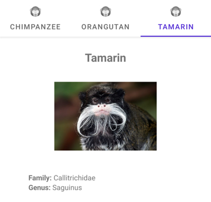

# TabbedPage



The .NET Multi-platform App UI (.NET MAUI) [[TabbedPage (Controls)|TabbedPage]] maintains a collection of children of type [[Page (Controls)|Page]], only one of which is fully visible at a time. Each child is identified by a series of tabs across the top or bottom of the page. Typically, each child will be a [[ContentPage|ContentPage]] and when its tab is selected the page content is displayed.

[[TabbedPage (Controls)|TabbedPage]] defines the following properties:

- `BarBackground`, of type [[Brush|Brush]], defines the background of the tab bar.
- `BarBackgroundColor`, of type [[Color|Color]], defines the background color of the tab bar.
- `BarTextColor`, of type [[Color|Color]], represents the color of the text on the tab bar.
- `SelectedTabColor`, of type [[Color|Color]], indicates the color of a tab when it's selected.
- `UnselectedTabColor`, of type [[Color|Color]], represents the color of a tab when it's unselected.

These properties are backed by [[BindableProperty|BindableProperty]] objects, which means that they can be targets of data bindings, and styled.

The title of a tab is defined by the [[Page (Controls).Title|Page.Title]] property of the child page, and the tab icon is defined by the [[Page (Controls).IconImageSource|Page.IconImageSource]] property of the child page.

In a [[TabbedPage (Controls)|TabbedPage]], each [[Page (Controls)|Page]] object is created when the [[TabbedPage (Controls)|TabbedPage]] is constructed. This can lead to a poor user experience, particularly if the [[TabbedPage (Controls)|TabbedPage]] is the root page of your app. However, .NET MAUI Shell enables pages accessed through a tab bar to be created on demand, in response to navigation. For more information about Shell apps, see [[shell|Shell]].

> [!WARNING]
> [[TabbedPage (Controls)|TabbedPage]] is incompatible with .NET MAUI Shell apps, and an exception will be thrown if you attempt to use [[TabbedPage (Controls)|TabbedPage]] in a Shell app.

## Create a TabbedPage

Two approaches can be used to create a [[TabbedPage (Controls)|TabbedPage]]:

- Populate the [[TabbedPage (Controls)|TabbedPage]] with a collection of child [[Page (Controls)|Page]] objects, such as a collection of [[ContentPage|ContentPage]] objects. For more information, see [Populate a TabbedPage with a Page collection](#populate-a-tabbedpage-with-a-page-collection).
- Assign a collection to the `ItemsSource` property and assign a [[DataTemplate|DataTemplate]] to the `ItemTemplate` property to return pages for objects in the collection. For more information, see [Populate a TabbedPage with a DataTemplate](#populate-a-tabbedpage-with-a-datatemplate).

> [!IMPORTANT]
> A [[TabbedPage (Controls)|TabbedPage]] should only be populated with [[NavigationPage (Controls)|NavigationPage]] and [[ContentPage|ContentPage]] objects.

Regardless of the approach taken, the location of the tab bar in a [[TabbedPage (Controls)|TabbedPage]] is platform-dependent:

- On iOS, the list of tabs appears at the bottom of the screen, and the page content is above. Each tab consists of a title and an icon. In portrait orientation, tab bar icons appear above tab titles. In landscape orientation, icons and titles appear side by side. In addition, a regular or compact tab bar may be displayed, depending on the device and orientation. If there are more than five tabs, a **More** tab will appear, which can be used to access the additional tabs.
- On Android, the list of tabs appears at the top of the screen, and the page content is below. Each tab consists of a title and an icon. However, the tabs can be moved to the bottom of the screen with a platform-specific. If there are more than five tabs, and the tab list is at the bottom of the screen, a *More* tab will appear that can be used to access the additional tabs. For information about moving the tabs to the bottom of the screen, see [[tabbedpage-toolbar-placement|TabbedPage toolbar placement on Android]].
- On Windows, the list of tabs appears at the top of the screen, and the page content is below. Each tab consists of a title. <!--However, icons can be added to each tab with a platform-specific. For more information, see [[tabbedpage-icons|TabbedPage Icons on Windows]].-->

### Populate a TabbedPage with a Page collection

A [[TabbedPage (Controls)|TabbedPage]] can be populated with a collection of child [[Page (Controls)|Page]] objects, which will typically be [[ContentPage|ContentPage]] objects. This is achieved by adding [[ContentPage|ContentPage]] objects as children of the [[TabbedPage (Controls)|TabbedPage]]:

```xaml
<TabbedPage xmlns="http://schemas.microsoft.com/dotnet/2021/maui"
            xmlns:x="http://schemas.microsoft.com/winfx/2009/xaml"
            xmlns:local="clr-namespace:TabbedPageWithNavigationPage"
            x:Class="TabbedPageWithNavigationPage.MainPage">
    <local:TodayPage />
    <local:SchedulePage />
    <local:SettingsPage />
</TabbedPage>
```

[[Page (Controls)|Page]] objects that are added as child elements of [[TabbedPage (Controls)|TabbedPage]] are added to the `Children` collection. The `Children` property of the `MultiPage<T>` class, from which [[TabbedPage (Controls)|TabbedPage]] derives, is the [[ContentPropertyAttribute|`ContentProperty`]] of `MultiPage<T>`. Therefore, in XAML it's not necessary to explicitly assign the [[Page (Controls)|Page]] objects to the `Children` property.

The following screenshot shows the appearance of the resulting tab bar on the [[TabbedPage (Controls)|TabbedPage]]:



The page content for a tab appears when the tab is selected.

### Populate a TabbedPage with a DataTemplate

[[TabbedPage (Controls)|TabbedPage]] inherits `ItemsSource`, `ItemTemplate`, and `SelectedItem` bindable properties from the `MultiPage<T>` class. These properties enable you to generate [[TabbedPage (Controls)|TabbedPage]] children dynamically, by setting the `ItemsSource` property to an `IEnumerable` collection of objects with public properties suitable for data bindings, and by setting the `ItemTemplate` property to a [[DataTemplate|DataTemplate]] with a page type as the root element.

The following example shows generating [[TabbedPage (Controls)|TabbedPage]] children dynamically:

```xaml
<TabbedPage xmlns="http://schemas.microsoft.com/dotnet/2021/maui"
            xmlns:x="http://schemas.microsoft.com/winfx/2009/xaml"
            xmlns:local="clr-namespace:TabbedPageDemo"
            x:Class="TabbedPageDemo.MainPage"
            ItemsSource="{x:Static local:MonkeyDataModel.All}"
            x:DataType="local:Monkey">
    <TabbedPage.ItemTemplate>
        <DataTemplate>
            <ContentPage Title="{Binding Name}"
                         IconImageSource="monkeyicon.png">
                <StackLayout Padding="5, 25">
                    <Label Text="{Binding Name}"
                           FontAttributes="Bold"
                           FontSize="18"
                           HorizontalOptions="Center" />
                    <Image Source="{Binding PhotoUrl}"
                           HorizontalOptions="Center"
                           WidthRequest="200"
                           HeightRequest="200" />
                    <StackLayout Padding="50, 10">
                        <StackLayout Orientation="Horizontal">
                            <Label Text="Family: "
                                   FontAttributes="Bold" />
                            <Label Text="{Binding Family}" />
                        </StackLayout>
                        ...
                    </StackLayout>
                </StackLayout>
            </ContentPage>
        </DataTemplate>
    </TabbedPage.ItemTemplate>
</TabbedPage>
```

In this example, each tab consists of a [[ContentPage|ContentPage]] object that uses [[Image (Controls)|Image]] and [[Label (Controls)|Label]] objects to display data for the tab:



## Navigate within a tab

Navigation can be performed within a tab, provided that the [[ContentPage|ContentPage]] object is wrapped in a [[NavigationPage (Controls)|NavigationPage]] object:

```xaml
<TabbedPage xmlns="http://schemas.microsoft.com/dotnet/2021/maui"
            xmlns:x="http://schemas.microsoft.com/winfx/2009/xaml"
            xmlns:local="clr-namespace:TabbedPageWithNavigationPage"
            x:Class="TabbedPageWithNavigationPage.MainPage">
    <local:TodayPage />
    <NavigationPage Title="Schedule"
                    IconImageSource="schedule.png">
        <x:Arguments>
            <local:SchedulePage />
        </x:Arguments>
    </NavigationPage>
</TabbedPage>
```

In this example, the [[TabbedPage (Controls)|TabbedPage]] is populated with two [[Page (Controls)|Page]] objects. The first child is a [[ContentPage|ContentPage]] object, and the second child is a [[NavigationPage (Controls)|NavigationPage]] object containing a [[ContentPage|ContentPage]] object.

When a [[ContentPage|ContentPage]] is wrapped in a [[NavigationPage (Controls)|NavigationPage]], forwards page navigation can be performed by calling the `PushAsync` method on the `Navigation` property of the [[ContentPage|ContentPage]] object:

```csharp
await Navigation.PushAsync(new UpcomingAppointmentsPage());
```

For more information about performing navigation using the [[NavigationPage (Controls)|NavigationPage]] class, see [[navigationpage|NavigationPage]].

> [!WARNING]
> While a [[NavigationPage (Controls)|NavigationPage]] can be placed in a  [[TabbedPage (Controls)|TabbedPage]], it's not recommended to place a [[TabbedPage (Controls)|TabbedPage]] into a [[NavigationPage (Controls)|NavigationPage]].
