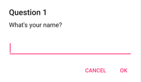
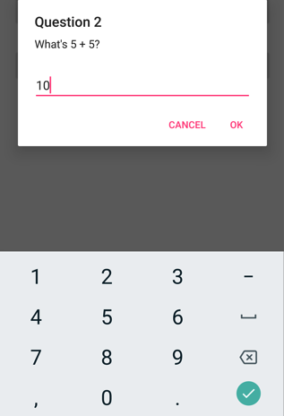

# Display pop-ups


![[pop-ups-dotnet9]]


![[pop-ups-dotnet10]]


## Display a prompt

To display a prompt, call the `DisplayPromptAsync%2A` on any [[Page (Controls)|Page]], passing a title and message as `string` arguments:

```csharp
string result = await DisplayPromptAsync("Question 1", "What's your name?");
```



If the OK button is tapped the entered response is returned as a `string`. If the Cancel button is tapped, `null` is returned.

> [!NOTE]
> On Android, prompts can be dismissed by tapping on the page outside the alert. On desktop platforms, prompts can be dismissed with the escape key.

The full argument list for the `DisplayPromptAsync%2A` method is:

- `title`, of type `string`, is the title to display in the prompt.
- `message`, of type `string`, is the message to display in the prompt.
- `accept`, of type `string`, is the text for the accept button. This is an optional argument, whose default value is OK.
- `cancel`, of type `string`, is the text for the cancel button. This is an optional argument, whose default value is Cancel.
- `placeholder`, of type `string`, is the placeholder text to display in the prompt. This is an optional argument, whose default value is `null`.
- `maxLength`, of type `int`, is the maximum length of the user response. This is an optional argument, whose default value is -1.
- `keyboard`, of type `Keyboard`, is the keyboard type to use for the user response. This is an optional argument, whose default value is `Keyboard.Default`.
- `initialValue`, of type `string`, is a pre-defined response that will be displayed, and which can be edited. This is an optional argument, whose default value is an empty `string`.

The following example shows setting some of the optional arguments:

```csharp
string result = await DisplayPromptAsync("Question 2", "What's 5 + 5?", initialValue: "10", maxLength: 2, keyboard: Keyboard.Numeric);
```

This code displays a predefined response of 10, limits the number of characters that can be input to 2, and displays the numeric keyboard for user input:



> [!WARNING]
> By default on Windows, when a prompt is displayed any access keys that are defined on the page behind the prompt can still be activated. For more information, see [[visualelement-access-keys|VisualElement access keys on Windows]].

## Display a page as a pop-up

.NET MAUI supports modal page navigation. A modal page encourages users to complete a self-contained task that can't be navigated away from until the task is completed or canceled. For example, to display a form as a pop-up that requires users to enter multiple pieces of data, create a [[ContentPage|ContentPage]] that contains the UI for your form and then push it onto the navigation stack as a modal page. For more information, see [[navigationpage#perform-modal-navigation|Perform modal navigation]].
