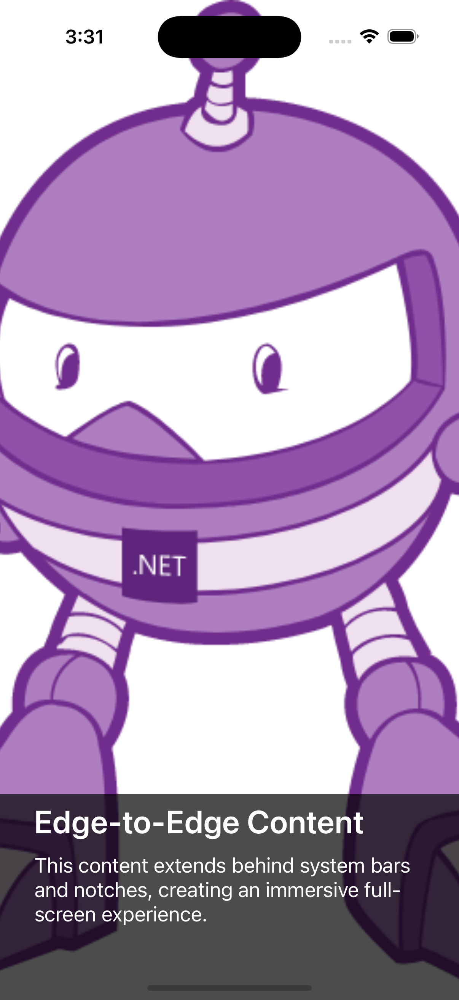
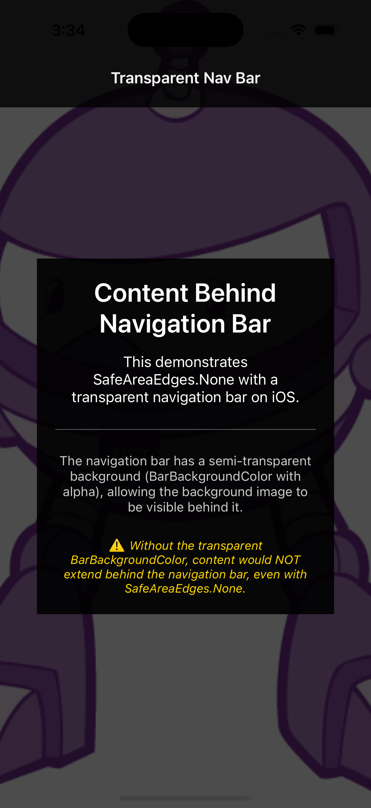
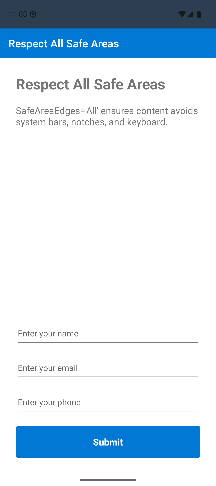
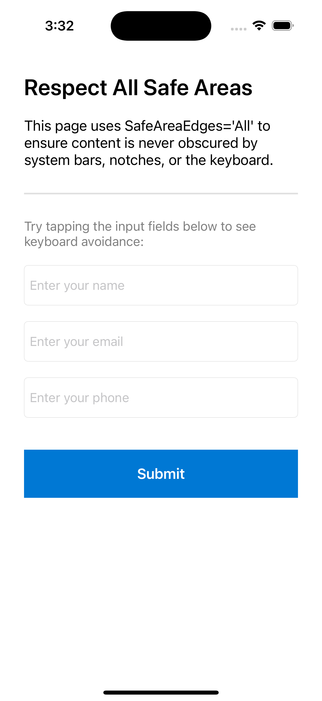
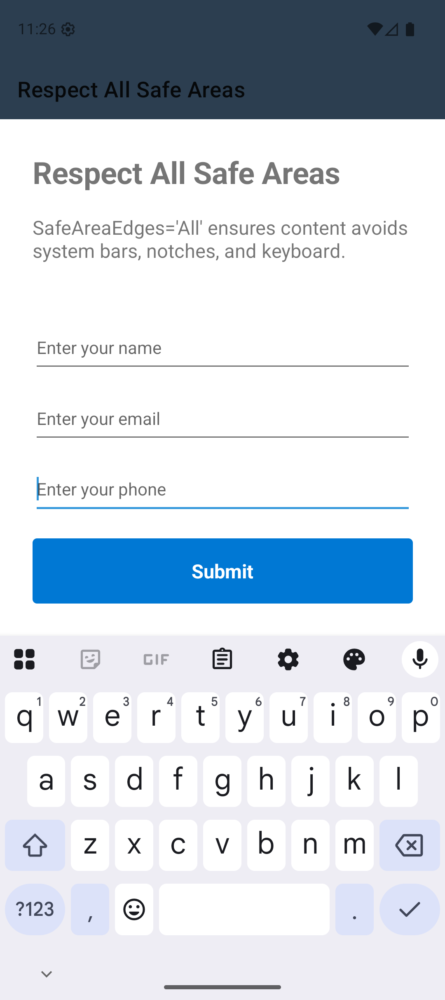
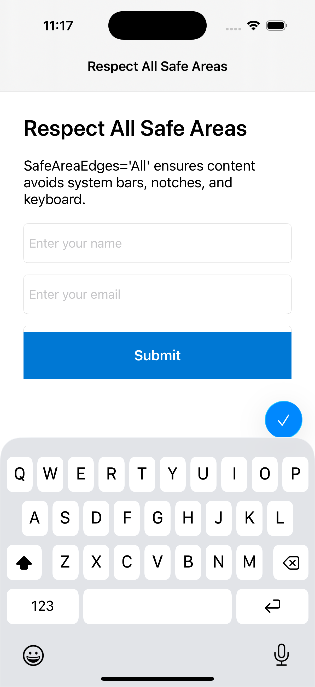
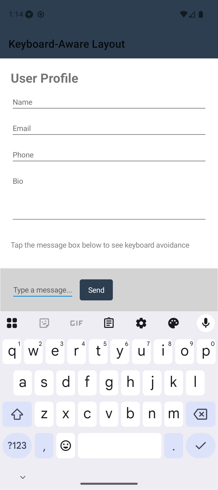
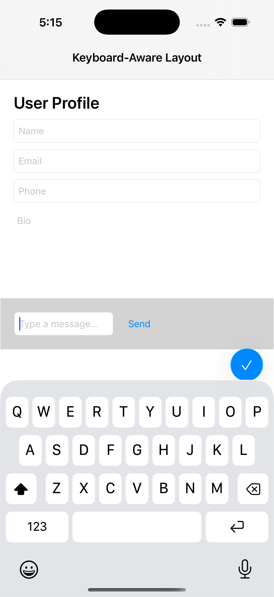

# Safe area layout

The safe area is the region of the screen that is guaranteed to be visible and not obscured by device-specific features such as notches, sensor housings, system bars, or on-screen keyboards. .NET Multi-platform App UI (.NET MAUI) provides the `SafeAreaEdges` property to give you precise control over how your content interacts with these safe area regions.


## SafeAreaEdges property

The [[ContentPage.SafeAreaEdges|SafeAreaEdges]] property, available in .NET 10 and later, provides fine-grained control over safe area behavior. This property is available on the following controls:

- [[ContentPage|ContentPage]]
- [[Layout (Controls)|Layout]] (and all derived layouts: [[Grid (Controls)|Grid]], [[StackLayout (Controls)|StackLayout]], [[AbsoluteLayout (Controls)|AbsoluteLayout]], [[FlexLayout (Controls)|FlexLayout]], etc.)
- [[ScrollView (Controls)|ScrollView]]
- [[ContentView (Controls)|ContentView]]
- [[Border|Border]]

The `SafeAreaEdges` property accepts values from the [[SafeAreaEdges|SafeAreaEdges]] enum, which provides granular control over which safe area insets should be respected.

## SafeAreaEdges enum

The [[SafeAreaEdges|SafeAreaEdges]] enum defines the following values:

| Value | Description |
|-------|-------------|
| `None` | Edge-to-edge content with no safe area padding. Content can extend behind system bars, notches, and the keyboard. |
| `SoftInput` | Respect only the soft input (keyboard) safe area. Content flows under system bars and notches but avoids overlapping the keyboard. |
| `Container` | Respect container safe areas (system bars, notches) but allow content to extend under the keyboard. |
| `Default` | Uses the platform-specific default behavior for the control type. See the note below for details on how this differs by control. |
| `All` | Respect all safe area insets including system bars, notches, and the keyboard. |

> [!NOTE]
> **Default values and behavior by control type:**
>
> - [[ContentPage|ContentPage]] defaults to `None` (edge-to-edge)
> - [[Layout (Controls)|Layout]] and derived layouts ([[Grid (Controls)|Grid]], [[StackLayout (Controls)|StackLayout]], etc.) default to `Container`
> - [[ContentView (Controls)|ContentView]], [[Border|Border]], and controls deriving from `ContentView` default to `None`
> - [[ScrollView (Controls)|ScrollView]] defaults to `Default`, which uses `UIScrollViewContentInsetAdjustmentBehavior.Automatic` on iOS and has no effect on Android. Only `Container` and `None` values have an effect on ScrollView. For keyboard avoidance with ScrollView, place it inside a container and set `SafeAreaEdges` on that container instead.

## Usage examples

### Edge-to-edge content

To create edge-to-edge content that extends behind system UI elements:

```xaml
<ContentPage SafeAreaEdges="None">
    <Grid SafeAreaEdges="None">
        <Image Source="background.jpg" 
               Aspect="AspectFill" />
        <VerticalStackLayout Padding="20"
                             VerticalOptions="End">
            <Label Text="Overlay content"
                   TextColor="White"
                   FontSize="24" />
        </VerticalStackLayout>
    </Grid>
</ContentPage>
```

> [!NOTE]
> The `Grid` is explicitly set to `SafeAreaEdges="None"` because layouts default to `Container`. Without this, the `Grid` would respect system bars and notches, preventing true edge-to-edge content.

The following screenshots show edge-to-edge content on Android and iOS:


      
      **Android**


      
      **iOS**


> [!TIP]
> **iOS Navigation Bar Transparency**: On iOS, for content to extend behind the navigation bar (Shell or NavigationPage), you must configure two things:
>
> 1. **Set a transparent or semi-transparent background color** on the navigation bar
> 2. **Hide the navigation bar separator line** - Without this, a visible line will appear below the navigation bar
>
> **Shell:**
>
> ```xaml
> <Shell xmlns="http://schemas.microsoft.com/dotnet/2021/maui"
>        Shell.BackgroundColor="#80000000"
>        Shell.NavBarHasShadow="False">
>     <!-- Shell.NavBarHasShadow="False" removes the shadow/separator line -->
> ```
>
> **NavigationPage:**
>
> ```xaml
> xmlns:ios="clr-namespace:Microsoft.Maui.Controls.PlatformConfiguration.iOSSpecific;assembly=Microsoft.Maui.Controls"
> 
> <NavigationPage BarBackgroundColor="#80000000"
>                 ios:NavigationPage.HideNavigationBarSeparator="True">
>     <!-- ios:NavigationPage.HideNavigationBarSeparator="True" removes the separator line -->
> ```
>
> ```csharp
> MainPage = new NavigationPage(new MainPage)
> {
>     BarBackgroundColor = Color.FromArgb("#80000000") // Semi-transparent black
> };
> // Remove the separator line below the navigation bar
> Microsoft.Maui.Controls.PlatformConfiguration.iOSSpecific.NavigationPage.SetHideNavigationBarSeparator(
>     (NavigationPage)MainPage, true);
> ```
>
> These iOS-specific configurations allow content to extend behind the navigation bar when using `SafeAreaEdges="None"`.
>
> 

### Respect all safe areas

To keep content within all safe areas:

```xaml
<ContentPage SafeAreaEdges="All">
    <VerticalStackLayout Padding="20">
        <Label Text="Safe content area"
               FontSize="18" />
        <Entry Placeholder="Enter text here" />
        <Button Text="Submit" />
    </VerticalStackLayout>
</ContentPage>
```

This ensures your content is never obscured by system bars, notches, or the keyboard.

The following screenshots show content respecting all safe areas on Android and iOS:


      
      **Android**


      
      **iOS**


When the keyboard appears, the content adjusts to remain visible:


      
      **Android with keyboard**


      
      **iOS with keyboard**


### Keyboard-aware layouts

For layouts with input controls at the bottom, use `SoftInput` on a container to avoid keyboard overlap while allowing content under system bars:

```xaml
<ContentPage>
    <Grid RowDefinitions="*,Auto" SafeAreaEdges="Container, Container, Container, SoftInput">
        <ScrollView Grid.Row="0">
            <VerticalStackLayout Padding="20" Spacing="10">
                <Label Text="User Profile" FontSize="24" />
                <Entry Placeholder="Name" />
                <Entry Placeholder="Email" />
                <Entry Placeholder="Phone" />
                <Editor Placeholder="Bio" HeightRequest="100" />
            </VerticalStackLayout>
        </ScrollView>
        
        <Border Grid.Row="1" 
                BackgroundColor="LightGray"
                Padding="20">
            <HorizontalStackLayout Spacing="10">
                <Entry Placeholder="Type a message..." 
                       HorizontalOptions="Fill" />
                <Button Text="Send" />
            </HorizontalStackLayout>
        </Border>
    </Grid>
</ContentPage>
```

This example sets `SafeAreaEdges` to respect system bars on the top and sides (`Container`) but avoid the keyboard at the bottom (`SoftInput`). The Grid layout controls the safe area behavior, while the ScrollView inside handles scrolling content.

The following screenshots show keyboard-aware layouts on Android and iOS:


      
      **Android**


      
      **iOS**


> [!NOTE]
> `SoftInput` doesn't work directly on ScrollView because ScrollView manages its own content insets. To make a ScrollView keyboard-aware, wrap it in a layout (such as Grid or VerticalStackLayout) and set `SafeAreaEdges="SoftInput"` or `SafeAreaEdges="All"` on the wrapping container.

### Per-layout control

You can set `SafeAreaEdges` on individual layouts within a page:

```xaml
<ContentPage SafeAreaEdges="None">
    <Grid RowDefinitions="Auto,*,Auto">
        <!-- Header extends edge-to-edge -->
        <Grid BackgroundColor="Primary">
            <Label Text="App Header" 
                   TextColor="White"
                   Margin="20,40,20,20" />
        </Grid>
        
        <!-- Main content respects safe areas -->
        <ScrollView Grid.Row="1" 
                    SafeAreaEdges="All">
            <VerticalStackLayout Padding="20">
                <Label Text="Main content" />
            </VerticalStackLayout>
        </ScrollView>
        
        <!-- Footer respects only keyboard -->
        <Grid Grid.Row="2" 
              SafeAreaEdges="SoftInput"
              BackgroundColor="LightGray"
              Padding="20">
            <Entry Placeholder="Type a message..." />
        </Grid>
    </Grid>
</ContentPage>
```

## Platform-specific behavior

### iOS and Mac Catalyst

On iOS and Mac Catalyst:

- Safe area insets include the status bar, navigation bar, tab bar, notch/Dynamic Island, and home indicator
- The `SoftInput` region includes the keyboard when visible
- Safe area insets automatically adjust during device rotation and when system UI visibility changes

### Android

On Android:

- Safe area insets include system bars (status bar, navigation bar) and display cutouts (notches)
- The `SoftInput` region includes the soft keyboard
- Behavior can vary based on edge-to-edge display settings and Android version

> [!IMPORTANT]
> **Breaking change in .NET 10 for Android:**
>
> - In .NET 9, `ContentPage` on Android behaved similar to `Container` by default (content avoided system bars).
> - In .NET 10, `ContentPage` defaults to `None` (edge-to-edge), providing a more immersive experience by default.
> - If you want .NET 9 behavior in .NET 10, explicitly set `ContentPage.SafeAreaEdges="Container"`.

> [!NOTE]
> **WindowSoftInputModeAdjust changes in .NET 10:**
>
> - If you're using the Android platform-specific `WindowSoftInputModeAdjust.Resize`, you may need to set `ContentPage.SafeAreaEdges="All"` to maintain the same keyboard avoidance behavior.
> - For more information, see [[soft-keyboard-input-mode|Soft keyboard input mode on Android]].

## Best practices

1. **Choose the right value for your scenario**:
   - Use `All` for critical content like forms that must always be visible
   - Use `None` for immersive experiences like photo viewers or games
   - Use `Container` for scrollable content with fixed headers/footers
   - Use `SoftInput` for input-focused UIs like messaging apps

2. **Test on multiple devices**: Test on:
   - Devices with notches (iPhone X and later)
   - Tablets in landscape orientation
   - Devices with different aspect ratios

3. **Combine with padding**: `SafeAreaEdges` controls automatic safe area padding. You can still add your own padding for visual spacing:

   ```xaml
   <ContentPage SafeAreaEdges="All">
       <VerticalStackLayout Padding="20">
           <!-- Your content with both safe area and custom padding -->
       </VerticalStackLayout>
   </ContentPage>
   ```

4. **Use per-control settings**: Take advantage of being able to set `SafeAreaEdges` on individual controls to create sophisticated layouts where different sections have different safe area behavior.

## Migration from legacy APIs

If you're migrating from earlier versions of .NET MAUI:

### From iOS-specific Page.UseSafeArea

The iOS-specific `Page.UseSafeArea` property still works but is considered legacy. Migrate to `SafeAreaEdges`:

**Old approach (.NET 9 and earlier):**

```xaml
<ContentPage xmlns:ios="clr-namespace:Microsoft.Maui.Controls.PlatformConfiguration.iOSSpecific;assembly=Microsoft.Maui.Controls"
             ios:Page.UseSafeArea="True">
    <!-- Content -->
</ContentPage>
```

**New approach (.NET 10+):**

```xaml
<ContentPage SafeAreaEdges="Container">
    <!-- Content -->
</ContentPage>
```

### From Layout.IgnoreSafeArea

The `Layout.IgnoreSafeArea` property still works but is less flexible. Migrate to `SafeAreaEdges`:

**Old approach:**

```xaml
<Grid IgnoreSafeArea="True">
    <!-- Content -->
</Grid>
```

**New approach:**

```xaml
<Grid SafeAreaEdges="None">
    <!-- Content -->
</Grid>
```

## See also

- [[dotnet-10#safearea-enhancements|Safe area enhancements in .NET 10]]
- [[page-safe-area-layout|iOS safe area layout guide]]
- [[contentpage|ContentPage]]
- [[layouts|Layouts]]


Safe area management in .NET MAUI versions earlier than .NET 10 is handled through iOS-specific platform APIs and the `Layout.IgnoreSafeArea` property. For information about these legacy approaches, see [[page-safe-area-layout|Enable the safe area layout guide on iOS]].

