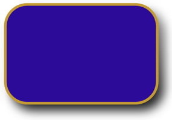

# Shadow

The .NET Multi-platform App UI (.NET MAUI) [[Shadow|Shadow]] class paints a shadow around a layout or view. The [[VisualElement (Controls)|VisualElement]] class has a [[VisualElement (Controls).Shadow|Shadow]] bindable property, of type [[Shadow|Shadow]], that enables a shadow to be added to any layout or view.

The [[Shadow|Shadow]] class defines the following properties:

- [[Shadow.Radius|Radius]], of type `float`, defines the radius of the blur used to generate the shadow. The default value of this property is 10.
- [[Shadow.Opacity|Opacity]], of type `float`, indicates the opacity of the shadow. The default value of this property is 1.
- [[Shadow.Brush|Brush]], of type [[Brush|Brush]], represents the brush used to colorize the shadow.
- [[Shadow.Offset|Offset]], of type `Point`, specifies the offset for the shadow, which represents the position of the light source that creates the shadow.

These properties are backed by [[BindableProperty|BindableProperty]] objects, which means that they can be targets of data bindings, and styled.

> [!IMPORTANT]
> The `Brush` property only currently supports a [[SolidColorBrush|SolidColorBrush]].

## Create a Shadow


To add a shadow to a control, use property element syntax to set the control's [[VisualElement (Controls).Shadow|Shadow]] property to a [[Shadow|Shadow]] object whose properties define its appearance.


To add a shadow to a control, set the control's [[VisualElement (Controls).Shadow|Shadow]] property to a formatted string that defines the shadow. There are three supported string formats:

- `color, offset X, offset Y`:

    ```xaml
    <Image Source="dotnet_bot.png"
           WidthRequest="250"
           HeightRequest="310"
           Shadow="#000000 4 4" />
    ```

- `offset X, offset Y, radius, color`:

    ```xaml
    <Image Source="dotnet_bot.png"
           WidthRequest="250"
           HeightRequest="310"
           Shadow="5 8 8 rgb(6, 201, 198)" />    
    ```

- `offset X, offset Y, radius, color, opacity`:

    ```xaml
    <Image Source="dotnet_bot.png"
           WidthRequest="250"
           HeightRequest="310"
           Shadow="4 4 16 AliceBlue 0.5" />
    ```

Colors can be specified using the following formats:

| Format | Example | Comments |
| ------ | ------- | -------- |
| HEX | `#rgb`, `#argb`, `#rrggbb`, `#aarrggbb` |  |
| RGB | `rgb(255,0,0)`, `rgb(100%,0%,0%)` | Valid values are in the range 0-255, or 0%-100%. |
| RGBA | `rgba(255, 0, 0, 0.8)`, `rgba(100%, 0%, 0%, 0.8)` | Valid opacity values are 0.0-1.0. |
| HSL | `hsl(120, 100%, 50%)` | Valid values for `h` are 0-360, and for `s` and `l` are 0%-100%. |
| HSLA | `hsla(120, 100%, 50%, .8)` | Valid opacity values are 0.0-1.0. |
| HSV | `hsv(120, 100%, 50%)` | Valid values for `h` are 0-360, and for `s` and `v` are 0%-100%. |
| HSVA | `hsva(120, 100%, 50%, .8)` | Valid opacity values are 0.0-1.0. |
| Predefined color | `fuchsia`, `AquaMarine`, `limegreen` | Color strings are case insensitive. |

Alternatively, the control's [[VisualElement (Controls).Shadow|Shadow]] property can be set to a [[Shadow|Shadow]] object, using property element syntax, whose properties define its appearance.


The following XAML example shows how to add a shadow to an [[Image (Controls)|Image]] using property element syntax:

```xaml
<Image Source="dotnet_bot.png"
       WidthRequest="250"
       HeightRequest="310">
    <Image.Shadow>
        <Shadow Brush="Black"
                Offset="20,20"
                Radius="40"
                Opacity="0.8" />
    </Image.Shadow>
</Image>
```

In this example, a black shadow is painted around the outline of the image, with its offset specifying that it appears at the right and bottom of the image:


Shadows can also be added to clipped objects, as shown in the following example:

```xaml
<Image Source="https://aka.ms/campus.jpg"
       Aspect="AspectFill"
       HeightRequest="220"
       WidthRequest="220"
       HorizontalOptions="Center">
    <Image.Clip>
        <EllipseGeometry Center="220,250"
                         RadiusX="220"
                         RadiusY="220" />
    </Image.Clip>
    <Image.Shadow>
        <Shadow Brush="Black"
                Offset="10,10"
                Opacity="0.8" />
    </Image.Shadow>
</Image>
```

In this example, a black shadow is painted around the outline of the [[EllipseGeometry|EllipseGeometry]] that clips the image:


For more information about clipping an element, see [[geometries#clip-with-a-geometry|Clip with a Geometry]].

<!-- Todo: Only currently supported on Android

## Create a Shadow gradient

The color of a shadow is defined using a [[Brush|Brush]]. Therefore, gradient shadows can also be added to controls:

```xaml
<RoundRectangle HeightRequest="200"
                WidthRequest="300"
                CornerRadius="40"
                Stroke="#C49B33"
                StrokeThickness="10"
                Fill="#2B0B98">
    <RoundRectangle.Shadow>
        <Shadow Radius="60"
                Offset="40,40"
                Opacity="0.75">
            <Shadow.Brush>
                <LinearGradientBrush EndPoint="0,1">
                    <GradientStop Color="Gray"
                                  Offset="0.1" />
                    <GradientStop Color="Black"
                                  Offset="1.0" />
                </LinearGradientBrush>
            </Shadow.Brush>
        </Shadow>
    </RoundRectangle.Shadow>
</RoundRectangle>
```

In this example, a linear gradient shadow is added to the round rectangle, with the gradient interpolating vertically from gray to black:



For more information about brushes, see [Brushes](). -->
