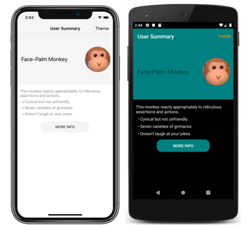

# Theme an app

[ Browse the sample](/samples/dotnet/maui-samples/userinterface-theming)

.NET Multi-platform App UI (.NET MAUI) apps can respond to style changes dynamically at runtime by using the [[DynamicResourceExtension|`DynamicResource`]] markup extension. This markup extension is similar to the [[StaticResourceExtension|`StaticResource`]] markup extension, in that both use a dictionary key to fetch a value from a [[ResourceDictionary|ResourceDictionary]]. However, while the [[StaticResourceExtension|`StaticResource`]] markup extension performs a single dictionary lookup, the [[DynamicResourceExtension|`DynamicResource`]] markup extension maintains a link to the dictionary key. Therefore, if the value associated with the key is replaced, the change is applied to the [[VisualElement (Controls)|VisualElement]]. This enables runtime theming to be implemented in .NET MAUI apps.

The process for implementing runtime theming in a .NET MAUI app is as follows:

1. Define the resources for each theme in a [[ResourceDictionary|ResourceDictionary]]. For more information, see [Define themes](#define-themes).
1. Set a default theme in the app's *App.xaml* file. For more information, see [Set a default theme](#set-a-default-theme).
1. Consume theme resources in the app, using the [[DynamicResourceExtension|`DynamicResource`]] markup extension. For more information, see [Consume theme resources](#consume-theme-resources).
1. Add code to load a theme at runtime. For more information, see [Load a theme at runtime](#load-a-theme-at-runtime).

> [!IMPORTANT]
> Use the [[StaticResourceExtension|`StaticResource`]] markup extension if your app doesn’t need to change themes dynamically at runtime. If you anticipate switching themes while the app is running, use the [[DynamicResourceExtension|`DynamicResource`]] markup extension, which enables resources to be updated at runtime.

The following screenshot shows themed pages, with the iOS app using a light theme and the Android app using a dark theme:



> [!NOTE]
> Changing a theme at runtime requires the use of XAML or C# style definitions, and isn't possible using CSS.

.NET MAUI also has the ability to respond to system theme changes. The system theme may change for a variety of reasons, depending on the device configuration. This includes the system theme being explicitly changed by the user, it changing due to the time of day, and it changing due to environmental factors such as low light. For more information, see [[system-theme-changes|Respond to system theme changes]].

## Define themes

A theme is defined as a collection of resource objects stored in a [[ResourceDictionary|ResourceDictionary]].

The following example shows a [[ResourceDictionary|ResourceDictionary]] for a light theme named `LightTheme`:

```xaml
<ResourceDictionary xmlns="http://schemas.microsoft.com/dotnet/2021/maui"
                    xmlns:x="http://schemas.microsoft.com/winfx/2009/xaml"
                    x:Class="ThemingDemo.LightTheme">
    <Color x:Key="PageBackgroundColor">White</Color>
    <Color x:Key="NavigationBarColor">WhiteSmoke</Color>
    <Color x:Key="PrimaryColor">WhiteSmoke</Color>
    <Color x:Key="SecondaryColor">Black</Color>
    <Color x:Key="PrimaryTextColor">Black</Color>
    <Color x:Key="SecondaryTextColor">White</Color>
    <Color x:Key="TertiaryTextColor">Gray</Color>
    <Color x:Key="TransparentColor">Transparent</Color>
</ResourceDictionary>
```

The following example shows a [[ResourceDictionary|ResourceDictionary]] for a dark theme named `DarkTheme`:

```xaml
<ResourceDictionary xmlns="http://schemas.microsoft.com/dotnet/2021/maui"
                    xmlns:x="http://schemas.microsoft.com/winfx/2009/xaml"
                    x:Class="ThemingDemo.DarkTheme">
    <Color x:Key="PageBackgroundColor">Black</Color>
    <Color x:Key="NavigationBarColor">Teal</Color>
    <Color x:Key="PrimaryColor">Teal</Color>
    <Color x:Key="SecondaryColor">White</Color>
    <Color x:Key="PrimaryTextColor">White</Color>
    <Color x:Key="SecondaryTextColor">White</Color>
    <Color x:Key="TertiaryTextColor">WhiteSmoke</Color>
    <Color x:Key="TransparentColor">Transparent</Color>
</ResourceDictionary>
```

Each [[ResourceDictionary|ResourceDictionary]] contains [[Color|Color]] resources that define their respective themes, with each [[ResourceDictionary|ResourceDictionary]] using identical key values. For more information about resource dictionaries, see [[resource-dictionaries|Resource Dictionaries]].

> [!IMPORTANT]
> A code behind file is required for each [[ResourceDictionary|ResourceDictionary]], which calls the `InitializeComponent` method. This is necessary so that a CLR object representing the chosen theme can be created at runtime.

## Set a default theme

An app requires a default theme, so that controls have values for the resources they consume. A default theme can be set by merging the theme's [[ResourceDictionary|ResourceDictionary]] into the app-level [[ResourceDictionary|ResourceDictionary]] that's defined in *App.xaml*:

```xaml
<Application xmlns="http://schemas.microsoft.com/dotnet/2021/maui"
             xmlns:x="http://schemas.microsoft.com/winfx/2009/xaml"
             x:Class="ThemingDemo.App">
    <Application.Resources>
        <ResourceDictionary Source="Themes/LightTheme.xaml" />
    </Application.Resources>
</Application>
```

For more information about merging resource dictionaries, see [[resource-dictionaries#merge-resource-dictionaries|Merged resource dictionaries]].

## Consume theme resources

When an app wants to consume a resource that's stored in a [[ResourceDictionary|ResourceDictionary]] that represents a theme, it should do so with the [[DynamicResourceExtension|`DynamicResource`]] markup extension. This ensures that if a different theme is selected at runtime, the values from the new theme will be applied.

The following example shows three styles from that can be applied to all [[Label (Controls)|Label]] objects in app:

```xaml
<Application xmlns="http://schemas.microsoft.com/dotnet/2021/maui"
             xmlns:x="http://schemas.microsoft.com/winfx/2009/xaml"
             x:Class="ThemingDemo.App">
    <Application.Resources>

        <Style x:Key="LargeLabelStyle"
               TargetType="Label">
            <Setter Property="TextColor"
                    Value="{DynamicResource SecondaryTextColor}" />
            <Setter Property="FontSize"
                    Value="30" />
        </Style>

        <Style x:Key="MediumLabelStyle"
               TargetType="Label">
            <Setter Property="TextColor"
                    Value="{DynamicResource PrimaryTextColor}" />
            <Setter Property="FontSize"
                    Value="25" />
        </Style>

        <Style x:Key="SmallLabelStyle"
               TargetType="Label">
            <Setter Property="TextColor"
                    Value="{DynamicResource TertiaryTextColor}" />
            <Setter Property="FontSize"
                    Value="15" />
        </Style>

    </Application.Resources>
</Application>
```

These styles are defined in the app-level resource dictionary, so that they can be consumed by multiple pages. Each style consumes theme resources with the [[DynamicResourceExtension|`DynamicResource`]] markup extension.

These styles are then consumed by pages:

```xaml
<ContentPage xmlns="http://schemas.microsoft.com/dotnet/2021/maui"
             xmlns:x="http://schemas.microsoft.com/winfx/2009/xaml"
             xmlns:local="clr-namespace:ThemingDemo"
             x:Class="ThemingDemo.UserSummaryPage"
             Title="User Summary"
             BackgroundColor="{DynamicResource PageBackgroundColor}">
    ...
    <ScrollView>
        <Grid>
            <Grid.RowDefinitions>
                <RowDefinition Height="200" />
                <RowDefinition Height="120" />
                <RowDefinition Height="70" />
            </Grid.RowDefinitions>
            <Grid BackgroundColor="{DynamicResource PrimaryColor}">
                <Label Text="Face-Palm Monkey"
                       VerticalOptions="Center"
                       Margin="15"
                       Style="{StaticResource MediumLabelStyle}" />
                ...
            </Grid>
            <StackLayout Grid.Row="1"
                         Margin="10">
                <Label Text="This monkey reacts appropriately to ridiculous assertions and actions."
                       Style="{StaticResource SmallLabelStyle}" />
                <Label Text="  &#x2022; Cynical but not unfriendly."
                       Style="{StaticResource SmallLabelStyle}" />
                <Label Text="  &#x2022; Seven varieties of grimaces."
                       Style="{StaticResource SmallLabelStyle}" />
                <Label Text="  &#x2022; Doesn't laugh at your jokes."
                       Style="{StaticResource SmallLabelStyle}" />
            </StackLayout>
            ...
        </Grid>
    </ScrollView>
</ContentPage>
```

When a theme resource is consumed directly, it should be consumed with the [[DynamicResourceExtension|`DynamicResource`]] markup extension. However, when a style that uses the [[DynamicResourceExtension|`DynamicResource`]] markup extension is consumed, it should be consumed with the [[StaticResourceExtension|`StaticResource`]] markup extension.

For more information about styling, see [[xaml|Style apps using XAML]]. For more information about the [[DynamicResourceExtension|`DynamicResource`]] markup extension, see [[xaml#dynamic-styles|Dynamic styles]].

## Load a theme at runtime

When a theme is selected at runtime, an app should:

1. Remove the current theme from the app. This is achieved by clearing the `MergedDictionaries` property of the app-level [[ResourceDictionary|ResourceDictionary]].
2. Load the selected theme. This is achieved by adding an instance of the selected theme to the `MergedDictionaries` property of the app-level [[ResourceDictionary|ResourceDictionary]].

Any [[VisualElement (Controls)|VisualElement]] objects that set properties with the [[DynamicResourceExtension|`DynamicResource`]] markup extension will then apply the new theme values. This occurs because the [[DynamicResourceExtension|`DynamicResource`]] markup extension maintains a link to dictionary keys. Therefore, when the values associated with keys are replaced, the changes are applied to the [[VisualElement (Controls)|VisualElement]] objects.

In the sample application, a theme is selected via a modal page that contains a [[Picker (Controls)|Picker]]. The following code shows the `OnPickerSelectionChanged` method, which is executed when the selected theme changes:

The following example shows removing the current theme and loading a new theme:

```csharp
ICollection<ResourceDictionary> mergedDictionaries = Application.Current.Resources.MergedDictionaries;
if (mergedDictionaries != null)
{
    mergedDictionaries.Clear();
    mergedDictionaries.Add(new DarkTheme());
}
```
