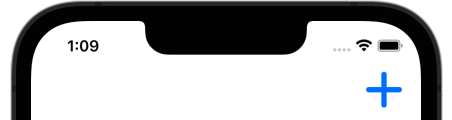
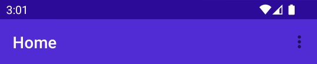
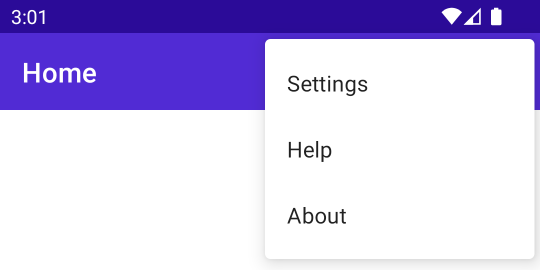

# Display toolbar items

The .NET Multi-platform App UI (.NET MAUI) [[ToolbarItem|ToolbarItem]] class is a special type of button that can be added to a [[Page (Controls)|Page]] object's [[Page (Controls).ToolbarItems|ToolbarItems]] collection. Because the [[Shell|Shell]] class derives from [[Page (Controls)|Page]], [[ToolbarItem|ToolbarItem]] objects can also be added to the `ToolbarItems` collection of a [[Shell|Shell]] object. Each [[ToolbarItem|ToolbarItem]] object will appear as a button in the app's navigation bar. A [[ToolbarItem|ToolbarItem]] object can have an icon and appear as a primary or secondary item. The [[ToolbarItem|ToolbarItem]] class inherits from [[MenuItem|MenuItem]].

The following screenshot shows a [[ToolbarItem|ToolbarItem]] object in the navigation bar on iOS:



The [[ToolbarItem|ToolbarItem]] class defines the following properties:

- [[ToolbarItem.Order|Order]], of type [[ToolbarItemOrder|ToolbarItemOrder]], determines whether the [[ToolbarItem|ToolbarItem]]  object displays in the primary or secondary menu.
- [[ToolbarItem.Priority|Priority]], of type `int`, determines the display order of items in a [[Page (Controls).ToolbarItems|ToolbarItems]] collection.

The [[ToolbarItem|ToolbarItem]] class inherits the following typically used properties from the [[MenuItem|MenuItem]] class:

- [[MenuItem.Command|Command]], of type `ICommand`, allows binding user actions, such as finger taps or clicks, to commands defined on a viewmodel.
- [[MenuItem.CommandParameter|CommandParameter]], of type `object`, specifies the parameter that should be passed to the `Command`.
- [[MenuItem.IconImageSource|IconImageSource]], of type [[ImageSource|ImageSource]], that determines the display icon on a [[ToolbarItem|ToolbarItem]]  object.
- [[MenuItem.Text|Text]], of type `string`, determines the display text on a [[ToolbarItem|ToolbarItem]]  object.

These properties are backed by [[BindableProperty|BindableProperty]] objects, which means that they can be targets of data bindings.

> [!NOTE]
> An alternative to creating a toolbar from [[ToolbarItem|ToolbarItem]] objects is to set the [[NavigationPage (Controls).TitleViewProperty|TitleViewProperty]] attached property to a layout class that contains multiple views. For more information, see [[navigationpage#display-views-in-the-navigation-bar|Display views in the navigation bar]].

## Create a ToolbarItem

To create a toolbar item, create a [[ToolbarItem|ToolbarItem]] object and set its properties to define its appearance and behavior. The following example shows how to create a [[ToolbarItem|ToolbarItem]] with minimal properties set, and add it to a [[ContentPage|ContentPage]]'s [[Page (Controls).ToolbarItems|ToolbarItems]] collection:

```xaml
<ContentPage.ToolbarItems>
    <ToolbarItem Text="Add item"
                 IconImageSource="add.png" />
</ContentPage.ToolbarItems>
```

This example results in a [[ToolbarItem|ToolbarItem]] object that has text and an icon. However, the appearance of a [[ToolbarItem|ToolbarItem]] varies across platforms.

A [[ToolbarItem|ToolbarItem]] can also be created in code and added to the [[Page (Controls).ToolbarItems|ToolbarItems]] collection:

```csharp
ToolbarItem item = new ToolbarItem
{
    Text = "Add item",
    IconImageSource = ImageSource.FromFile("add.png")
};

// "this" refers to a Page object
this.ToolbarItems.Add(item);
```

> [!NOTE]
> Images can be stored in a single location in your app project. For more information, see [[images|Add images to a .NET MAUI project]].

## Define button behavior

The [[ToolbarItem|ToolbarItem]] class inherits the [[MenuItem.Clicked|Clicked]] event from the [[MenuItem|MenuItem]] class. An event handler can be attached to the [[MenuItem.Clicked|Clicked]] event to react to taps or clicks on [[ToolbarItem|ToolbarItem]] objects:

```xaml
<ToolbarItem ...
             Clicked="OnItemClicked" />
```

An event handler can also be attached in code:

```csharp
ToolbarItem item = new ToolbarItem { ... };
item.Clicked += OnItemClicked;
```

These examples reference an `OnItemClicked` event handler, which is shown in the following example:

```csharp
void OnItemClicked(object sender, EventArgs e)
{
    ToolbarItem item = (ToolbarItem)sender;
    messageLabel.Text = $"You clicked the \"{item.Text}\" toolbar item.";
}
```

> [!NOTE]
> [[ToolbarItem|ToolbarItem]] objects can also use the [[MenuItem.Command|Command]] and [[MenuItem.CommandParameter|CommandParameter]] properties to react to user input without event handlers.

## Enable or disable a ToolbarItem at runtime

To enable or disable a [[ToolbarItem|ToolbarItem]] at runtime, bind its [[MenuItem.Command|Command]] property to an `ICommand` implementation, and ensure that its `canExecute` delegate enables and disables the `ICommand` as appropriate.

> [!IMPORTANT]
> Don't bind the `IsEnabled` property to another property when using the `Command` property to enable or disable the [[ToolbarItem|ToolbarItem]].

## Primary and secondary toolbar items

The [[ToolbarItemOrder|ToolbarItemOrder]] enum has `Default`, `Primary`, and `Secondary` values.

When the [[ToolbarItem.Order|Order]] property is set to `Primary`, the [[ToolbarItem|ToolbarItem]] object appears in the navigation bar on all platforms. [[ToolbarItem|ToolbarItem]] objects are prioritized over the page title, which will be truncated to make room for the items.


When the [[ToolbarItem.Order|Order]] property is set to `Secondary`, behavior varies across platforms. On iOS and Mac Catalyst, `Secondary` toolbar items appear as a horizontal list. On Android and Windows, the `Secondary` items menu appears as three dots that can be tapped:



Tapping the three dots reveals items in a vertical list:




When the [[ToolbarItem.Order|Order]] property is set to `Secondary`, behavior varies across platforms. On iOS and Mac Catalyst, `Secondary` toolbar items are grouped into a pull‑down menu, shown under a system ellipsis icon in the navigation bar. Items within this menu are ordered by their [[ToolbarItem.Priority|Priority]] value. On Android and Windows, the `Secondary` items menu appears as three dots that can be tapped:


Tapping the three dots reveals items in a vertical list:


> [!WARNING]
> Icon behavior in [[ToolbarItem|ToolbarItem]] objects that have their [[ToolbarItem.Order|Order]] property set to `Secondary` can be inconsistent across platforms. Avoid setting the [[MenuItem.IconImageSource|IconImageSource]] property on items that appear in the secondary menu.


### Example: order secondary items by priority (iOS and Mac Catalyst)

On iOS and Mac Catalyst, secondary items are shown in a pull‑down menu ordered by their `Priority` (lower values appear first):

```xaml
<ContentPage.ToolbarItems>
    <ToolbarItem Text="Settings" Order="Secondary" Priority="0" />
    <ToolbarItem Text="Feedback" Order="Secondary" Priority="1" />
    <ToolbarItem Text="About" Order="Secondary" Priority="2" />
    <ToolbarItem Text="Help" Order="Secondary" Priority="3" />
    <ToolbarItem Text="Sign out" Order="Secondary" Priority="100" />
</ContentPage.ToolbarItems>
```

> [!TIP]
> Keep labels short so they fit comfortably in the pull‑down. Avoid icons for `Secondary` items due to platform inconsistency.


## Display a badge on a ToolbarItem

A badge can be displayed on a [[ToolbarItem|ToolbarItem]] to surface counts or status indicators. The `ToolbarItem` class defines three bindable properties for badge support:

- `BadgeText`, of type `string`, is the text displayed on the badge. Set to a non-empty value to show a text or count badge, an empty string to show a dot indicator, or `null` (the default) to hide the badge.
- `BadgeColor`, of type [[Color|Color]], is the background color of the badge. When `null`, the platform default is used.
- `BadgeTextColor`, of type [[Color|Color]], is the foreground (text) color of the badge. When `null`, the platform default is used.

The following example sets a numeric badge on a toolbar item:

```xaml
<ContentPage.ToolbarItems>
    <ToolbarItem Text="Inbox"
                 IconImageSource="inbox.png"
                 BadgeText="3"
                 BadgeColor="Red"
                 BadgeTextColor="White" />
</ContentPage.ToolbarItems>
```

To bind the badge text to a view model, use a regular data binding:

```xaml
<ToolbarItem Text="Inbox"
             IconImageSource="inbox.png"
             BadgeText="{Binding UnreadCount}" />
```

Badges are only displayed on primary toolbar items — items whose [[ToolbarItem.Order|Order]] is set to [[ToolbarItemOrder.Primary|Primary]] or [[ToolbarItemOrder.Default|Default]]. Secondary (overflow) items don't display badges.

Badge rendering varies by platform:

- **Android** uses the Material Design `BadgeDrawable`. Numeric and text badges are supported. `BadgeTextColor` maps to `BadgeDrawable.BadgeTextColor`.
- **iOS and Mac Catalyst** use `UIBarButtonItem.Badge`, which requires iOS 26 or higher. On earlier iOS versions, the badge is silently ignored. `BadgeTextColor` maps to `UIBarButtonItemBadge.ForegroundColor`.
- **Windows** uses the WinUI `InfoBadge` overlaid on the toolbar button. Numeric values display as counts; non-numeric text and the empty string display as a dot indicator. `BadgeTextColor` maps to `InfoBadge.Foreground`.

