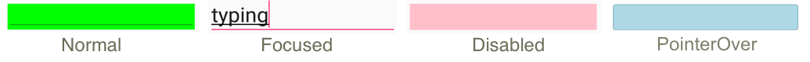
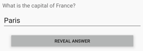
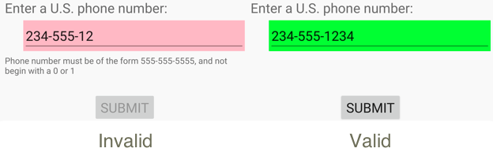

# Visual states

The .NET Multi-platform App UI (.NET MAUI) Visual State Manager provides a structured way to make visual changes to the user interface from code. In most cases, the user interface of an app is defined in XAML, and this XAML can include markup describing how the Visual State Manager affects the visuals of the user interface.

The Visual State Manager introduces the concept of *visual states*. A .NET MAUI view such as a [[Button (Controls)|Button]] can have several different visual appearances depending on its underlying state — whether it's disabled, or pressed, or has input focus. These are the button's states. Visual states are collected in *visual state groups*. All the visual states within a visual state group are mutually exclusive. Both visual states and visual state groups are identified by simple text strings.

The .NET MAUI Visual State Manager defines a visual state group named `CommonStates` with the following visual states:

- Normal
- Disabled
- Focused
- Selected
- PointerOver

The `Normal`, `Disabled`, `Focused`, and `PointerOver` visual states are supported on all classes that derive from [[VisualElement (Controls)|VisualElement]], which is the base class for [[View|View]] and [[Page (Controls)|Page]]. In addition, you can also define your own visual state groups and visual states.

The advantage of using the Visual State Manager to define appearance, rather than accessing visual elements directly from code-behind, is that you can control how visual elements react to different state entirely in XAML, which keeps all of the UI design in one location.

> [!NOTE]
> Triggers can also make changes to visuals in the user interface based on changes in a view's properties or the firing of events. However, using triggers to deal with various combinations of these changes can become confusing. With the Visual State Manager, the visual states within a visual state group are always mutually exclusive. At any time, only one state in each group is the current state.

## Common visual states

The Visual State Manager allows you to include markup in your XAML file that can change the visual appearance of a view if the view is normal, disabled, has input focus, is selected, or has the mouse cursor hovering over it but not pressed. These are known as the _common states_.

For example, suppose you have an [[Entry (Controls)|Entry]] view on your page, and you want the visual appearance of the [[Entry (Controls)|Entry]] to change in the following ways:

- The [[Entry (Controls)|Entry]] should have a pink background when the [[Entry (Controls)|Entry]] is disabled.
- The [[Entry (Controls)|Entry]] should have a lime background normally.
- The [[Entry (Controls)|Entry]] should expand to twice its normal height when it has input focus.
- The [[Entry (Controls)|Entry]] should have a light blue background when it has the mouse cursor hovering over it but not pressed.

You can attach the Visual State Manager markup to an individual view, or you can define it in a style if it applies to multiple views.

### Define visual states on a view

The `VisualStateManager` class defines a `VisualStateGroups` attached property, that's used to attach visual states to a view. The `VisualStateGroups` property is of type `VisualStateGroupList`, which is a collection of `VisualStateGroup` objects. Therefore, the child of the `VisualStateManager.VisualStateGroups` attached property is a `VisualStateGroup` object. This object defines an `x:Name` attribute that indicates the name of the group. Alternatively, the `VisualStateGroup` class defines a `Name` property that you can use instead. For more information about attached properties, see [[attached-properties|Attached properties]].

The `VisualStateGroup` class defines a property named `States`, which is a collection of [[VisualState|VisualState]] objects. `States` is the content property of the `VisualStateGroups` class so you can include the [[VisualState|VisualState]] objects as children of the `VisualStateGroup`. Each [[VisualState|VisualState]] object should be identified using `x:Name` or `Name`.

The [[VisualState|VisualState]] class defines a property named `Setters`, which is a collection of [[Setter|Setter]] objects. These are the same [[Setter|Setter]] objects that you use in a [[Style|Style]] object. `Setters` isn't the content property of [[VisualState|VisualState]], so it's necessary to include property element tags for the `Setters` property. [[Setter|Setter]] objects should be inserted as children of `Setters`. Each [[Setter|Setter]] object indicates the value of a property when that state is current. Any property referenced by a [[Setter|Setter]] object must be backed by a bindable property.

> [!IMPORTANT]
> In order for visual state [[Setter|Setter]] objects to function correctly, a `VisualStateGroup` must contain a [[VisualState|VisualState]] object for the `Normal` state. If this visual state does not have any [[Setter|Setter]] objects, it should be included as an empty visual state (`<VisualState Name="Normal" />`).

The following example shows visual states defined on an [[Entry (Controls)|Entry]]:

```xaml
<Entry FontSize="18">
    <VisualStateManager.VisualStateGroups>
        <VisualStateGroupList>
            <VisualStateGroup Name="CommonStates">
                <VisualState Name="Normal">
                    <VisualState.Setters>
                        <Setter Property="BackgroundColor" Value="Lime" />
                    </VisualState.Setters>
                </VisualState>

                <VisualState Name="Focused">
                    <VisualState.Setters>
                        <Setter Property="FontSize" Value="36" />
                    </VisualState.Setters>
                </VisualState>

                <VisualState Name="Disabled">
                    <VisualState.Setters>
                        <Setter Property="BackgroundColor" Value="Pink" />
                    </VisualState.Setters>
                </VisualState>

                <VisualState Name="PointerOver">
                    <VisualState.Setters>
                        <Setter Property="BackgroundColor" Value="LightBlue" />
                    </VisualState.Setters>
                </VisualState>
            </VisualStateGroup>
        </VisualStateGroupList>
    </VisualStateManager.VisualStateGroups>
</Entry>
```

The following screenshot shows the [[Entry (Controls)|Entry]] in its four defined visual states:



When the [[Entry (Controls)|Entry]] is in the `Normal` state, its background is lime. When the [[Entry (Controls)|Entry]] gains input focus its font size doubles. When the [[Entry (Controls)|Entry]] becomes disabled, its background becomes pink. The [[Entry (Controls)|Entry]] doesn't retain its lime background when it gains input focus. When the mouse pointer hovers over the [[Entry (Controls)|Entry]], but isn't pressed, the [[Entry (Controls)|Entry]] background becomes light blue. As the Visual State Manager switches between the visual states, the properties set by the previous state are unset. Therefore, the visual states are mutually exclusive.

If you want the [[Entry (Controls)|Entry]] to have a lime background in the `Focused` state, add another [[Setter|Setter]] to that visual state:

```xaml
<VisualState Name="Focused">
    <VisualState.Setters>
        <Setter Property="FontSize" Value="36" />
        <Setter Property="BackgroundColor" Value="Lime" />
    </VisualState.Setters>
</VisualState>
```

### Define visual states in a style

It's often necessary to share the same visual states in two or more views. In this scenario, the visual states can be defined in a [[Style|Style]]. This can be achieved by adding a [[Setter|Setter]] object for the `VisualStateManager.VisualStateGroups` property. The content property for the [[Setter|Setter]] object is its `Value` property, which can therefore be specified as the child of the [[Setter|Setter]] object. The `VisualStateGroups` property is of type `VisualStateGroupList`, and so the child of the [[Setter|Setter]] object is a `VisualStateGroupList` to which a `VisualStateGroup` can be added that contains [[VisualState|VisualState]] objects.

The following example shows an implicit style for an [[Entry (Controls)|Entry]] that defines the common visual states:

```xaml
<Style TargetType="Entry">
    <Setter Property="FontSize" Value="18" />
    <Setter Property="VisualStateManager.VisualStateGroups">
        <VisualStateGroupList>
            <VisualStateGroup Name="CommonStates">
                <VisualState Name="Normal">
                    <VisualState.Setters>
                        <Setter Property="BackgroundColor" Value="Lime" />
                    </VisualState.Setters>
                </VisualState>
                <VisualState Name="Focused">
                    <VisualState.Setters>
                        <Setter Property="FontSize" Value="36" />
                        <Setter Property="BackgroundColor" Value="Lime" />
                    </VisualState.Setters>
                </VisualState>
                <VisualState Name="Disabled">
                    <VisualState.Setters>
                        <Setter Property="BackgroundColor" Value="Pink" />
                    </VisualState.Setters>
                </VisualState>
                <VisualState Name="PointerOver">
                    <VisualState.Setters>
                        <Setter Property="BackgroundColor" Value="LightBlue" />
                    </VisualState.Setters>
                </VisualState>
            </VisualStateGroup>
        </VisualStateGroupList>
    </Setter>
</Style>
```

When this style is included in a page-level resource dictionary, the [[Style|Style]] object will be applied to all [[Entry (Controls)|Entry]] objects on the page. Therefore, all [[Entry (Controls)|Entry]] objects on the page will respond in the same way to their visual states.

## Visual states in .NET MAUI

The following table lists the visual states that are defined in .NET MAUI:

| Class | States | More Information |
| ----- | ------ | ---------------- |
| [[Button (Controls)|Button]] | `Pressed` | [[button#button-visual-states|Button visual states]] |
| [[CarouselView|CarouselView]] | `DefaultItem`, `CurrentItem`, `PreviousItem`, `NextItem` | [[interaction#define-visual-states|CarouselView visual states]] |
| [[CheckBox|CheckBox]] | `IsChecked` | [[checkbox#checkbox-visual-states|CheckBox visual states]] |
| [[CollectionView|CollectionView]] | `Selected` | [[selection#change-selected-item-color|CollectionView visual states]] |
| [[ImageButton (Controls)|ImageButton]] | `Pressed` | [[imagebutton#imagebutton-visual-states|ImageButton visual states]] |
| [[RadioButton|RadioButton]] | `Checked`, `Unchecked` | [[radiobutton#radiobutton-visual-states|RadioButton visual states]] |
| [[Switch (Controls)|Switch]] | `On`, `Off` | [[switch#switch-visual-states|Switch visual states]] |
| [[VisualElement (Controls)|VisualElement]] | `Normal`, `Disabled`, `Focused`, `PointerOver` | [Common states](#common-visual-states) |

## Set state on multiple elements

In the previous examples, visual states were attached to and operated on single elements. However, it's also possible to create visual states that are attached to a single element, but that set properties on other elements within the same scope. This avoids having to repeat visual states on each element the states operate on.

The [[Setter|Setter]] type has a `TargetName` property, of type `string`, that represents the target object that the [[Setter|Setter]] for a visual state will manipulate. When the `TargetName` property is defined, the [[Setter|Setter]] sets the `Property` of the object defined in `TargetName` to `Value`:

```xaml
<Setter TargetName="label"
        Property="Label.TextColor"
        Value="Red" />
```

In this example, a [[Label (Controls)|Label]] named `label` will have its `TextColor` property set to `Red`. When setting the `TargetName` property you must specify the full path to the property in `Property`. Therefore, to set the `TextColor` property on a [[Label (Controls)|Label]], `Property` is specified as `Label.TextColor`.

> [!NOTE]
> Any property referenced by a [[Setter|Setter]] object must be backed by a bindable property.

The following example shows how to set state on multiple objects, from a single visual state group:

```xaml
<StackLayout>
    <Label Text="What is the capital of France?" />
    <Entry x:Name="entry"
           Placeholder="Enter answer" />
    <Button Text="Reveal answer">
        <VisualStateManager.VisualStateGroups>
            <VisualStateGroup Name="CommonStates">
                <VisualState Name="Normal" />
                <VisualState Name="Pressed">
                    <VisualState.Setters>
                        <Setter Property="Scale"
                                Value="0.8" />
                        <Setter TargetName="entry"
                                Property="Entry.Text"
                                Value="Paris" />
                    </VisualState.Setters>
                </VisualState>
            </VisualStateGroup>
        </VisualStateManager.VisualStateGroups>
    </Button>
</StackLayout>
```

In this example, the `Normal` state is active when the [[Button (Controls)|Button]] isn't pressed, and a response can be entered into the [[Entry (Controls)|Entry]]. The `Pressed` state becomes active when the [[Button (Controls)|Button]] is pressed, and specifies that its `Scale` property will be changed from the default value of 1 to 0.8. In addition, the [[Entry (Controls)|Entry]] named `entry` will have its `Text` property set to Paris. Therefore, the result is that when the [[Button (Controls)|Button]] is pressed it's rescaled to be slightly smaller, and the [[Entry (Controls)|Entry]] displays Paris:



Then, when the [[Button (Controls)|Button]] is released it's rescaled to its default value of 1, and the [[Entry (Controls)|Entry]] displays any previously entered text.

> [!IMPORTANT]
> Property paths are unsupported in [[Setter|Setter]] elements that specify the `TargetName` property.

## Define custom visual states

Custom visual states can be implemented by defining them as you would define visual states for the common states, but with names of your choosing, and then calling the `VisualStateManager.GoToState` method to activate a state.

The following example shows how to use the Visual State Manager for input validation:

```xaml
<ContentPage xmlns="http://schemas.microsoft.com/dotnet/2021/maui"
             xmlns:x="http://schemas.microsoft.com/winfx/2009/xaml"
             x:Class="VsmDemos.VsmValidationPage"
             Title="VSM Validation">
    <StackLayout x:Name="stackLayout"
                 Padding="10, 10">
            <VisualStateManager.VisualStateGroups>
                <VisualStateGroup Name="ValidityStates">
                    <VisualState Name="Valid">
                        <VisualState.Setters>
                            <Setter TargetName="helpLabel"
                                    Property="Label.TextColor"
                                    Value="Transparent" />
                            <Setter TargetName="entry"
                                    Property="Entry.BackgroundColor"
                                    Value="Lime" />
                        </VisualState.Setters>
                    </VisualState>
                    <VisualState Name="Invalid">
                        <VisualState.Setters>
                            <Setter TargetName="entry"
                                    Property="Entry.BackgroundColor"
                                    Value="Pink" />
                            <Setter TargetName="submitButton"
                                    Property="Button.IsEnabled"
                                    Value="False" />
                        </VisualState.Setters>
                    </VisualState>
                </VisualStateGroup>
            </VisualStateManager.VisualStateGroups>
        <Label Text="Enter a U.S. phone number:"
               FontSize="18" />
        <Entry x:Name="entry"
               Placeholder="555-555-5555"
               FontSize="18"
               Margin="30, 0, 0, 0"
               TextChanged="OnTextChanged" />
        <Label x:Name="helpLabel"
               Text="Phone number must be of the form 555-555-5555, and not begin with a 0 or 1" />
        <Button x:Name="submitButton"
                Text="Submit"
                FontSize="18"
                Margin="0, 20"
                VerticalOptions="Center"
                HorizontalOptions="Center" />
    </StackLayout>
</ContentPage>
```

In this example, visual states are attached to the [[StackLayout (Controls)|StackLayout]], and there are two mutually-exclusive states named `Valid` and `Invalid`. If the [[Entry (Controls)|Entry]] does not contain a valid phone number, then the current state is `Invalid`, and so the [[Entry (Controls)|Entry]] has a pink background, the second [[Label (Controls)|Label]] is visible, and the [[Button (Controls)|Button]] is disabled. When a valid phone number is entered, then the current state becomes `Valid`. The [[Entry (Controls)|Entry]] gets a lime background, the second [[Label (Controls)|Label]] disappears, and the [[Button (Controls)|Button]] is now enabled:



The code-behind file is responsible for handling the `TextChanged` event from the [[Entry (Controls)|Entry]]. The handler uses a regular expression to determine if the input string is valid or not. The `GoToState` method in the code-behind file calls the static `VisualStateManager.GoToState` method on the [[StackLayout (Controls)|StackLayout]] object:

```csharp
public partial class VsmValidationPage : ContentPage
{
    public VsmValidationPage()
    {
        InitializeComponent();

        GoToState(false);
    }

    void OnTextChanged(object sender, TextChangedEventArgs args)
    {
        bool isValid = Regex.IsMatch(args.NewTextValue, @"^[2-9]\d{2}-\d{3}-\d{4}$");
        GoToState(isValid);
    }

    void GoToState(bool isValid)
    {
        string visualState = isValid ? "Valid" : "Invalid";
        VisualStateManager.GoToState(stackLayout, visualState);
    }
}
```

In this example, the `GoToState` method is called from the constructor to initialize the state. There should always be a current state. The code-behind file then calls `VisualStateManager.GoToState`, with a state name, on the object that defines the visual states.

## Visual state triggers

Visual states support state triggers, which are a specialized group of triggers that define the conditions under which a [[VisualState|VisualState]] should be applied.

State triggers are added to the [[VisualState.StateTriggers|StateTriggers]] collection of a [[VisualState|VisualState]]. This collection can contain a single state trigger, or multiple state triggers. A [[VisualState|VisualState]] will be applied when any state triggers in the collection are active.

When using state triggers to control visual states, .NET MAUI uses the following precedence rules to determine which trigger (and corresponding [[VisualState|VisualState]]) will be active:

1. Any trigger that derives from [[StateTriggerBase|StateTriggerBase]].
1. An [[AdaptiveTrigger|AdaptiveTrigger]] activated due to the [[AdaptiveTrigger.MinWindowWidth|MinWindowWidth]] condition being met.
1. An [[AdaptiveTrigger|AdaptiveTrigger]] activated due to the [[AdaptiveTrigger.MinWindowHeight|MinWindowHeight]] condition being met.

If multiple triggers are simultaneously active (for example, two custom triggers) then the first trigger declared in the markup takes precedence.

For more information about state triggers, see [[triggers#state-triggers|State triggers]].


## Invalidate and reapply visual states

When you modify the setter values inside a [[VisualState|VisualState]] at runtime, the affected control doesn't automatically reflect the changes. The `VisualElement)` method forces a [[VisualElement (Controls)|VisualElement]] to unapply and then reapply the setters for the current state across all visual state groups, which causes the updated values to take effect.

The following example modifies a visual state's setter value and then calls `InvalidateVisualStates` to refresh the control:

```csharp
// Locate the "Pressed" visual state defined on the button.
var groups = VisualStateManager.GetVisualStateGroups(myButton);
var pressedState = groups
    .SelectMany(g => g.States)
    .First(s => s.Name == "Pressed");

// Modify a setter value in-place.
pressedState.Setters[0].Value = Colors.Orange;

// Force the control to reapply the current state's setters.
VisualStateManager.InvalidateVisualStates(myButton);
```

> [!NOTE]
> `InvalidateVisualStates` is a caller-driven API — .NET MAUI does not automatically detect when visual state setter values change. You must call this method on each element that should reflect the updated visual state.

