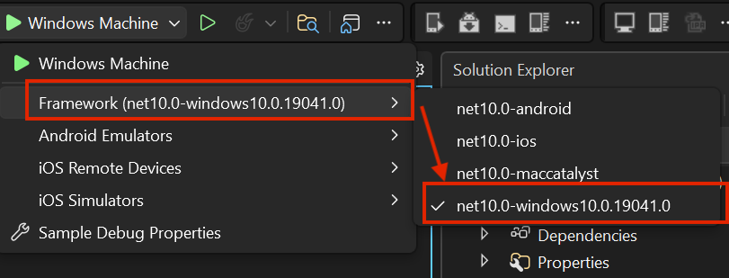
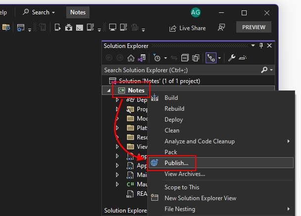
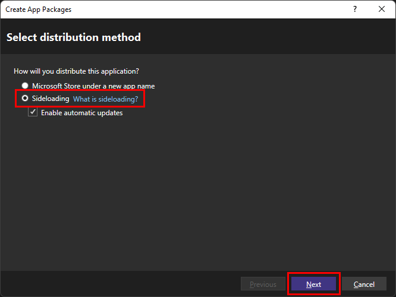
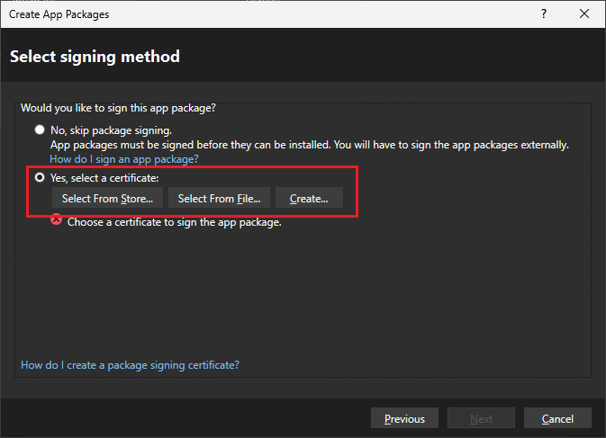
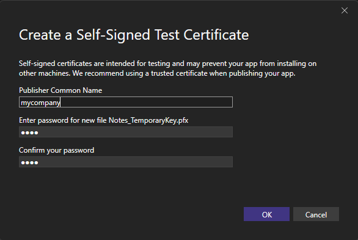
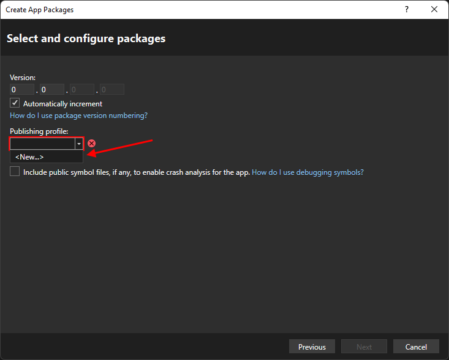
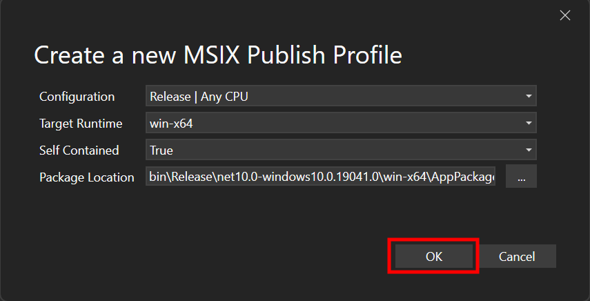
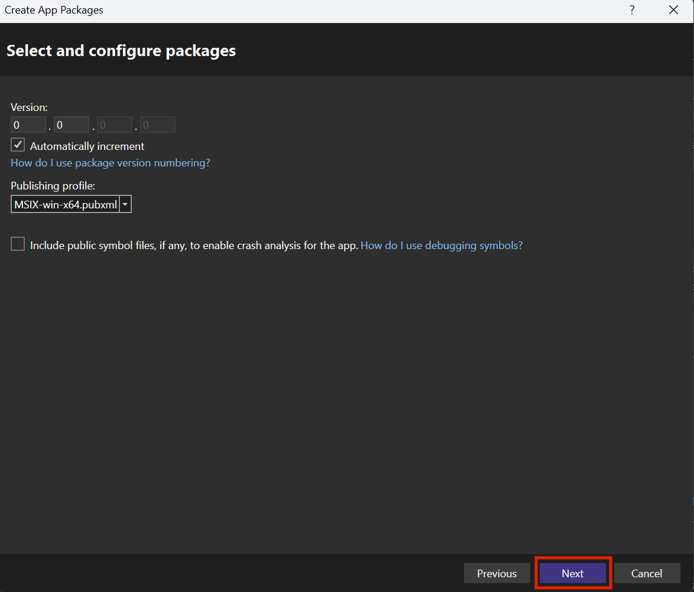
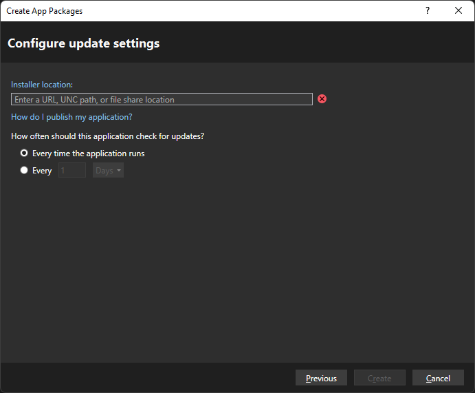
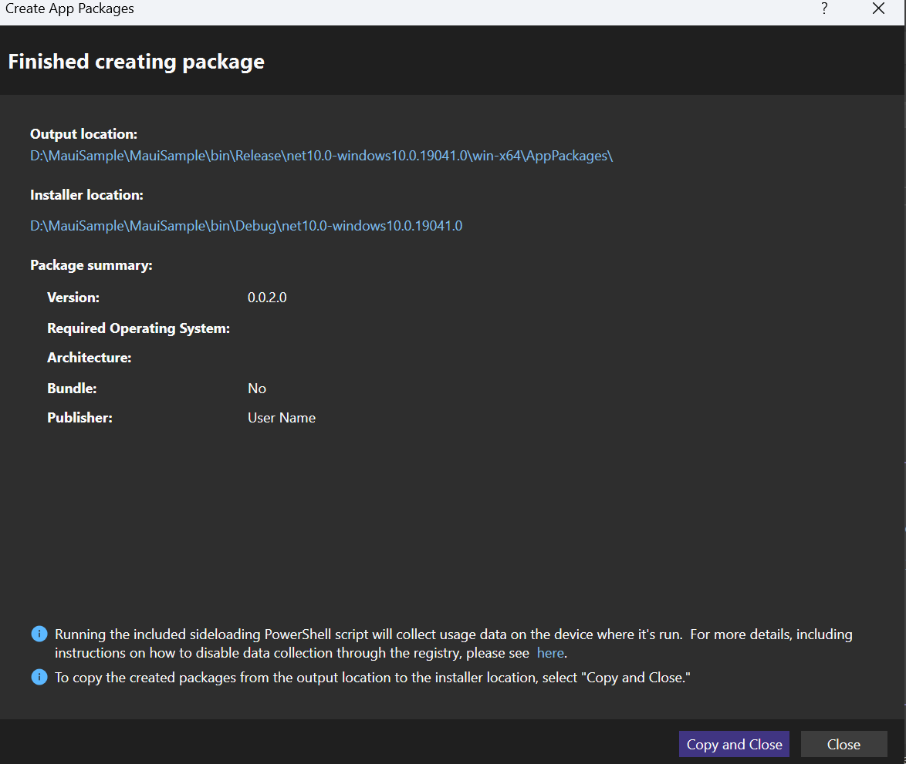

# Publish a .NET MAUI app for Windows with Visual Studio

> [!div class="op_single_selector"]
>
> - [[publish-cli|Publish a packaged app using the command line]]
> - [[publish-unpackaged-cli|Publish an unpackaged app using the command line]]

This article describes how to use Visual Studio to publish your .NET MAUI app for Windows. .NET MAUI apps can be packaged into an MSIX package, which is used for installing in Windows or for submission to the Microsoft Store. For more information about the benefits of MSIX, see [What is MSIX?](/windows/msix/overview).

## Set the build target

In Visual Studio, you can only publish to one platform at a time. The target platform is selected with the **Debug Target** drop-down in the Visual Studio toolbar. Set the target to **Windows Machine** or to **Framework** > **net10.0-windows**, as illustrated in the following image:

## Publish the project

After the build target is set to Windows, you can publish your project. Perform the following steps:

01. In the **Solution Explorer** pane, right-click the project and select **Publish**.

    

01. In the **Create App Packages** dialog, select **Sideloading**, and then select **Next**.

    

    The **Enable automatic updates** checkbox is optional.
    <!--
    > [!TIP]
    > Publishing to the Microsoft Store is described in the article [[publish-visual-studio-store|Publish a .NET MAUI app to the Microsoft Store]].
    -->

01. In the **Select Signing Method** dialog, select **Yes, select a certificate**. You can choose a certificate from a variety of sources. This article will create a temporary self-signed certificate for testing.

    

    01. Select **Create**.

        You can create a temporary self-signed certificate for testing. This certificate shouldn't be used to distribute your app package, it should only be used for testing your app's installation process.

    01. In the **Create a self-signed test certificate** dialog box, enter a company name used to represent the publisher of your app. Next, type in a password for the certificate, and enter the same password into the **Confirm your password** box.

        

    01. Select **OK** to return to the previous dialog.

    Once you've selected a certificate, you should see the certificate's information displayed in the dialog box. Select the **Next** button to move on to the next dialog.

01. In the **Select and configure packages** dialog, you can select a version for the app package or leave it at its default of `0.0.0.0`. The **Automatically increment** checkbox determines if the version of the package is increased everytime it's published.

    Select the **Publishing profile** drop-down and select **\<New...>**

    

    01. In the **Create a new MSIX Publish Profile** dialog, the default options should be what you want selected.

        

    01. Select **OK** to return to the previous dialog.

    The publishing profile you created is now selected.

    

01. If you chose the option to enable automatic updates for your package, then select the **Next** button. If you didn't select automatic updates, the button reads **Create**, select it, and skip the next step.

01. The next dialog displayed is the **Configure update settings** dialog. This is where you configure the installer location for your app, and how often the app should check for updates.

    Whenever you publish an updated version of the app, it overwrites the previous version of the app at the **Installer location**. When users run your app, and based on how often your app checks for updates, the app checks this location for an updated version, and if found, installs it.

    

    Once you select an **Installer location**, select **Create**.

01. After pressing **Create**, the installer is created and the **Finished creating package** dialog is displayed, which summarizes your package.

    

    There may be two options to close the dialog box. If you have the **Copy and close** button, select it to copy the package to the **Installer location** you selected during the **Configure update settings** step. Otherwise, select **Close** to close the dialog box.

## Current limitations

The following list describes the current limitations with publishing and packaging:

- The published app doesn't work if you try to run it directly with the executable file out of the publish folder.
- The way to run the app is to first install it through the packaged _MSIX_ file.
