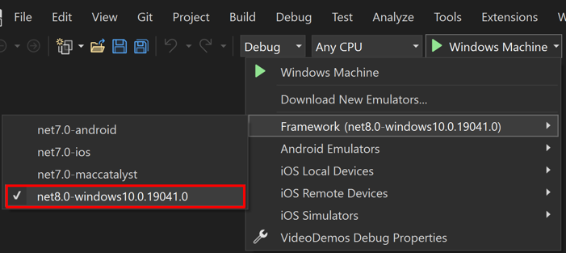
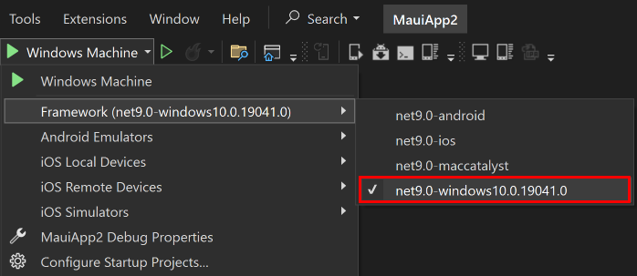

## Target Windows

In Visual Studio, set the **Debug Target** to **Framework (...)** > **net8.0-windows**. There is a version number in the item entry, which may or may not match the following screenshot:

In Visual Studio, set the **Debug Target** to **Framework (...)** > **net9.0-windows**. There is a version number in the item entry, which may or may not match the following screenshot:

