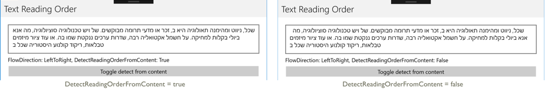

# InputView reading order on Windows

This .NET Multi-platform App UI (.NET MAUI) Windows platform-specific enables the reading order (left-to-right or right-to-left) of bidirectional text in [[Entry (Controls)|Entry]], [[Editor|Editor]], and [[Label (Controls)|Label]] objects to be detected dynamically. It's consumed in XAML by setting the `InputView.DetectReadingOrderFromContent` (for [[Entry (Controls)|Entry]] and [[Editor|Editor]] objects) or `Label.DetectReadingOrderFromContent` attached property to a `boolean` value:

```xaml
<ContentPage ...
             xmlns:windows="clr-namespace:Microsoft.Maui.Controls.PlatformConfiguration.WindowsSpecific;assembly=Microsoft.Maui.Controls">
    <StackLayout>
        <Editor ... windows:InputView.DetectReadingOrderFromContent="true" />
        ...
    </StackLayout>
</ContentPage>
```

Alternatively, it can be consumed from C# using the fluent API:

```csharp
using Microsoft.Maui.Controls.PlatformConfiguration.WindowsSpecific;
...

editor.On<Microsoft.Maui.Controls.PlatformConfiguration.Windows>().SetDetectReadingOrderFromContent(true);
```

The `Editor.On<Microsoft.Maui.Controls.PlatformConfiguration.Windows>` method specifies that this platform-specific will only run on Windows. The `InputView.SetDetectReadingOrderFromContent` method, in the `Microsoft.Maui.Controls.PlatformConfiguration.WindowsSpecific` namespace, is used to control whether the reading order is detected from the content in the [[InputView (Controls)|InputView]]. In addition, the `InputView.SetDetectReadingOrderFromContent` method can be used to toggle whether the reading order is detected from the content by calling the `InputView.GetDetectReadingOrderFromContent` method to return the current value:

```csharp
editor.On<Microsoft.Maui.Controls.PlatformConfiguration.Windows>().SetDetectReadingOrderFromContent(!editor.On<Microsoft.Maui.Controls.PlatformConfiguration.Windows>().GetDetectReadingOrderFromContent());
```

The result is that [[Entry (Controls)|Entry]], [[Editor|Editor]], and [[Label (Controls)|Label]] objects can have the reading order of their content detected dynamically:



> [!NOTE]
> Unlike setting the `FlowDirection` property, the logic for views that detect the reading order from their text content will not affect the alignment of text within the view. Instead, it adjusts the order in which blocks of bidirectional text are laid out.
