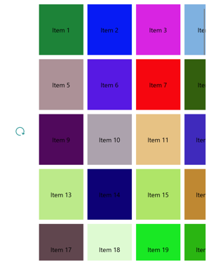

# RefreshView pull direction on Windows

This .NET Multi-platform App UI (.NET MAUI) Windows platform-specific enables the pull direction of a [[RefreshView (Controls)|RefreshView]] to be changed to match the orientation of the scrollable control that's displaying data. It's consumed in XAML by setting the `RefreshView.RefreshPullDirection` bindable property to a value of the `RefreshPullDirection` enumeration:

```xaml
<ContentPage ...
             xmlns:local="clr-namespace:PlatformSpecifics"
             xmlns:windows="clr-namespace:Microsoft.Maui.Controls.PlatformConfiguration.WindowsSpecific;assembly=Microsoft.Maui.Controls"
             x:DataType="local:WindowsRefreshViewPageViewModel">
    <RefreshView windows:RefreshView.RefreshPullDirection="LeftToRight"
                 IsRefreshing="{Binding IsRefreshing}"
                 Command="{Binding RefreshCommand}">
        <ScrollView>
            ...
        </ScrollView>
    </RefreshView>
 </ContentPage>
```

Alternatively, it can be consumed from C# using the fluent API:

```csharp
using Microsoft.Maui.Controls.PlatformConfiguration.WindowsSpecific;
...
refreshView.On<Microsoft.Maui.Controls.PlatformConfiguration.Windows>().SetRefreshPullDirection(RefreshPullDirection.LeftToRight);
```

The `RefreshView.On<Microsoft.Maui.Controls.PlatformConfiguration.Windows>` method specifies that this platform-specific will only run on Windows. The `RefreshView.SetRefreshPullDirection` method, in the `Microsoft.Maui.Controls.PlatformConfiguration.WindowsSpecific` namespace, is used to set the pull direction of the [[RefreshView (Controls)|RefreshView]], with the `RefreshPullDirection` enumeration providing four possible values:

- `LeftToRight` indicates that a pull from left to right initiates a refresh.
- `TopToBottom` indicates that a pull from top to bottom initiates a refresh, and is the default pull direction of a [[RefreshView (Controls)|RefreshView]].
- `RightToLeft` indicates that a pull from right to left initiates a refresh.
- `BottomToTop` indicates that a pull from bottom to top initiates a refresh.

In addition, the `GetRefreshPullDirection` method can be used to return the current `RefreshPullDirection` of the [[RefreshView (Controls)|RefreshView]].

The result is that a specified `RefreshPullDirection` is applied to the [[RefreshView (Controls)|RefreshView]], to set the pull direction to match the orientation of the scrollable control that's displaying data. The following screenshot shows a [[RefreshView (Controls)|RefreshView]] with a `LeftToRight` pull direction:



> [!NOTE]
> When you change the pull direction, the starting position of the progress circle automatically rotates so that the arrow starts in the appropriate position for the pull direction.
