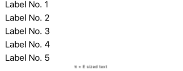
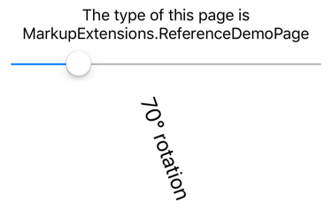
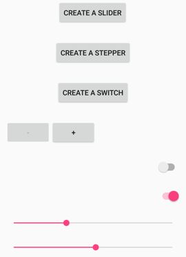
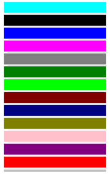
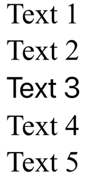

# Consume XAML markup extensions

[ Browse the sample](/samples/dotnet/maui-samples/xaml-markupextensions)

.NET Multi-platform App UI (.NET MAUI) XAML markup extensions help enhance the power and flexibility of XAML by allowing element attributes to be set from a variety of sources.

For example, you typically set the `Color` property of [[BoxView (Controls)|BoxView]] like this:

```xaml
<BoxView Color="Blue" />
```

However, you might prefer instead to set the `Color` attribute from a value stored in a resource dictionary, or from the value of a static property of a class that you've created, or from a property of type [[Color|Color]] of another element on the page, or constructed from separate hue, saturation, and luminosity values. All these options are possible using XAML markup extensions.

A markup extension is a different way to express an attribute of an element. .NET MAUI XAML markup extensions are usually identifiable by an attribute value that is enclosed in curly braces:

```xaml
<BoxView Color="{StaticResource themeColor}" />
```

Any attribute value in curly braces is *always* a XAML markup extension. However, XAML markup extensions can also be referenced without the use of curly braces.

> [!NOTE]
> Several XAML markup extensions are part of the XAML 2009 specification. These appear in XAML files with the customary `x` namespace prefix, and are commonly referred to with this prefix.

In addition to the markup extensions discussed in this article, the following markup extensions are included in .NET MAUI and discussed in other articles:

- [[AppThemeBindingExtension|`AppThemeBinding`]] - specifies a resource to be consumed based on the current system theme. For more information, see [[system-theme-changes#appthemebinding-markup-extension|AppThemeBinding markup extension]].
- [[BindingExtension|`Binding`]] - establishes a link between properties of two objects. For more information, see [[data-binding|Data binding]].
- [[DynamicResourceExtension|`DynamicResource`]] - responds to changes in objects in a resource dictionary. For more information, see [[xaml#dynamic-styles|Dynamic styles]].
- [[FontImageExtension|`FontImage`]] - displays a font icon in any view that can display an [[ImageSource|ImageSource]]. This markup extension is deprecated in .NET 10. For more information, see [[image#load-a-font-icon|Load a font icon]].
- [[OnIdiomExtension|`OnIdiom`]] - customizes UI appearance based on the idiom of the device the application is running on. For more information, see [[customize-ui-appearance#customize-ui-appearance-based-on-the-device-idiom|Customize UI appearance based on the device idiom]].
- [[OnPlatformExtension|`OnPlatform`]] - customizes UI appearance on a per-platform basis. For more information, see [[customize-ui-appearance#customize-ui-appearance-based-on-the-platform|Customize UI appearance based on the platform]].
- [[RelativeSourceExtension|`RelativeSource`]] - sets the binding source relative to the position of the binding target. For more information, see [[relative-bindings|Relative bindings]].
- [[StaticResourceExtension|`StaticResource`]] - references objects from a resource dictionary. For more information, see [[resource-dictionaries|Resource dictionaries]].
- [[TemplateBindingExtension|`TemplateBinding`]] - performs data binding from a control template. For more information, see [[controltemplate|Control templates]].
<!-- - `ConstraintExpression` - relates the position and size of a child in a `RelativeLayout` to its parent, or a sibling. For more information, see [[relativelayout|RelativeLayout]].-->

## x:Static markup extension

The `x:Static` markup extension is supported by the [[StaticExtension|StaticExtension]] class. The class has a single property named `Member` of type `string` that you set to the name of a public constant, static property, static field, or enumeration member.

One way to use `x:Static` is to first define a class with some constants or static variables, such as this `AppConstants` class:

```csharp
static class AppConstants
{
    public static double NormalFontSize = 18;
}
```

The following XAML demonstrates the most verbose approach to instantiating the [[StaticExtension|StaticExtension]] class between `Label.FontSize` property-element tags:

```xaml
<ContentPage xmlns="http://schemas.microsoft.com/dotnet/2021/maui"
             xmlns:x="http://schemas.microsoft.com/winfx/2009/xaml"
             xmlns:sys="clr-namespace:System;assembly=netstandard"
             xmlns:local="clr-namespace:MarkupExtensions"
             x:Class="MarkupExtensions.StaticDemoPage"
             Title="x:Static Demo">
    <StackLayout Margin="10, 0">
        <Label Text="Label No. 1">
            <Label.FontSize>
                <x:StaticExtension Member="local:AppConstants.NormalFontSize" />
            </Label.FontSize>
        </Label>
        ···
    </StackLayout>
</ContentPage>
```

The XAML parser also allows the [[StaticExtension|StaticExtension]] class to be abbreviated as `x:Static`:

```xaml
<Label Text="Label No. 2">
    <Label.FontSize>
        <x:Static Member="local:AppConstants.NormalFontSize" />
    </Label.FontSize>
</Label>
```

This syntax can be simplified even further by putting the [[StaticExtension|StaticExtension]] class and the member setting in curly braces. The resulting expression is set directly to the `FontSize` attribute:

```xaml
<Label Text="Label No. 3"
       FontSize="{x:StaticExtension Member=local:AppConstants.NormalFontSize}" />
```

In this example, there are *no* quotation marks within the curly braces. The `Member` property of [[StaticExtension|StaticExtension]] is no longer an XML attribute. It is instead part of the expression for the markup extension.

Just as you can abbreviate `x:StaticExtension` to `x:Static` when you use it as an object element, you can also abbreviate it in the expression within curly braces:

```xaml
<Label Text="Label No. 4"
       FontSize="{x:Static Member=local:AppConstants.NormalFontSize}" />
```

The [[StaticExtension|StaticExtension]] class has a [[ContentPropertyAttribute|`ContentProperty`]] attribute referencing the property `Member`, which marks this property as the class's default content property. For XAML markup extensions expressed with curly braces, you can eliminate the `Member=` part of the expression:

```xaml
<Label Text="Label No. 5"
       FontSize="{x:Static local:AppConstants.NormalFontSize}" />
```

This is the most common form of the `x:Static` markup extension.

The root tag of the XAML example also contains an XML namespace declaration for the .NET `System` namespace. This allows the [[Label (Controls)|Label]] font size to be set to the static field `Math.PI`. That results in rather small text, so the `Scale` property is set to `Math.E`:

```xaml
<Label Text="&#x03C0; &#x00D7; E sized text"
       FontSize="{x:Static sys:Math.PI}"
       Scale="{x:Static sys:Math.E}"
       HorizontalOptions="Center" />
```

The following screenshot shows the XAML output:



## x:Reference markup extension

The `x:Reference` markup extension is supported by the [[ReferenceExtension|ReferenceExtension]] class. The class has a single property named `Name` of type `string` that you set to the name of an element on the page that has been given a name with `x:Name`. This `Name` property is the content property of [[ReferenceExtension|ReferenceExtension]], so `Name=` is not required when `x:Reference` appears in curly braces. The `x:Reference` markup extension is used exclusively with data bindings. For more information about data bindings, see [[data-binding|Data binding]].

The following XAML example shows two uses of `x:Reference` with data bindings, the first where it's used to set the `Source` property of the `Binding` object, and the second where it's used to set the `BindingContext` property for two data bindings:

```xaml
<ContentPage xmlns="http://schemas.microsoft.com/dotnet/2021/maui"
             xmlns:x="http://schemas.microsoft.com/winfx/2009/xaml"
             x:Class="MarkupExtensions.ReferenceDemoPage"
             x:Name="page"
             Title="x:Reference Demo">    
    <StackLayout Margin="10, 0">        
        <Label x:DataType="ContentPage"
               Text="{Binding Source={x:Reference page},
                              StringFormat='The type of this page is {0}'}"
               FontSize="18"
               VerticalOptions="Center"
               HorizontalTextAlignment="Center" />
        <Slider x:Name="slider"
                Maximum="360"
                VerticalOptions="Center" />
        <Label x:DataType="Slider"
               BindingContext="{x:Reference slider}"
               Text="{Binding Value, StringFormat='{0:F0}&#x00B0; rotation'}"
               Rotation="{Binding Value}"
               FontSize="24"
               HorizontalOptions="Center"
               VerticalOptions="Center" />        
    </StackLayout>
</ContentPage>
```

In this example, both `x:Reference` expressions use the abbreviated version of the [[ReferenceExtension|ReferenceExtension]] class name and eliminate the `Name=` part of the expression. In the first example, the `x:Reference` markup extension is embedded in the `Binding` markup extension and the `Source` and `StringFormat` properties are separated by commas.

The following screenshot shows the XAML output:



## x:Type markup extension

The `x:Type` markup extension is the XAML equivalent of the C# [`typeof`](/dotnet/csharp/language-reference/keywords/typeof/) keyword. It's supported by the [[TypeExtension|TypeExtension]] class, which defines a property named `TypeName` of type `string` that should be set to a class or structure name. The `x:Type` markup extension returns the `Type` object of that class or structure. `TypeName` is the content property of [[TypeExtension|TypeExtension]], so `TypeName=` is not required when `x:Type` appears with curly braces.

The `x:Type` markup extension is commonly used with the `x:Array` markup extension. For more information, see [x:Array markup extension](#xarray-markup-extension).

The following XAML example demonstrates using the `x:Type` markup extension to instantiate .NET MAUI objects and add them to a [[StackLayout (Controls)|StackLayout]]. The XAML consists of three [[Button (Controls)|Button]] elements with their `Command` properties set to a `Binding` and the `CommandParameter` properties set to types of three .NET MAUI views:

```xaml
<ContentPage xmlns="http://schemas.microsoft.com/dotnet/2021/maui"
             xmlns:x="http://schemas.microsoft.com/winfx/2009/xaml"
             xmlns:local="clr-namespace:MarkupExtensions"
             x:Class="MarkupExtensions.TypeDemoPage"
             Title="x:Type Demo"
             x:DataType="local:TypeDemoPage">
    <StackLayout x:Name="stackLayout"
                 Padding="10, 0">
        <Button Text="Create a Slider"
                HorizontalOptions="Center"
                VerticalOptions="Center"
                Command="{Binding CreateCommand}"
                CommandParameter="{x:Type Slider}" />
        <Button Text="Create a Stepper"
                HorizontalOptions="Center"
                VerticalOptions="Center"
                Command="{Binding CreateCommand}"
                CommandParameter="{x:Type Stepper}" />
        <Button Text="Create a Switch"
                HorizontalOptions="Center"
                VerticalOptions="Center"
                Command="{Binding CreateCommand}"
                CommandParameter="{x:Type Switch}" />
    </StackLayout>
</ContentPage>
```

The code-behind file defines and initializes the `CreateCommand` property:

```csharp
public partial class TypeDemoPage : ContentPage
{
    public ICommand CreateCommand { get; private set; }

    public TypeDemoPage()
    {
        InitializeComponent();

        CreateCommand = new Command<Type>((Type viewType) =>
        {
            View view = (View)Activator.CreateInstance(viewType);
            view.VerticalOptions = LayoutOptions.Center;
            stackLayout.Add(view);
        });

        BindingContext = this;
    }
}
```

When a [[Button (Controls)|Button]] is pressed a new instance of the `CommandParameter` argument is created and added to the [[StackLayout (Controls)|StackLayout]]. The three [[Button (Controls)|Button]] objects then share the page with dynamically created views:



Generic types can be specified with the `x:Type` markup extension by specifying the generic constraint as a prefixed string argument in parentheses:

```xaml
<x:Array Type="{x:Type local:MyType(local:MyObject)}">
    ...
</x:Array>
```

Multiple type arguments can be specified as prefixed string arguments, delimited by a comma:

```xaml
<x:Array Type="{x:Type local:MyType(local:MyObject,x:Boolean)}">
    ...
</x:Array>
```

For more information about generics in XAML, see [[generics|Generics]].

## x:Array markup extension

The `x:Array` markup extension enables you to define an array in markup. It is supported by the [[ArrayExtension|ArrayExtension]] class, which defines two properties:

- `Type` of type `Type`, which indicates the type of the elements in the array. This property should be set to an `x:Type` markup extension.
- `Items` of type `IList`, which is a collection of the items themselves. This is the content property of [[ArrayExtension|ArrayExtension]].

The `x:Array` markup extension itself never appears in curly braces. Instead, `x:Array` start and end tags delimit the list of items.

The following XAML example shows how to use `x:Array` to add items to a [[ListView (Controls)|ListView]] by setting the `ItemsSource` property to an array:

```xaml
<ContentPage xmlns="http://schemas.microsoft.com/dotnet/2021/maui"
             xmlns:x="http://schemas.microsoft.com/winfx/2009/xaml"
             x:Class="MarkupExtensions.ArrayDemoPage"
             Title="x:Array Demo Page">
    <ListView Margin="10">
        <ListView.ItemsSource>
            <x:Array Type="{x:Type Color}">
                <Color>Aqua</Color>
                <Color>Black</Color>
                <Color>Blue</Color>
                <Color>Fuchsia</Color>
                <Color>Gray</Color>
                <Color>Green</Color>
                <Color>Lime</Color>
                <Color>Maroon</Color>
                <Color>Navy</Color>
                <Color>Olive</Color>
                <Color>Pink</Color>
                <Color>Purple</Color>
                <Color>Red</Color>
                <Color>Silver</Color>
                <Color>Teal</Color>
                <Color>White</Color>
                <Color>Yellow</Color>
            </x:Array>
        </ListView.ItemsSource>
        <ListView.ItemTemplate>
            <DataTemplate x:DataType="Color">
                <ViewCell>
                    <BoxView Color="{Binding}"
                             Margin="3" />
                </ViewCell>
            </DataTemplate>
        </ListView.ItemTemplate>
    </ListView>
</ContentPage>  
```

In this example, the [[ViewCell (Controls)|ViewCell]] creates a simple [[BoxView (Controls)|BoxView]] for each color entry:



> [!NOTE]
> When defining arrays of common types like strings or numbers, use the XAML language primitives tags listed in [[pass-arguments|Pass arguments]].

## x:Null markup extension

The `x:Null` markup extension is supported by the [[NullExtension|NullExtension]] class. It has no properties and is simply the XAML equivalent of the C# [`null`](/dotnet/csharp/language-reference/keywords/null/) keyword.

The following XAML example shows how to use the `x:Null` markup extension:

```xaml
<ContentPage xmlns="http://schemas.microsoft.com/dotnet/2021/maui"
             xmlns:x="http://schemas.microsoft.com/winfx/2009/xaml"
             x:Class="MarkupExtensions.NullDemoPage"
             Title="x:Null Demo">
    <ContentPage.Resources>
        <Style TargetType="Label">
            <Setter Property="FontSize" Value="48" />
            <Setter Property="FontFamily" Value="OpenSansRegular" />
        </Style>
    </ContentPage.Resources>

    <StackLayout Padding="10, 0">
        <Label Text="Text 1" />
        <Label Text="Text 2" />
        <Label Text="Text 3"
               FontFamily="{x:Null}" />
        <Label Text="Text 4" />
        <Label Text="Text 5" />
    </StackLayout>
</ContentPage>      
```

In this example, an implicit [[Style|Style]] is defined for [[Label (Controls)|Label]] that includes a [[Setter|Setter]] that sets the `FontFamily` property to a specific font. However, the third [[Label (Controls)|Label]] avoids using the font defined in the implicit style by setting its `FontFamily` to `x:Null`:



## DataTemplate markup extension

The [[DataTemplate|DataTemplate]] markup extension enables you to convert a type into a [[DataTemplate|DataTemplate]]. It's supported by the [[DataTemplateExtension|DataTemplateExtension]] class, which defines a `TypeName` property, of type `string`, that is set to the name of the type to be converted into a [[DataTemplate|DataTemplate]]. The `TypeName` property is the content property of [[DataTemplateExtension|DataTemplateExtension]]. Therefore, for XAML markup expressions expressed with curly braces, you can eliminate the `TypeName=` part of the expression.

> [!NOTE]
> The XAML parser allows the [[DataTemplateExtension|DataTemplateExtension]] class to be abbreviated as [[DataTemplate|DataTemplate]].

A typical usage of this markup extension is in a Shell application, as shown in the following example:

```xaml
<ShellContent Title="Monkeys"
              Icon="monkey.png"
              ContentTemplate="{DataTemplate views:MonkeysPage}" />
```

In this example, `MonkeysPage` is converted from a [[ContentPage|ContentPage]] to a [[DataTemplate|DataTemplate]], which is set as the value of the `ShellContent.ContentTemplate` property. This ensures that `MonkeysPage` is only created when navigation to the page occurs, rather than at application startup.

For more information about Shell apps, see [[shell|Shell]].
